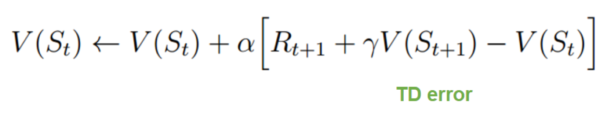
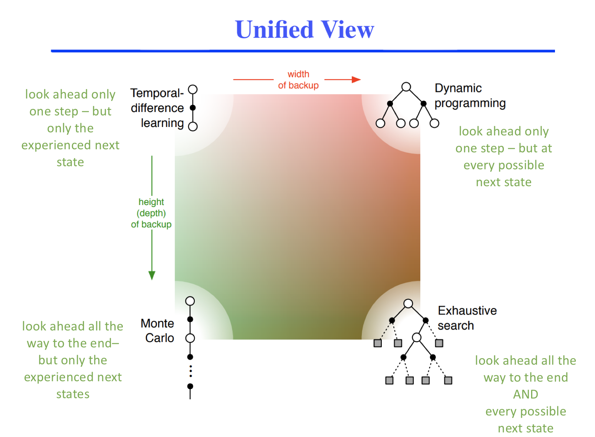
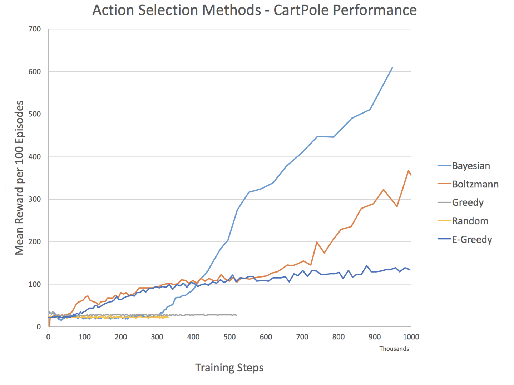
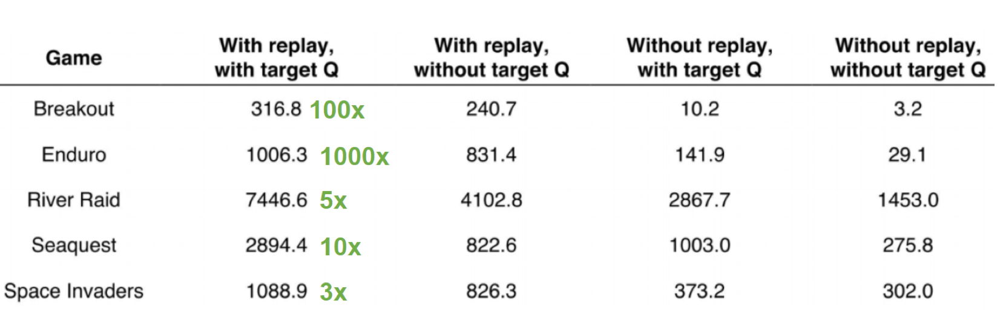
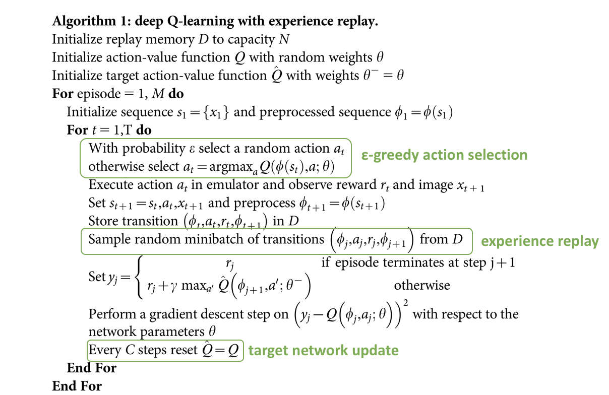
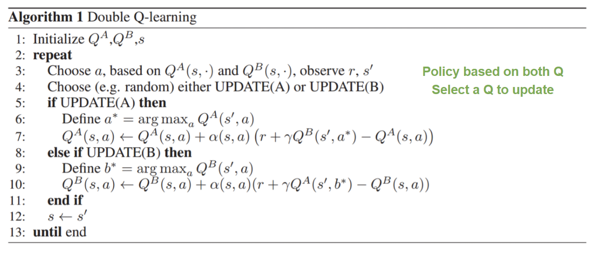

---?image=assets/images/section2/learn_plan_act.png&size=auto 80%


---
# a glance at reinforcement learning

## Adam Green
## [adam.green@adgefficiency.com](adam.green@adgefficiency.com)
## [adgefficiency.com](http://adgefficiency.com)
---
### Course Materials
[All course materials are in the GitHub repo dsr_rl](https://github.com/ADGEfficiency/dsr_rl)

- lecture notes hosted on GitPages
- a collection of useful machine learning & reinforcement learning literature
- practical work, consisting of a collection of scripts to run DQN on Cartpole and some additional Python tips & tricks
---
### Agenda

**today - morning**

one - background & terminology

two - introduction to reinforcement learning

three - value functions

**today - afternoon**

DQN practical

**tomorrow - morning**

four - improvements to DQN

five - policy gradients

six - practical concerns

seven - a quick look at the state of the art

**tomorrow - afternoon**
---
### About Me

**Education**

B.Eng Chemical Engineering

MSc Advanced Process Design for Energy

DSR Batch 9

**Experience**  

Energy Engineer at ENGIE UK

Energy Data Scientist at Tempus Energy

Taught this course over six times

---
### Goals for today and tomorrow

Introduction you to the concepts, ideas and terminology of reinforcement learning

Guidance on reinforcement learning project ideas

To learn RL, you will need to dedicate significiant amount of time (same as if you want to learn NLP, convolution, GANs etc)

These notes are designed to be both a set of slides for **lectures** and a **future reference** to help you learn

---

### Where to start
For those interested in learning more, any of these are a good place to start
- [Sutton & Barto - An Introduction to Reinforcement Learning (2nd Edition is in
  progress)](http://incompleteideas.net/book/bookdraft2017nov5.pdf)
- [David Silver's 10 lecture series on YouTube](https://www.youtube.com/watch?v=2pWv7GOvuf0)
- [Li (2017) Deep Reinforcement Learning: An Overview](https://arxiv.org/abs/1701.07274)

---
## one
### nomenclature & definitions
### background and terminology
---

### Nomenclature

[Thomas & Okal (2016) A Notation for Markov Decision Processes](https://arxiv.org/pdf/1512.09075.pdf)  maybe put the screenshot in here

|symbol | variable  | symbol | variable | 
|symbol | variable  |
|-------|-----------|--------|---------|
|$s$ |state     |
|$s'$|next state|
|$a$ |action    |
|$r$ |reward    |
|$G_t$ | discounted return after time t|
|$\gamma$ |  discount factor [0, 1) |
---
### Nomenclature

|------|----------|
|$ a \sim \pi(s) $  | sampling action from a stochastic policy |
|$ a = \pi(s)$ | determinstic policy |
|$ \pi^\star $ | optimal policy |
|$ V_t\pi (s)$| value function |
|$ Q_t\pi (s,a)$| value function |
|$ \theta , \omega $ | function parameters (i.e. weights) |
|$ \mathbb{E}[f(x)] $  | expectation of f(x) |

---

### Expectation

Weighted average of all possible values - i.e. the mean

$$ \mathbb{E}[f(x)] = \sum p(x) \cdot f(x) $$

---

### Conditionals

**Probability of one thing given another**

probability of next state and reward for a given state & action

$$ P(s'|s,a) $$  

reward received from a state & action

$$ R(r|s,a,s') $$  

Sampling an action from a stochastic policy conditioned on being in state s

$$ a \sim \pi (s|a) $$


---

### Variance & bias in supervised learning
Model generalization error = <span style="color:red">bias + variance + noise</span>

**Variance**

error from sensitivity to noise in data set

model sees patterns that aren’t there -> overfitting

**Bias**

error from assumptions in the learning algorithm

model can miss relevant patterns -> underfitting

---

### Variance & bias in reinforcement learning

**Variance**

deviation from expected value

how consistent is my model / sampling

can often be dealt with by sampling more

high variance = sample inefficient

**Bias**

expected deviation vs true value

how close to the truth is my model

approximations or bootstrapping tend to introduce bias

biased away from an optimal agent / policy

---?image=assets/variance_bias.png&size=auto 90%

---
### Bootstrapping

Doing something on your own - i.e. funding a startup with your own capital

Using a function to improve / estimate itself

The Bellman Equation is bootstrapped equation

$$ V(s) = r + \gamma V(s') $$

$$ Q(s,a) = r + \gamma Q(s', a') $$

---
### Function approximation


---
### Lookup tables
A system with two dimensions in the state variable

`state = np.array([temperature, pressure])`

|state |temperature | pressure | estimate |
|---|
|0   |high   |high   |unsafe   |
|1   |low   |high   |safe   |
|2  |high   |low   |safe   |
|3   |low   |low   |very safe   |

***Advantages***

Stability - each estimate is independent of every other estimate

***Disadvantages***

No sharing of knowledge between similar states/actions

Curse of dimensionality - high dimensional state/action spaces means lots of entries

---

### Linear functions

$$ V(s) = 3s_1 + 4s_2 $$

**Advantages**

Less parameters than a table

Can generalize across states

**Disadvantages**

The real world is often non-linear

---

###  Non-linear functions


***Advantages***

Model complex dynamics

Convolution for vision

Recurrency for memory / temporal dependencies

***Disadvantages***

Instability

Difficult to train

---

### iid

Fundamental assumption in statistical learning

Independent and identically distributed

In statistical learning one always assumes the training set is independently drawn from a fixed distribution

---

### A few things about training neural networks

1 - Learning rate

2 - Batch size

3 - Scaling / preprocessing

Does anyone know what these are?

How do they affect each other?

---

### Learning rate

Controls the strength of weight updates performed by the optimizer (SGD, RMSprop, ADAM etc)

Small learning rate = slow training

High learning rate = overshoot or divergence

---

### Batch size

Modern reinforcement learning trains neural networks using batches of samples

1 epoch = 1 pass over all samples

i.e. 128 samples, batch size=64
-> two forward & backward passes across net

Smaller batch sizes = less memory on GPU

Batches train faster – weights are updated more often for each epoch

The cost of using batches is a less accurate estimate of the gradient - this noise can be useful to escape local minima

---

### Learning rate & batch sizes

Bigger batch size = larger learning rate

This is because a larger batch size gives a more accurate estimation of the gradient

https://miguel-data-sc.github.io/2017-11-05-first/


---

### Scaling aka pre-processing

Neural networks don't like numbers on different scales.  Improperly scaled inputs or targets can cause issues with exploding gradients

Anything that touches a neural network needs to be within a reasonable range

Standardization = removing mean & scale by unit variance

$$ \phi(x) = x - \frac{\mu(x)}{\sigma $$}

Our data now has a mean of 0, and a variance of 1

Normalization = min/max scaling

$$ \phi(x) = \frac{x - xmin}{xmax-xmin} $$

Our data is now within a range of 0 to 1

---

---?image=assets/batch_norm_lit.png&size=auto 80%

### Batch normalization

In supervised learning we can estimate the true mean, variance, min or max of our data from our training set (in RL we don't get this).

Batch norm. is used in both supervised & reinforcment learning.  It's additional preprocessing of data as it moves between network layers

We use the mean and variance of the batch to normalize activations (note - standardization is actually used!)

This reduces sensitivty to weight & bias initialization

It also allows us to use higher learning rates

### Batch renormalization

Vanilla batch norm. struggles with small or non-iid batches - the mean/variance/min/max estimtates are worse

Vanilla batch norm. uses two different methods for normalization for training & testing

Batch renormalization attempts to fix this by using a single algorithm for both training & testing

---
## two
### introduction to reinforcement learning
### four central challenges
### Markov Decision Processes
---

---?image=assets/sl_unsl_rl.png&size=auto 90%

### Reinforcement learning

**one - value function methods**

Parameterize a value function - ie $V(s)$ or $Q(s,a)$

i.e. dynamic programming, SARSA, Q-Learning, DQN, DDQN

**two - policy gradient methods**

Parameterize a policy

i.e. REINFORCE, TRPO, PPO

**three - actor critic methods**

Parameterize both value functions and policies

i.e. DPG, AC2, AC3

**four - model based or planning methods**

A model can be used to plan by simulating tragetories (known as roll outs)

i.e. AlphaGo

This course covers only **model free** reinforcement learning (i.e. the first three)

---

###  Also worth knowing about are

Evolutionary methods are better able to deal with sparse error signals and eaisly parallelizable

More general optimization methods such as cross entropy method are often reccomended to be tried before you try RL

---

###  Applications

RL is all about **decision making**.


[*David Silver – Deep Reinforcement Learning*](http://www0.cs.ucl.ac.uk/staff/d.silver/web/Resources_files/deep_rl.pdf)

---

###  Biological inspiration

*Sutton & Barto - Reinforcment Learning: An Introduction*
>Of all the forms of machine learning, reinforcement learning is the closest to the kind of learning that humans and other animals do, and many of the core algorithms of reinforcement learning were originally inspired by biological learning systems 

*Mnih et. al (2015) Human-level control through deep reinforcement learning*
>Neurobiological evidence that reward signals during perceptual learning may influence the characteristics of representations within the primate visual cortex 

Habit formation

Cue -> Routine -> Reward

State -> Action -> Reward

---

###  Reinforcement learning is not

NOT an alternative method to use instead of a random forest, neural network etc

“I’ll try to solve this problem using a convolutional nn or RL” this is nonsensical

Neural networks (supervised techniques in general) are a tool that reinforcement learners can use

---

###  Deep reinforcement learning

**Deep learning** = neural networks with multiple layers

**Deep reinforcement learning** = using multiple layer networks to approximate policies or value functions

Feedforward, convolutional or recurrent neural networks are all used within different RL algorithms

---
###  A new level of intelligence

Founder & CEO of DeepMind Demis Hassabis on the brilliance of AlphaGo in it's 2015 series


---
## Reinforcement Learning

###is

## learning through action
---

---?image=assets/images/section_2/mdp_schema_simple.png&size=auto 80%

---?image=assets/images/section_2/rl_process.png&size=auto 80%

---
### Data in reinforcement learning

In RL we generate our own data

Data = the agent's experience $(s,a,r,s')$

It's not clear what we should do with this data - no implicit target
---
### Supervised learning versus reinforcement learning

In supervised learning we are limited by our dataset

In reinforcement learning we can generate more data by acting

> Deep RL is popular because it’s the only area in ML where it’s socially acceptable to train on the test set

---
### Reinforcement learning dataset

Experience (aka a transition) $(s,a,r,s')$

$$[experience,
experience,
experience,
...
experience]$$

The dataset we generate is a sequence of experience
---
### Reinforcement learning dataset

$$[(s_0,a_0,r_1,s_1'),
(s_1,a_1,r_2,s_2'),
(s_2,a_2,r_3,s_3'),
...
(s_n,a_n,r_{n+1},s_{n+1'})]$$

What should we do with this dataset?

---
### Four central challenges in reinforcement learning

one - exploration vs exploitation

two - data quality

three - credit assignment

four - sample efficiency
---
### Exploration vs exploitation
Do I go to the restaurant in Berlin I think is best – or do  I try something new?

Exploration  = finding information
Exploitation = using information

Agent needs to balance between the two
---
### Exploration vs exploitation

How stationary are the environment state transition and reward functions?  How stochastic is my policy?

Design of reward signal vs. exploration required

Algorithm does care about the time step
 too small = rewards are delayed = credit assignment harder
 ---
### Data Quality

All the samples collected on a given episode are correlated (along the state trajectory)

This *breaks the iid assumption of independent sampling*

Environment can be non-stationary

Learning changes the data we see
Exploration changes the data we see

All of these *break the identically distributed assumption* of iid
---
## Reinforcement learning will always break supervised learning assumptions about data quality
---
###  Credit assignment

Which actions give us which reward

Reward signal is often

*delayed*	benefit of action only seen much later  

*sparse* experience with reward = 0

Sometimes we can design a more dense reward signal for a given environment
---
### Sample efficiency
How quickly a learner learns

How often we reuse data
- do we only learn once or can we learn from it again
- can we learn off-policy

How much we squeeze out of data
- i.e. learn a value function, learn a environment model
---
### Four challenges
**exploration vs exploitation**
 how good is my understanding of the range of options

**data**
 biased sampling, non-stationary distribution

**credit assignment**
which action gave me this reward

**sample efficiency**
 learning quickly, squeezing information from data
---
### Markov Decision Processes

Mathematical framework for the reinforcement learning problem

The Markov property is often a requirement to gurantee convergence
---
### Markov property

Future is conditional only on the present

Can make prediction or decisions using only the current state

Any additional information about the history of the process will not improve our decision

$$ P(s_{t+1}|s_t,a_t) = P(s_{t+1}|s_t,a_t...s_0,a_0)$$
---
### Formal definition of a MDP

$$ (\mathcal{S}, \mathcal{A}, \mathcal{R}, P, R, d_0, \gamma) $$

Set of states $\mathcal{S}$

Set of actions $\mathcal{A}$

Set of rewards $\mathcal{R}$

State transition function $ P(s'|s,a) $

Reward transition function $ R(r|s,a,s') $  

Distribution over initial states $d_0$

Discount factor $\gamma$
---
### Object oriented definition of a MDP

Two objects - the agent and Environment

Three signals - state, action & reward

```
class Agent
class Environment

state = env.reset()

action = agent.act(state)

reward, next_state = env.step(action)
```
---
### Environment

Can be real or virtual - modern RL makes heavy use of virtual environments to generate lots of experience

Each environment has a state space and an action space

Both of these spaces can be discrete or continuous

Environments can be episodic (terminating at a certain point) or continuous

The MDP framework unites both in the same way by using the idea of a final absorbing state at the end of episodes
---
### Discretiziation

Too coarse -> non-smooth control output

Too fine -> curse of dimensionality = computational expense

Discretization requires some prior knowledge

When we discretize we lose the shape of the space
---
### State

Infomation for the agent to *choose next action* and to *learn from*

State is a flexible concept - it's a n-d array
```
state = np.array([temperature, pressure])

state = np.array(pixels).reshape(height, width)
```
Possible to concactenate sequential samples together to give some idea of the recent trajectory
---
### State versus observation

I choose to distinguish between state and observation

Many problems your agent won't be able to see everything that would help it learn - i.e. non-Markov.  This then becomes a POMDP

```
state = np.array([temperature, pressure])

state = np.array([temperature, pressure])

observation = np.array([temperature + noise])
```
---
### Reward

Scalar

Delayed

Sparse

A well defined reward signal is often a limit for applications of RL (i.e. autonomous driving - whats the reward?)
---
### Agent

Our agent is the **learner and decision maker**

It's goal is to maximize total discounted reward

An agent always has a policy - even if it's a bad one
---
### The reward hypothesis

Maximising return is making an assumption about the nature of our goals

We are assuming that *goals can be described by the maximization of expected cumulative reward*

Do you agree with this?
---
### Policy $\pi(s)

A policy is rules to select actions

$pi(s)$
$\pi(s,a,/theta)$
$\pi_\theta(s|a)$

Example policies
- act randomly
- always pick a specific action
- the optimal policy - the policy that maximizes future reward

Policies can be deterministic or stochastic

Policy can be
- parameterized directly (policy gradient methods)
- generated from a value function (value function methods)
---
### On versus off policy learning


---
### Environment model

Our agent can optionally learn an environment model

Predicts environment response to actions
- predicts $s,r$ from $s,a$

```
def model(state, action):
# do stuff
return next_state, reward
```

Sample vs. distributional model

Model can be used to simulate trajectories for **planning**
---
---?image=assets/images/section2/learn_plan_act.png&size=auto 80%

*Sutton & Barto - Reinforcement Learning: An Introduction*

---?image=assets/images/section2/mdp_schema_complex.png&size=auto 80%

### Return

Goal of our agent is to maximize reward

Return ($G_t$) is the total discounted future reward

$$G_t = r_{t+1} + \gamma r_{t+2} + \gamma^2 r_{t+3} + ... = \sum_{k=0}^{\infty} \gamma^k r_{t+k+1}$$

` return = reward + discount * reward + discount^2 * reward ...`

**Why do we discount future rewards?**
---
### Discounting

Future is uncertain - stochastic environment

Matches human thinking - hyperbolic discounting

Finance - time value of money

Makes return for infinite horizon problems finite

if our discount rate is $[0,1)$ then we can make the sum of an infinite series finite (known as a geometric series)

Can use discount = 1 for
- games with tree-like structures (without cycles)
- when time to solve is irrelevant (i.e. a board game)

---
## three
### introduction to value functions 
### Bellman Equation 
### approximation methods
### SARSA & Q-Learning
### DQN
---

# Value function

<center>$V_\pi(s)$</center>

## how good is this state

# Action-value function

<center>$Q_\pi(s,a)$</center>

## how good is this action
---
### Value functions

**Value function**

$ V_{\pi}(s) = \mathcal{E}[G_t | s_t] $ 

Expected return when in state $s$, following policy $\pi$

Action-value function

$ Q_{\pi}(s,a) = \mathbb{E}[G_t | s_t, a_t] $ 

Expected return when in state $s$, taking action $a$, following policy $\pi$

---
### Value functions are oracles

Value functions are predictions of the future 
- they are expectations
- predict expected future discounted reward
- always conditioned on a policy

But we don’t know this function 
- agent must learn it 
- once we learn it – how will it help us to act?
---
### Generating the optimal policy from the optimal value function

Imagine we were given the optimal value function $Q_*(s,a)$

We are in state $s$, and our set of actions $\mathcal{A} = \{a_1, a_2, a_3\}$

We can use our optimal value function to calculate the optimal expected discounted return for each action

We then select the action with the largest $Q(s,a)$ - ie take the $\underset{a}{\arg\max} Q(s,a)$

Set of actions 
This is known as a *greedy policy*

---
### Generating the optimal policy from the optimal value function

```
def greedy_policy(state):
    q_values = value_function.predict(state)

    action = np.argmax(q_values)

    return action
```

---
### Policy approximation versus policy improvement

We can see that having a good approximation of the optimal value function helps us to improve our policy

These are two distinct steps

1 - improving the predictive power of our value function (to predict return)

2 - improving the policy - i.e. improving the actions that we take

---
### Policy & value iteration

$$V_{k+1} (s) = \max_a \sum_{s',r} P(s',r|s,a) [r + \gamma V_k(s')]$$

These two steps are done sequentially in a process known as **policy iteration**
- approximate our policy (i.e. $V_{\pi}(s)$)
- improve our policy by being greedy
- approximate our new better policy
- act greedy 

A similar by slightly difference process is **value iteration**, where we combine the policy approximation and
improvement steps by using a maximization over all possible next states in the update


---
### Generalized policy iteration
GPI = the general idea of letting policy evaluation and improvement processes interact  

Policy iteration = sequence of approximating value function then making policy greedy wrt value function

Value iteration = single iteration of policy evaluation done inbetween each policy improvement

Both of these can achieve the same result - stabilizing when a policy has been found that is greedy wrt it's own value
function

---
### Value function approximation

To approximate a value function we can use one of the methods we looked at in the first section
- lookup table
- linear function
- non-linear function

Linear functions are appropriate with some agents or environments

Modern reinforcement learning is based on using deep neural networks - commonly convolution 

---
### Richard Bellman


Invented dynamic programming in 1953 

*[On the naming of dynamic programminging](ttp://arcanesentiment.blogspot.com.au/2010/04/why-dynamic-programming.html)*
> I was interested in planning, in decision making, in thinking. But planning, is not a good word for various reasons. I decided therefore to use the word, ‘programming.’ I wanted to get across the idea that this was dynamic, this was multistage, this was time-varying

Also introduced the curse of dimensionality - number of states $\mathcal{S}$ increases exponentially with the number of
state variables

---
###  Bellman Equation

Bellman's contribution is remembered by the Bellman Equation

$$ G_{\pi}(s) = r + \gamma G_{\pi}(s') $$

The Bellman equation relates the expected discounted return of the current state to the discounted value of the next
state

---
### Bellman Equation

The Bellman equation is a recursive definition - i.e. it is bootstrapped

We can apply it to value functions

$$ V_{\pi}(s) = r + \gamma V_{\pi}(s') $$

$$ Q_{\pi}(s,a) = r + \gamma Q_{\pi}(s', a') $$

---
### How does the Bellman Equation help us learn?

In supervised learning you train a neural network by minimizing the difference between the network output and the
correct target for that sample

In order to improve our approximation of a value function (i.e. a neural network) we need to create a target for each
sample of experience

We can then improve our approximation by minimizing a loss function

$$ loss = target - approximation $$

For an experience sample of $(s, a, r, s')$
$$ loss = r + Q(s',a) - Q(s,a) $$

This is also known as the **temporal difference error**

---
## break

---
## three
### introduction to value functions 
### Bellman Equation 
### Approximation methods
### SARSA & Q-Learning
### DQN
---
### Approximation methods

We are going to look at three different methods for approximation

1 - dynamic programming
2 - Monte Carlo
3 - temporal difference

Policy improvement can be done by either policy iteration or value iteration for all of these different approximation
methods

---
### Dynamic programming

Imagine you had a perfect environment model

i.e. you know both the state transition function $ P(s'|s,a) $ and the reward transition function $ R(r|s,a,s') $  

Can we use our perfect environment model for value function approximation?

---


Note that the probabilities here depend both on the environment and the policy

---
### Dynamic programming backup

We can perform iterative backups of the expected return for each state

The return for all terminal states is zero

$$V(s_2) = 0$$

$$V(s_4) = 0$$

We can then express the value functions for the remaining two states

$$V(s_3) = P_{34}[r_{34} + \gamma V(s_4)$$

$$V(s_3) = 1 * [5 + 0.9 * 0] = 5 $$

$$V(s_1) = P_{12}[r_{12} + \gamma V(s_2) + P_{13}[r_{13} + \gammaV(s_3)]$$

$$V(s_1) = 0.5 * [1 + 0.9 * 0] + 0.5 * [2 + 0.9 * 5] = 3.75 $$

---
### Dynamic programming


Our value function approximation depends on
- our policy (what actions we pick)
- the environment (where our actions take us and what rewards we get)
- our current estimate of $V(s')$

A dynamic programming update is expensive - our new estimate $V(s)$ depends on the value of all other states (even if
the probability is zero)

Asynchronous dynamic programming addresses this by updating states in an arbitrary order

---
### Dynamic programming summary

Requries a **perfect environment model** - we don't need to sample experience at all (i.ewe don't ever actually take
actions)

**Bootstrapped** - we use the recursive Bellman Equation to update our value function

Limited utility in practice but they provide an **essential foundation** for understanding reinforcement learning - all RL
can be thought of as attempts to achieve what DP can but without a model and with less computation

---
### Monte Carlo

Monte Carlo methods = finding the expected value of a function of a random variable

**No model** - we learn from actual experience (i.e. our sequences of $(s,a,r,s')$

**No boostrapping** - we take the average of the true discounted return

**Episodic only** - because we need to calcuate the true discounted return

---
### Monte Carlo approximation

Estimate the value of a state by averaging the true discounted return observed after each visit to that state

As we run more episodes, our estimate should converge to the true expectation

Low bias & high variance - why?

---
### Bias & variance of Monte Carlo

High variance
- we need to sample enough episodes for our averages to converge
- can be a lot for stochastic or path dependent environments

Low bias
- we are using actual experience
- no chance for a bootstrapped function to mislead 

---
### Monte Carlo algorithm

Algorithm for a lookup table based Monte Carlo approximation


---
###  Interesting feature of Monte Carlo

Computational expense of estimating the value of state $s$ is independent of the number of states $\mathcal{S}$ 

This is because we use experienced state transitions


---
### Monte Carlo

Learn from **actual experience** – no environment model

**No bootstrapping** – use true discounted returns

**Episodic problems only** – no learning online

High variance, low bias

---
### Temporal difference 

Learn from **actual experience** – no environment model

**Bootstrap** – learn online

Episodic & non-episodic problems

---
### Temporal difference

Use the Bellman Equation to approximate $V(s)$ using $V(s')$ (like dynammic programming)

Sample from experienced trajectories (like Monte Carlo)

Update rule for a lookup table based TD(0) approximation


---
### Temporal difference backup


$$ V(s_1) \leftarrow V(s_1) + \alpha [ r_{23} + \gamma V(s_3) - V(s_1) ] $$

---
### TD(0) algorithm


*Li (2017)*

---
### Linking together 

Temporal difference and Monte Carlo exist on two extremes of the same scale


---



[The Long-term of AI & Temporal-Difference Learning – Rich Sutton](https://www.youtube.com/watch?v=EeMCEQa85tw)

---


[The Long-term of AI & Temporal-Difference Learning – Rich Sutton](https://www.youtube.com/watch?v=EeMCEQa85tw)

---
### Recap


Sutton & Barto - Reinforcement Learning: An Introduction

---
## three
### introduction to value functions 
### Bellman Equation 
### approximation methods
### SARSA & Q-Learning
### DQN
---

### SARSA & Q-Learning

SARSA & Q-Learning are both based on the action-value function $Q(s,a)$

Why might we want to learn $Q(s,a)$ rather than $V(s)$?

Imagine a simple MDP

$$ (\mathcal{S} = \{s_1, s_2, s_3\} $$

$$ (\mathcal{A} = \{a_1, a_2\} $$

Our agent finds itself in state $s_2$

We use our value function $V(s)$ to calculate 

$V(s_1) = 10$
$V(s_2) = 5$
$V(s_3) = 20$

Which action should we take?  

### $V(s)$ versus $Q(s,a)$ 

$V(s)$ tells us how good a state is

$Q(s,a)$ tells us how good an **action** is

### SARSA

SARSA is an on-policy approximation method

We learn $Q(s,a)$ by using every element from our experience tuple $(s,a,r,s')$ 

And also $a'$ - the next action selected by our agent

$$Q(s,a) \leftarrow Q(s,a) + \alpha [r + \gamma Q(s', a') - Q(s,a)] $$

SARSA is on-policy because we are forced to learn about the action $a'$ that our agent choose to take after reaching
$s'$

### Q-Learning

Q-Learning is an off-policy control method

We learn $Q(s,a)$ by using every element from our experience tuple $(s,a,r,s')$

We don't need to know what action our agent took next (i.e. $a'$) - instead we take the **maximum over all possible actions**

This allows us to learn the optimal value function while following a sub-optimal policy!

$$Q(s,a) \leftarrow Q(s,a) + \alpha [r + \gamma \underset{a}{\max} Q(s', a') - Q(s,a)] $$

---
### SARSA & Q-Learning


---
### Q-Learning

Selecting optimal actions in Q-Learning can be done by an $\argmax$ across the action space

$$action = \underset{a}{\argmax}Q(s,a)$$

The $\argmax$ limits Q-Learning to **discrete action spaces only**

Acting in Q-Learning is also deterministic - we will always pick the action our $Q(s,a)$ approximation thinks is good

How then do we explore the environment?

---
### $\epsilon$-greedy exploration

One stragety to explore in Q-Learning is known as the epsilon-greedy policy

```
def epsilon_greedy_policy():
    if np.random.rand() < epsilon:
        #  act randomly
        action = np.random.uniform(action_space)

    else:
        #  act greedy
        action = np.argmax(Q_values)

    return action
```

$\epsilon$ is decayed during experiments as our approximation of $Q_*(s,a)$ improves
---
### Exploration strageties

Alternative policies include Boltzmann (i.e. a softmax) with temperature being annealed as learning progresses

More advanced is a Bayesian Neural Network - a network that maintains distributions over weights -> distribution over actions.  This can also be performed using dropout to simulate a probabilistic network

[Action-Selection Strategies for Exploration](https://medium.com/emergent-future/simple-reinforcement-learning-with-tensorflow-part-7-action-selection-strategies-for-exploration-d3a97b7cceaf)

---
DQN trained on CartPole



[Action-Selection Strategies for Exploration](https://medium.com/emergent-future/simple-reinforcement-learning-with-tensorflow-part-7-action-selection-strategies-for-exploration-d3a97b7cceaf)

---
### Problems with Q-learning

One issue is correlations in our dataset (the list of experience tuples)

Another issue is that small changes to weights or $Q(s,a)$ estimates can change the policy drastically

$$Q(s_1, a_1) = 10 $$

$$Q(s_1, a_2) = 11 $$

For the Q values above we would select action $a_1$ in state $s_1$

Then we do some learning and our estimates change

$$Q(s_1, a_1) = 12 $$
$$Q(s_1, a_2) = 11 $$

Now our policy is completely different!  

For the Q values above we would select action $a_1$ in state $s_1$

---
### Deadly triad

Sutton & Barto discuss the concept of the **deadly triad** - three mechanisms that docombine to produce instability and
divergence

1 - off-policy learning - to learn about the optimal policy while following an exploratory policy

2 - function approximation - for scalability and generalization

3 - bootstrapping - computational & sample efficiency

---
### Deadly triad

It's not clear which of the three cause instability
- dynamic programming can diverge with function approximation (so even on-policy learing can diverge)
- prediction can diverge
- linear functions can be unstable

Divergence is an emergent phenomenon

---
## three
### introduction to value functions 
### Bellman Equation 
### approximation methods
### SARSA & Q-Learning
### DQN
---

### DQN

This section covers two papers that introduced (2013) and developed (2015) the Deep Q-Network (DQN) algorithm

Prior to 2013, Q-Learning was only stable in MDPs with lookup tables or linear function approximators

Attempts to use complex, non-linear function approximators (i.e. neural networks) all failed - learning was unstable and would often diverge

---
### DQN

In 2013 a small London startup published a paper where an agent based on Q-Learning was able to reach a superhuman level of performance in _ Atari games

In 2014 Google purchased DeepMind for around £400M

This is for a company with no product, no revenue, no customers and a few world class employees

---?image=assets/images/section3/2013_atari.png&size=auto 80%

---?image=assets/images/section3/2015_atari.png&size=auto 80%

---
### Significance

**End to end deep reinforcement learning**

Learning from high dimensional input - raw pixels

Ability to **generalize**

Same algorithm, network strucutre and hyperparameters

Two key innovations behind the success of the DeepMind Atari work

1 - experience replay (Lin 1993)

2 - target network

---
### Reinforcement learning to play Atari

**State**

Last four screens concatenated together

Allows infomation about movement

Grey scale, cropped & normalized

**Reward**

Game score

Clipped to [-1, +1]

**Actions**

Joystick buttons (a discrete action space)

---?image=assets/images/section3/atari_results.png&size=auto 80%

---?image=assets/images/section3/atari_func.png&size=auto 80%

---?image=assets/images/section3/atari_sea.png&size=auto 80%

---
### Experience replay


---
### Experience replay

Experience replay helps to deal with our non-iid dataset (i.e. correlations between samples of experience)

Makes our sampling more independent

Data efficiency - we can learn from experience multiple times

Allows seeding of the memory with human expert experience

---
### Biological basis for experience replay

Hippocampus may support an experience replay process in the brain

Time compressed reactivation of recently experienced trajectories during offline periods

Provides a mechanism where value functions can be efficiently updated through interactions with the basal ganglia

*Mnih et. al (2015)*

---
### Target network

Second innovation behind DQN

Parameterize two separate neural networks (identical structure) - two sets of weights $\theta$ and $\theta^{-}$


Original Atari work copied the online network weights to the target network every 10k - 100k steps.  Modern methods use
a small factor $\tau$ to smoothly update weights at each step

---
### Target network

Changing value of one action changes value of all actions & similar states - bigger networks less prone (less aliasing)
 
Stable training - no longer bootstrapping from the same function, but from an old & fixed version of $Q(s,a)$ 

Reduces the correlation between the target used to train the network and the current network approximation 

---
### Stability techniques



*Minh – Deep Q-Networks – Deep RL Bootcamp 2017*

---
### DQN algorithm



---
### Huber Loss


---
### Timeline

1989 - Q-Learning (Watkins)

1992 - Experience replay (Lin)

...

2013 - DQN

2015 - DQN

2015 - Prioritized experience replay

2016 - Double DQN (DDQN)

2017 - Distributional Q-Learning

We will cover these improvements and more powerful algorithms tomorrow

---
## Lunch

---

### Practical

The practical we will do this afternoon is to play with a working DQN (Deep Q-Network) agent on the Open AI Cartpole environment.

The ideas behind this practical are:
- in industry you won't be handed a set of notebooks to shift-enter through

- you will likely be given an existing code base and be expected to figure out how it works

- this skill is also useful for understanding open source projects

- using a working system allows you to understand the effect of hyperparameters

---
###  CartPole


Environment with two actions - push left or push right

Reward is +1 for each timestep the cartpole stays balanced

Episode ends when the cartpole falls over

---
## four
### prioritized experience replay
### DDQN
### Rainbow

---
### Experience replay


---?image=assets/images/section4/schaul_2015.png&size=auto 80%

### Prioritized Experience Replay

Naive experience replay randomly samples batches of experience for learning.  This random sampling means we learn from experience at the same frequency as they are experienced

Some samples of experience are more useful for learning than others

We can measure how useful experience by the temporal difference error

$$ td_error = r + \gamma Q(s', a) - Q(s,a) $$

TD error measures suprise - this transition gave a higher or lower reward than expected

---
### Prioritized Experience Replay

Non-random sampling introduces two problems

1 - loss of diversity - we will only sample from high TD error experiences

2 - introduce bias - non-independent sampling

Schaul et. al (2016) solves these problems by:

1 - correct the loss of diversity by making the prioritization stochastic

2 - correct the bias using importance sampling

---
### Stochastic prioritization

Noisy rewards can make the TD error signal less useful

$p_i$ is the priority for transition $i$ ($i > 0$)

$$ \frac{p_{i}^{\alpha}}{\sum_{k}p_{k}^{\alpha}} $$

$\alpha = 0 $ -> uniform random sampling

Schaul suggets alpha $~ 0.6 - 0.7$

---
### Importance sampling

Not a sampling method - it's a method of Monte Carlo approximation

https://www.youtube.com/watch?v=S3LAOZxGcnk

Monte Carlo approximates using the sample mean, assuming that the sampling distribution (x<sub>p</sub>) is the same as
the true distribution (x~p)

$$ \mathbb{E}[f(x)] = 1/n \sum f(xi) $$

Could we use infomation about another distribution (q) to learn the distribution of p

i.e. correct for the fact that we are using another distribution

---

### Importance sampling

The importance weight function:
$$ w(x) = p(x) / q(x) $$

$$ \mathbb{E}[f(x)] = 1/n \sum f(xi) w(xi) $$

This is an unbiased approximation, and can also be lower variance than using the sample distribution $p$

---
### Importance sampling in prioritized experience replay

$$ \omega_i = \Big(  \frac{1}{N} \cdot \frac{1}{P(i)} \Big^\beta $$

Weights are normalized by $ 1 / \max_i \omega_i $ to ensure that we only scale the update (ie the update to the neural network weights) downwards

$\beta$ is a parameter that is increased over the course of an experiment (0.4 or 0.5 up to 1.0)

---
### Prioritized experience replay

All new transitions are stored at maximum priority - to ensure replay at least oncec

Sampling is commonly done using binary heaps to efficiently search for high prioritiy transitions and to calculate sums
and minimums

---?image=assets/images/section4/sumtree_test.png&size=auto 80%

---
## four
### prioritized experience replay
### DDQN
### Rainbow

---


### DDQN

DDQN = Double Deep Q-Network

First introducued in a tabular setting in 2010, then reintroduced in the content of DQN in 2016

DDQN aims to overcome the *maximization bias* that occurs due to the max operator in Q-Learning

---
### Maximization bias

Imagine a state where $Q(s,a) = 0$ for all $a$

Our estimates of the value of this state are normally distributed above and below 0


---
### Double Q-Learning

2010 paper parameterizes two networks $Q^A$ and $Q^B$

Actions are taken by averaging the estimates of both Q functions

Learning is done by selecting the optimal action for one function, but using the estimated value for the other function



---
### DDQN

In 2016 an updated paper on Double Q-Learning was published

The DDQN modification to DQN is simpler than the 2010 modification

*Original DQN target*
$$ r + \gamma \underset{a}{\max} Q(s,a,\theta) $$

*DDQN target*
$$ r + \gamma Q(s', \underset{a}{\argmax}Q(s',a)) $$ 

We select the optimal action according to our online network, but we use the Q value as estimated by the target network


