## a glance at reinforcement learning

Adam Green

[adam.green@adgefficiency.com](adam.green@adgefficiency.com)

[adgefficiency.com](http://adgefficiency.com)

---

**one** - background & terminology

**two** - introduction to reinforcement learning

**three** - value functions & DQN

**four** - improvements to DQN

**five** - policy gradients & Actor Critic

**six** - AlphaGo & AlphaZero

**seven** - practical concerns

**eight** - deep reinforcement learning doesn't work yet

---
### About Me

**Education**

B.Eng Chemical Engineering

MSc Advanced Process Design for Energy

DSR Batch 9

**Industry**

Energy Engineer at ENGIE UK

Energy Data Scientist at Tempus Energy

---
### Goals for the course

Introduction to **concepts, ideas and terminology**, and familiarity with important literature.

Course material

- slides
- detailed notes at `dsr-rl/notes`

These slides cover **model free reinforcement learning**.

---
### Where to go next

Textbook
[Sutton & Barto - An Introduction to Reinforcement Learning (2nd Edition is in progress)](http://incompleteideas.net/book/bookdraft2017nov5.pdf)

Video lectures
[David Silver's 10 lecture series on YouTube](https://www.youtube.com/watch?v=2pWv7GOvuf0)

Literature review
[Li (2017) Deep Reinforcement Learning: An Overview](https://arxiv.org/abs/1701.07274)

---
## one
### nomenclature & statistics background
### a few things about training neural networks

---
### Nomenclature

Nomenclature in RL can be inconsistent
- value function methods, action = $a$
- policy gradient methods, action = $u$

Following [Thomas & Okal (2016) A Notation for Markov Decision Processes](https://arxiv.org/pdf/1512.09075.pdf)

---

|symbol | variable  |
|---|---|
|$s$ |state     |
|$s'$|next state|
|$a$ |action    |
|$r$ |reward    |
|$G_t$ | discounted return after time t|
|$\gamma$ |  discount factor [0, 1) |
|$ a \sim \pi(s) $  | sampling action from a stochastic policy |
|$ a = \pi(s)$ | determinstic policy |
|$ \pi^\star $ | optimal policy |
|$ V_\{\pi} (s)$| value function |
|$ Q_\{\pi} (s,a)$| value function |
|$ \theta , \omega $ | function parameters (weights) |
|$ \mathbf{E}[f(x)] $  | expectation of f(x) |

---
### Expectations

Weighted average of all possible values (the mean)

```python
expected_value = probability * magnitude
```

$$ \mathbf{E} [f(x)] = \sum p(x) \cdot f(x) $$

Expectations **allow us to approximate by sampling**

- if we want to approximate the average time it takes us to get to work

- we can measure how long it takes us for a week and get an approximation by averaging each of those days

---
### Conditionals

**Probability of one thing given another**

probability of next state and reward given state & action

$$ P(s'|s,a) $$

reward received from a state & action

$$ R(r|s,a,s') $$

sampling an action from a stochastic policy conditioned on being in state $s$

$$ a \sim \pi (s|a) $$

---
### Variance & bias in supervised learning

Model generalization error = <span style="color:red">bias + variance + noise</span>

**Variance**

- error from sensitivity to noise in data set
- seeing patterns that aren’t there -> overfitting

**Bias**

- error from assumptions in the learning algorithm
- missing relevant patterns -> underfitting

---
### Variance & bias in RL

**Variance** = deviation from expected value

- how consistent is my model / sampling
- can often be dealt with by sampling more
- high variance = sample inefficient

**Bias** = expected deviation vs true value

- how close to the truth is my model
- approximations or bootstrapping tend to introduce bias
- biased away from an optimal agent / policy

---


---
### Bootstrapping

Doing something on your own
- i.e. funding a startup with your own capital
- using a function to improve / estimate itself

The Bellman Equation is bootstrapped equation

$$ V(s) = r + \gamma V(s') $$

$$ Q(s,a) = r + \gamma Q(s', a') $$

Bootstrapping often introduces bias
- the agent has a chance to fool itself

---
### Function approximation

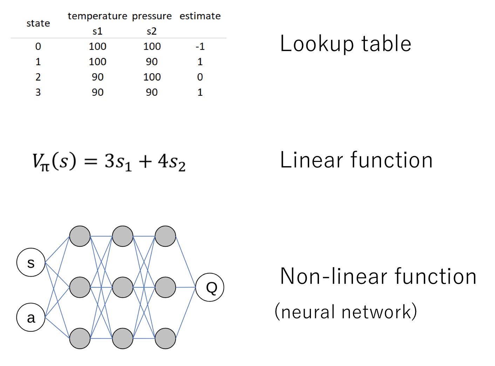

---
### Lookup tables
Two dimensions in the state variable

`state = np.array([temperature, pressure])`

|state |temperature | pressure | estimate |
|---|
|0   |high   |high   |unsafe   |
|1   |low   |high   |safe   |
|2  |high   |low   |safe   |
|3   |low   |low   |very safe   |

---
### Lookup tables

**Advantages**

Stability

Each estimate is independent of every other estimate

**Disadvantages**

No sharing of knowledge between similar states/actions

Curse of dimensionality

High dimensional state/action spaces means lots of entries

---
### Linear functions

$$ V(s) = 3s_1 + 4s_2 $$

**Advantages**

Less parameters than a table

Can generalize across states

**Disadvantages**

The real world is often non-linear

---

###  Non-linear functions

Most commonly neural networks

**Advantages**

Model complex dynamics

Convolution for vision

Recurrency for memory / temporal dependencies

**Disadvantages**

Instability

Difficult to train

---
### IID

Fundamental assumption in statistical learning

**Independent and identically distributed**

In statistical learning one always assumes the training set is independently drawn from a fixed distribution

---

## one
### nomenclature & statistics background
### a few things about training neural networks

---
### A few things about training neural networks

Learning rate

Batch size

Scaling / preprocessing

Larger batch size
- larger learning rate
- decrease in generalization
- increase in batch normalization performance

---
### Learning rate

Controls the strength of weight updates performed by the optimizer (SGD, RMSprop, ADAM etc)

$$ \theta^{t+1} = \theta^{t} - \alpha \frac{\partial E(x, \theta^{t})}{\partial \theta} $$

where $E(x, \theta^{t})$ is the error backpropagated from sample $x$

Small learning rate
- slow training

High learning rate
- overshoot or divergence

---
### Learning rate

Always intentionally set it

```python
from keras.models import Sequential

#  don't do this!
model.compile(optimizer='rmsprop', loss='mse')

#  do this
from keras.optimizers import RMSprop
opt = RMSprop(lr=0.001)
model.compile(optimizer=opt, loss='mse')
```

---
### Batch size

Modern reinforcement learning trains neural networks using batches of samples

Below we have a dataset with four samples, of shape (14, 2)

`>>> import numpy as np`

`>>> data = np.arange(4*28).reshape(4, -1, 2)`

`>>> data.shape`

`(4, 14, 2)`

The first dimension is the batch dimension - this is foundational in TensorFlow

`tf.placeholder(shape=(None, 14, 2))`

Passing in `None` allows us to use whatever batch size we want

---
### Batch size

Smaller batches can fit onto smaller GPUs
- if a large sample dimension we can use less samples per batch

Batches allow us to learn faster
- weights are updated more often during each epoch

Batches give a less accurate estimate of the gradient
- this noise can be useful to escape local minima

Larger batch size -> larger learning rate
- more accurate estimation of the gradient (better distribution across batch)
- we can take larger steps

---

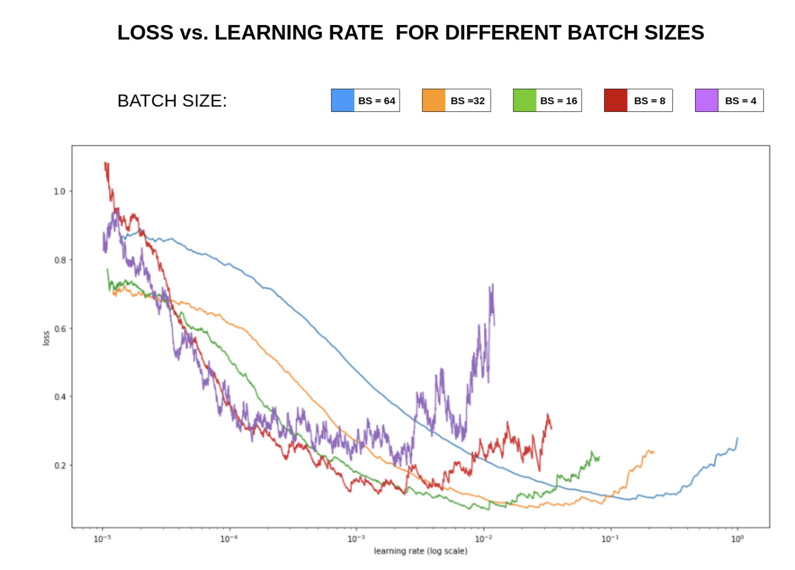

<div class="image_footer">https://miguel-data-sc.github.io/2017-11-05-first/</div>

---
### Batch size

Observed that larger batch sizes decrease generalization performance

Poor generalization  due to large batches converging to *sharp minimizers*

- areas with large positive eigenvalues $ \nabla^{2} f(x) $
- Hessian matrix (matrix of second derivatives) where all eigenvalues positive = positive definite = local minima

Batch size is a **hyperparameter that should be tuned**

---
### Scaling aka pre-processing

Neural networks don't like numbers on different scales
- improperly scaled inputs or outputs can cause issues with gradients
- anything that touches a neural network needs to be within a reasonable range

We can estimate statistics like min/max/mean from the training set
- these statistics are as much a part of the ML model as weights
- in reinforcement learning we have no training set

---
### Scaling aka pre-processing

**Standardization** = removing mean & scale by unit variance

$$ \phi(x) = x - \frac{\mu(x)}{\sigma(x)} $$

Our data now has mean of 0, variance of 1

**Normalization** = min/max scaling

$$ \phi(x) = \frac{x - x\_{min}}{x\_{max} - x\_{min}} $$

Our data is now between 0 and 1

---


---
### Batch normalization

Batch norm. is additional preprocessing of data as it moves between network layers
- used in very deep convolutional/residual nets

We use the mean and variance of the batch to normalize activations
- standardization is actually used!
- reduces sensitivty to weight & bias initialization
- allows higher learning rates
- originally applied before the activation - but this is a topic of debate

[Batch normalization before or after relu - Reddit](http://www.reddit.com/r/MachineLearning/comments/67gonq/d_batch_normalization_before_or_after_relu/)

[Ian Goodfellow Lecture (3:20 onward)](http://www.youtube.com/watch?time_continue=385&v=Xogn6veSyxAppl)

---
### Batch renormalization

Vanilla batch norm. struggles with small or non-iid batches

- the estimated statistics are worse
- vanilla batch norm. uses two different methods for normalization during training & testing
- batch renormalization uses a single algorithm for both training & testing

---
## two
### introduction to reinforcement learning
### four central challenges
### Markov Decision Processes

---
### Related methods

**Evolutionary methods**
- better able to deal with sparse error signals
- eaisly parallelizable
- tend to perform better that RL if state variable is hidden

**Cross entropy method** is often reccomended as an alternative

Constrained optimization such as **linear programming**

Any other **domain specific** algorithm for your problem

---
### Machine learning


---
###  Reinforcement learning is not

NOT an alternative method to use instead of a random forest, neural network etc

“I’ll try to solve this problem using a convolutional nn or RL” **this is nonsensical**

Neural networks (supervised techniques in general) are a tool that reinforcement learners can use to learn or approximate functions
- classifier learns the function of image -> cat
- regressor learns the function of market_data -> stock_price

---
###  Deep reinforcement learning

**Deep learning**
- neural networks with multiple layers

**Deep reinforcement learning**
- using multiple layer networks to approximate policies or value functions
- feedforward
- convolutional
- recurrent

---
### Model free reinforcment learning

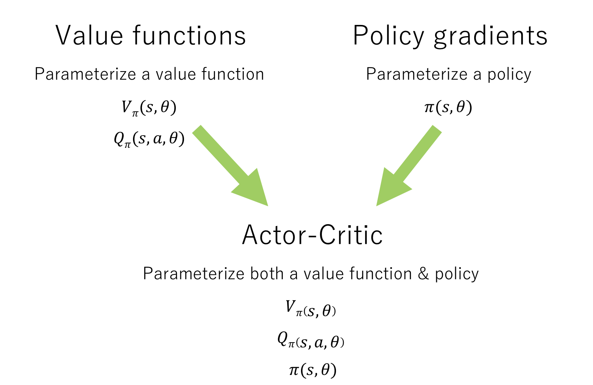

---
###  Applications

RL is **decision making**

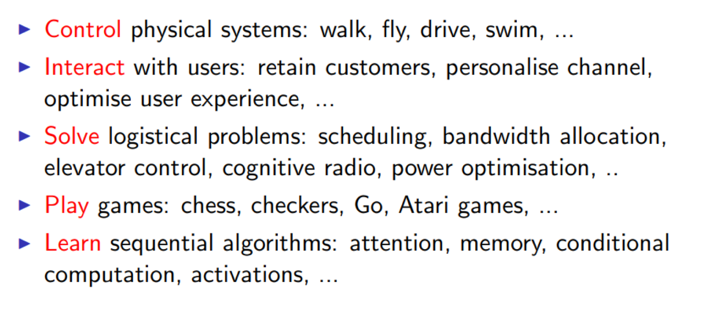

[*David Silver – Deep Reinforcement Learning*](http://www0.cs.ucl.ac.uk/staff/d.silver/web/Resources_files/deep_rl.pdf)

---
###  Biological inspiration

Sutton & Barto - Reinforcment Learning: An Introduction
>Of all the forms of machine learning, reinforcement learning is the closest to the kind of learning that humans and other animals do, and many of the core algorithms of reinforcement learning were originally inspired by biological learning systems

Mnih et. al (2015) Human-level control through deep reinforcement learning
>Neurobiological evidence that reward signals during perceptual learning may influence the characteristics of representations within the primate visual cortex

---
###  A new level of intelligence

Founder & CEO of DeepMind Demis Hassabis on the brilliance of AlphaGo in it's 2015 series

<iframe width="854" height="480" src="https://www.youtube.com/embed/i3lEG6aRGm8?start=1632" frameborder="0" allow="autoplay; encrypted-media" allowfullscreen></iframe>

---

Reinforcement learning is **learning through action to maximize reward**

---

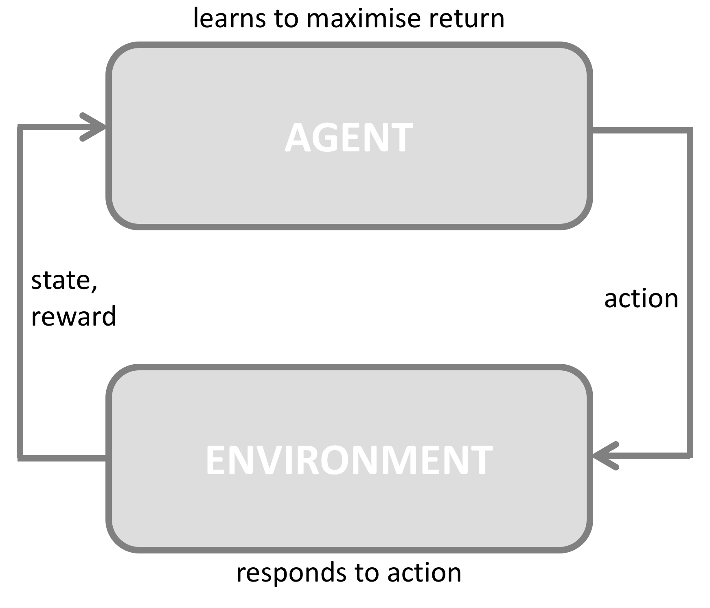

---

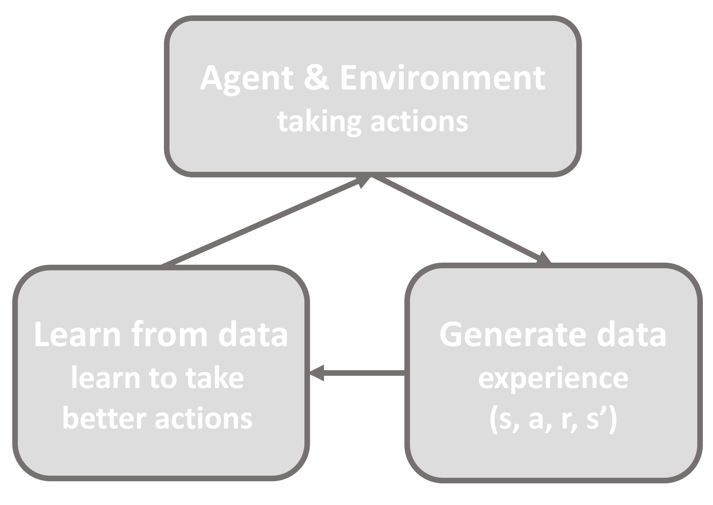

---
### Contrast with supervised learning

Supervised learning
- are given a dataset with labels
- we are constrained by this dataset
- test on unseen data

Reinforcement learning
- are given no dataset and no labels
- we can generate more data by acting
- test using the same environment

Data in RL
- the agent's experience $(s,a,r,s')$
- it's not clear what we should do with this data
- no implicit target

---
### Reinforcement learning dataset

The dataset we generate is the agent's memory

$$[experience,$$
$$experience,$$
$$...$$
$$experience]$$

$$[(s\_{0}, a_0, r_1, s_1), $$
$$(s_1, a_1, r_2, s_2), $$
$$...$$
$$(s_n, a_n, r_n, s_n)] $$

What should we do with this dataset?

---
## two
### introduction to reinforcement learning
### four central challenges
### Markov Decision Processes

---
### Four central challenges

one - exploration vs exploitation

two - data quality

three - credit assignment

four - sample efficiency

---
### Exploration vs exploitation
Do I go to the restaurant in Berlin I think is best – or do  I try something new?

- exploration = finding information
- exploitation = using information

Agent needs to balance between the two
- we don't want to waste time exploring poor quality states
- we don't want to miss high quality states

---
### Exploration vs exploitation

How stationary are the environment state transition and reward functions?

How stochastic is my policy?

Design of reward signal vs. exploration required

Time step matters
- too small = rewards are delayed = credit assignment harder
- too large = coarser control

---
### Data quality

iid = independent sampling & identical distribution

RL breaks both in multiple ways

**Independent sampling**

- all the samples collected on a given episode are correlated (along the state trajectory)
- our agent will likely be following a policy that is biased (towards good states)

**Identically distributed**

- learning changes the data distribution
- exploration changes the data distribution
- environment can be non-stationary

---

Reinforcement learning will **always** break supervised learning assumptions about data quality

---
###  Credit assignment

The reward we see now might not be because of the action we just took

Reward signal can be
- **delayed** - benefit/penalty of action only seen much later
- **sparse** - experience with reward = 0

Can design a more dense reward signal for a given environment
- reward shaping
- changing the reward signal can change behaviour

---
### Sample efficiency
How quickly a learner learns

How often we reuse data
- do we only learn once or can we learn from it again
- can we learn off-policy

How much we squeeze out of data
- i.e. learn a value function, learn a environment model

Requirement for sample efficiency depends on how expensive it is to generate data
- cheap data -> less requirement for data efficiency
- expensive / limited data -> squeeze more out of data

---
### Four challenges
**exploration vs exploitation**

how good is my understanding of the range of options

**data**

biased sampling, non-stationary distribution

**credit assignment**

which action gave me this reward

**sample efficiency**

learning quickly, squeezing information from data

---
## two
### introduction to reinforcement learning
### four central challenges
### Markov Decision Processes

---
### Markov Decision Processes

Mathematical framework for reinforcement learning

### Markov property

Can be a requirement to gurantee convergence

Future is conditional only on the present

Can make prediction or decisions using only the current state

Any additional information about the history of the process will not improve our decision

$$ P(s\_{t+1} | s\_{t}, a\_{t}) = P(s\_{t+1}|s\_t,a\_t...s\_0,a\_0)$$

---
### Formal definition of a MDP

An MDP can be defined a tuple

$$ (\mathcal{S}, \mathcal{A}, \mathcal{R}, P, R, d_0, \gamma) $$

Set of states $\mathcal{S}$

Set of actions $\mathcal{A}$

Set of rewards $\mathcal{R}$

State transition function $ P(s'|s,a) $

Reward transition function $ R(r|s,a,s') $

Distribution over initial states $d_0$

Discount factor $\gamma$

---
### Object oriented definition of a MDP

Two objects - the agent and environment

Three signals - state, action & reward

`class Agent`

`class Environment`

`state = env.reset()`

`action = agent.act(state)`

`reward, next_state = env.step(action)`

---
### Environment

Real or virtual
- modern RL uses virtual environments to generate lots of experience

Each environment has a state space and an action space
- these spaces can be discrete or continuous

Environments can be
- episodic (finite length, can be variable or fixed length)
- non-episodic (infinite length)

The MDP framework unites both in the same way by using the idea of a final absorbing state at the end of episodes

---
### Discretiziation

Too coarse
- non-smooth control output

Too fine
- curse of dimensionality
- computational expense

Requires some prior knowledge

Lose the shape of the space

---
### State

Infomation for the agent to **choose next action** and to **learn from**

State is a flexible concept - it's a n-d array

`state = np.array([temperature, pressure])`

`state = np.array(pixels).reshape(height, width)`

---
### Observation

Many problems your agent won't be able to see everything that would help it learn - i.e. non-Markov

This then becomes a POMDP - partially observed MDP

``` python
state = np.array([temperature, pressure])

observation = np.array([temperature + noise])
```
Observation can be made more Markov by
- concatenating state trajectories together
- using function approximation with a memory element (LSTMs)

---
### Agent

Our agent is the **learner and decision maker**

It's goal is to maximize total discounted reward

An agent always has a policy

### Reward

Scalar

Delayed

Sparse

A well defined reward signal is a limit for applying RL

---
### Reward hypothesis

Maximising expected return is making an assumption about the nature of our goals

*Goals can be described by the maximization of expected cumulative reward*

Do you agree with this?
- happiness
- status
- reputation

Think about the role of emotion in human decision making.  Is there a place for this in RL?

---
### Reward engineering

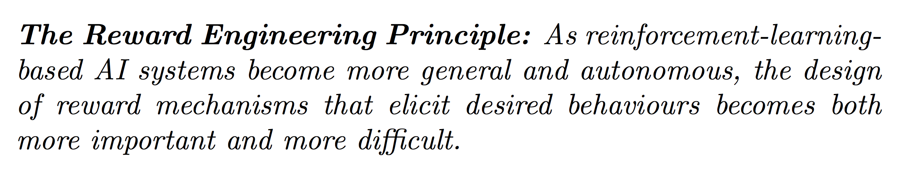

[Reinforcement Learning and the Reward Engineering Principle](http://www.danieldewey.net/reward-engineering-principle.pdf)

---
### Policy $\pi(s)$

$$\pi(s)$$

$$\pi(s,a|\theta)$$

$$\pi_\theta(s|a)$$

A policy is rules to select actions
- act randomly
- always pick a specific action
- the optimal policy - the policy that maximizes future reward

Policy can be
- parameterized directly (policy gradient methods)
- generated from a value function (value function methods)

Deterministic or stochastic

---

### On versus off policy learning

On policy
- learn about the policy we are using to make decisions

Off policy
- evaluate or improve one policy while using another to make decisions

Control can be on or off policy
- use general policy iteration to improve a policy using an on-policy approximation
---

### Why would we want to learn off-policy?

We can learn about policies that we don't have
- learn the optimal policy from data generated by a random policy

We can reuse data
- on-policy algorithms have to throw away experience after the policy is improved

> Maybe the lesson we need to learn from deep learning is large capacity learners with large and diverse datasets - Sergey Levine

---
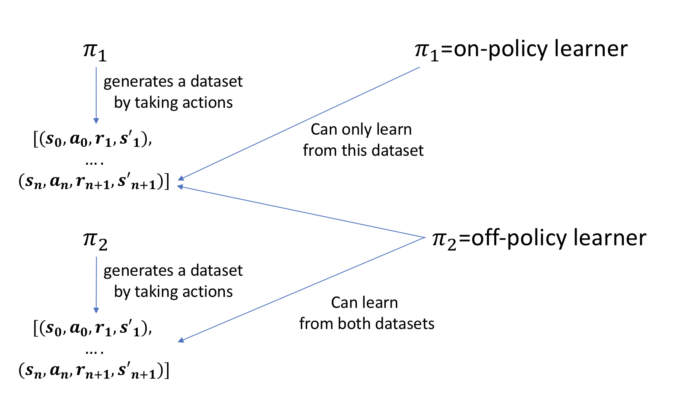

---
### Environment model

Our agent can learn an environment model

Predicts environment response to actions
- predicts $s', r$ from $s, a$

```python
def model(state, action):

    # do stuff

    return next_state, reward
```

Sample vs. distributional model

Model can be used to simulate trajectories for **planning**

---

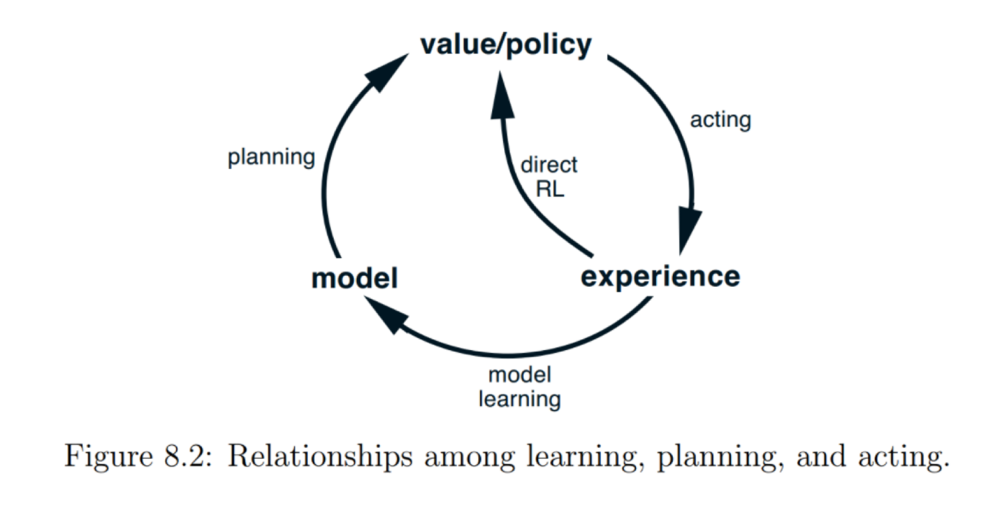

---


---

### Return

Goal of our agent is to maximize reward

Return ($G_t$) is the total discounted future reward

$$G\_t = r\_{t+1} + \gamma r\_{t+2} + \gamma^2 r\_{t+3} + ... = \sum\_{k=0}^{\infty} \gamma^k r\_{t+k+1}$$

` reward + discount * reward + discount^2 * reward ...`

**Why do we discount future rewards?**

---
### Discounting

Future is uncertain
- stochastic environment

Matches human thinking
- hyperbolic discounting

Finance
- time value of money

Makes the maths works
- return for infinite horizon problems finite
- discount rate is $[0,1)$
- can make the sum of an infinite series finite
- geometric series

---
### Discounting

Can use discount = 1 for
- games with tree-like structures (without cycles)
- when time to solve is irrelevant (i.e. a board game)

---
## three
### value functions
### Bellman Equation
### approximation methods
### SARSA & Q-Learning
### DQN

---
### Value function

<center>$V_\pi(s)$</center>

<center>how good is this state</center>

<br> </br>

### Action-value function

<center>$Q_\pi(s,a)$</center>

<center>how good is this action</center>

---
### Value function

<center>$ V_{\pi}(s) = \mathbf{E}[G_t | s_t] $ </center>

<center>Expected return when in state $s$, following policy $\pi$</center>

<br> </br>

### Action-value function

<center> $ Q_{\pi}(s,a) = \mathbf{E}[G_t | s_t, a_t] $ </center>

<center>Expected return when in state $s$, taking action $a$, following policy $\pi$</center>

---
### Value functions are oracles

Prediction of the future
- predict expected future discounted reward
- always conditioned on a policy

We don’t know this function
- agent must learn it
- once we learn it – how will it help us to act?

---
### Using a value function

- given the optimal value function $Q_*(s,a)$

- we are in state $s$

- our set of actions $\mathcal{A} = \{a_1, a_2, a_3\}$

How can we act?

- use the value function to determine which action has the highest expected return

- select the action with the largest $Q(s,a)$ - ie take the $\underset{a}{\arg\max} Q(s,a)$

This is known as a *greedy policy*

---
### Using a value function

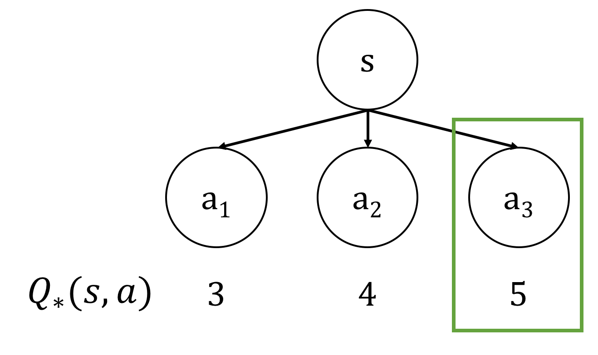
---
``` python
def greedy_policy(state):

    #  get the Q values for each state_action pair
    q_values = value_function.predict(state)

    # select action with highest Q
    action = np.argmax(q_values)

    return action
```

---
### Prediction versus control

Prediction / approximation
- predicting return for given policy

Control
- the optimal policy
- the policy that maximizes expected future discounted reward

---
### Value function approximation

To approximate a value function we can use one of the methods we looked at in the first section
- lookup table
- linear function
- non-linear function

Linear functions are appropriate with some agents or environments

Modern reinforcement learning is based on using neural networks

---
## three
### value functions
### Bellman Equation
### approximation methods
### SARSA & Q-Learning
### DQN

---
### Richard Bellman


Invented dynamic programming in 1953.

Also introduced the curse of dimensionality
- number of states $\mathcal{S}$ increases exponentially with number of dimensions in the state

---

*[On the naming of dynamic programming](ttp://arcanesentiment.blogspot.com.au/2010/04/why-dynamic-programming.html)*

> I was interested in planning, in decision making, in thinking. But planning, is not a good word for various reasons. I decided therefore to use the word, ‘programming.’ I wanted to get across the idea that this was dynamic, this was multistage, this was time-varying...

---
###  Bellman Equation

Bellman's contribution is remembered by the Bellman Equation

$$ G\_{\pi}(s) = r + \gamma G\_{\pi}(s') $$

The Bellman equation relates the expected discounted return of the **current state** to the discounted value of the **next state**

The Bellman equation is a recursive definition - it is bootstrapped

We can apply it to value functions

$$ V\_{\pi}(s) = r + \gamma V\_{\pi}(s') $$

$$ Q\_{\pi}(s,a) = r + \gamma Q\_{\pi}(s', a') $$

---
### How do we use the Bellman Equation?

Create **targets for learning**
- train a neural network by minimizing the difference between the network output and the correct target

- improve our approximation of a value function we need to create a targets for each sample of experience

- minimize a loss function

$$ loss = target - approximation $$

For an experience sample of $(s, a, r, s')$

$$ loss = r + Q(s',a) - Q(s,a) $$

This is also known as the **temporal difference error**

---
## three
### value functions
### Bellman Equation
### approximation methods
### SARSA & Q-Learning
### DQN

---
### Approximation methods

Look at three different methods for approximation

1. dynamic programming
2. Monte Carlo
3. temporal difference

We are **creating targets** to learn from

Policy improvement can be done by either policy iteration or value iteration for all of these different approximation methods

---
### Dynamic programming

Imagine you had a perfect environment model

- the state transition function $ P(s'|s,a) $
- the reward transition function $ R(r|s,a,s') $

Can we use our perfect environment model for value function approximation?

---

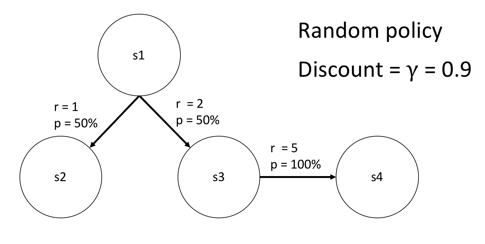

Note that the probabilities here depend both on the environment and the policy

---
### Dynamic programming backup

We can perform iterative backups of the expected return for each state

The return for all terminal states is zero

$$V(s_2) = 0$$

$$V(s_4) = 0$$

We can then express the value functions for the remaining two states

$$V(s\_3) = P\_{34}[r\_{34} + \gamma V(s\_4)]$$

$$V(s\_3) = 1 \cdot [5 + 0.9 \cdot 0] = 5 $$

$$V(s\_1) = P\_{12}[r\_{12} + \gamma V(s\_2) + P\_{13}[r\_{13} + \gamma V(s\_3)]$$

$$V(s\_1) = 0.5 \cdot [1 + 0.9 \cdot 0] + 0.5 \cdot [2 + 0.9 \cdot 5] = 3.75 $$

---
### Dynamic programming

Our value function approximation depends on
- our policy (what actions we pick)
- the environment (where our actions take us and what rewards we get)
- our current estimate of $V(s')$

A dynamic programming update is expensive
- our new estimate $V(s)$ depends on the value of all other states (even if the probability is zero)

Asynchronous dynamic programming addresses this by updating states in an arbitrary order

---
### Dynamic programming summary

Requries a **perfect environment model**

- we don't need to sample experience at all
- we don't ever actually take actions - we just need the policy

We make **full backups**
- the update to the value function is based on the probability distribution over all possible next states

**Bootstrapped**
- we use the recursive Bellman Equation to update our value function

Limited utility in practice but they provide an **essential foundation** for understanding reinforcement learning
- all RL can be thought of as attempts to achieve what DP can but without a model and with less computation

---
### Monte Carlo

Monte Carlo methods = finding the expected value of a function of a random variable

**No model**
- we learn from actual experience

We can also learn from **simulated experience**
- we don't need to know the whole proability distribution
- just be able to generate sample trajectories

**No boostrapping**
- we take the average of the true discounted return

**Episodic only**
- because we need to calcuate the true discounted return

---
### Monte Carlo approximation

Estimate the value of a state by averaging the true discounted return observed after each visit to that state

As we run more episodes, our estimate should converge to the true expectation

Low bias & high variance - why?

---

### Bias & variance of Monte Carlo

High variance
- we need to sample enough episodes for our averages to converge
- can be a lot for stochastic or path dependent environments

Low bias
- we are using actual experience
- no chance for a bootstrapped function to mislead us

---
### Monte Carlo algorithm

Algorithm for a lookup table based Monte Carlo approximation

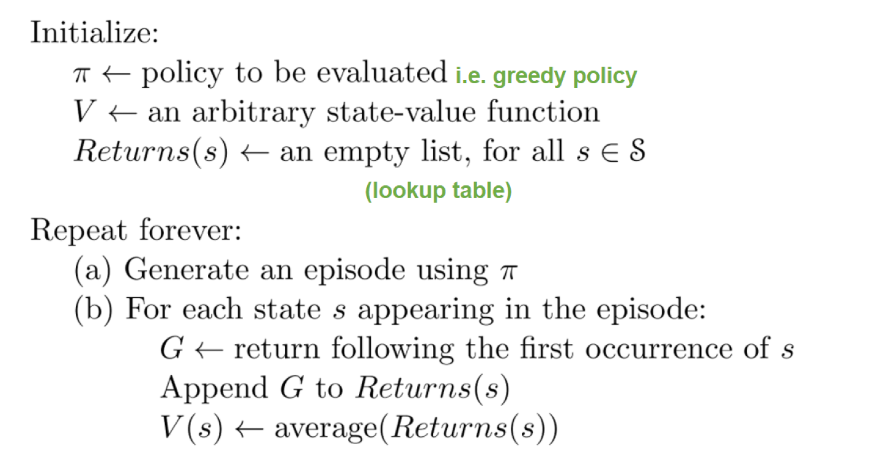

---
###  Interesting feature of Monte Carlo

Computational expense of estimating the value of state $s$ is independent of the number of states $\mathcal{S}$

This is because we use experienced state transitions

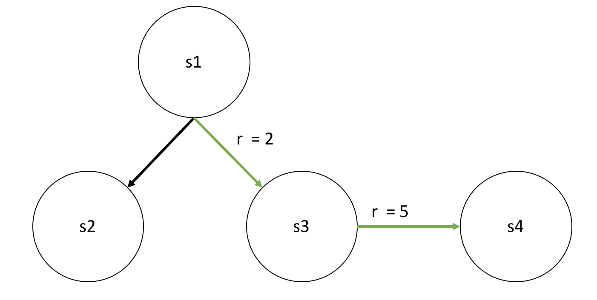

---
### Monte Carlo

Learn from **actual or simulated experience**
- no environment model

**No bootstrapping**
- use true discounted returns sampled from the environment

**Episodic problems only**
- no learning online

Ability to **focus** on interesting states and ignore others

High variance & low bias

---
### Temporal difference

Learn from **actual experience**
- like Monte Carlo
- no environment model

**Bootstrap**
- like dynamic programming
- learn online

Episodic & non-episodic problems

---
### Temporal difference

Use the Bellman Equation to approximate $V(s)$ using $V(s')$

**Temporal difference error**

$$ \text{TD error} = r + \gamma V(s') - V(s) $$

Update rule for a table TD(0) approximation

$$ V(s_t) \leftarrow V(s_t) + \alpha [R_{t+1} + \gamma \cdot V(s_{t+1}) - V(s_t)] $$

---
### Temporal difference backup


$$ V(s\_1) \leftarrow V(s\_1) + \alpha [ r\_{23} + \gamma V(s\_3) - V(s\_1) ] $$

---
### You are the predictor

Example 6.4 from Sutton & Barto

Imagine you observe the following episodes

- format of (State Reward, State Reward)
- i.e. A 0 B 0 = state A, reward 0, state B, reward 0

| Episode | Count |
|---|---|
|A 0, B 0| 1 |
|B 1 | 6 |
|B 0 | 1 |

What are the optimal predictions for $V(A)$ and $V(B)$?

---
### You are the predictor

We can estimate the expected return from state $B$ by averaging the rewards

$$V(B) = 6/8 \cdot 1 + 2/6 \cdot 0 = 3/4 $$

What about $V(A)$?

- We observed that every time we were in $A$ we got $0$ reward and ended up in $B$
- Therefore $V(A) = 0 + V(B) = 3/4$

or

- We observed a discounted return of $0$ each time we saw $A$
- therefore $V(A) = 0$

Which is the Monte Carlo approach, which is the TD approach?

---
### You are the predictor

Estimating $V(A) = 3/4$ is the answer given by TD(0)

Estimtating $V(A) = 0$ is the answer given by Monte Carlo

The MC method gives us the lowest error on fitting the data (i.e. minimizes MSE)

The TD method gives us the **maximum-likelihood estimate**

---
### You are the predictor

The maximum likelihood estimate of a parameter is the parameter value whose probabilty of generating the data is greatest

We take into account the transition probabilities, which gives us the **certanitiy equivilance estimate** - which is the estimate we get when assuming we know the underlying model (rather than approximating it)


---
### Generalized policy iteration

Letting policy evaluation and improvement processes interact

Policy iteration
- sequence of approximating value function then making policy greedy wrt value function

Value iteration
- single iteration of policy evaluation done inbetween each policy improvement

Both of these can achieve the same result

The policy and value functions interact to move both towards their optimal values - this is one source of non-stationary learning in RL

---
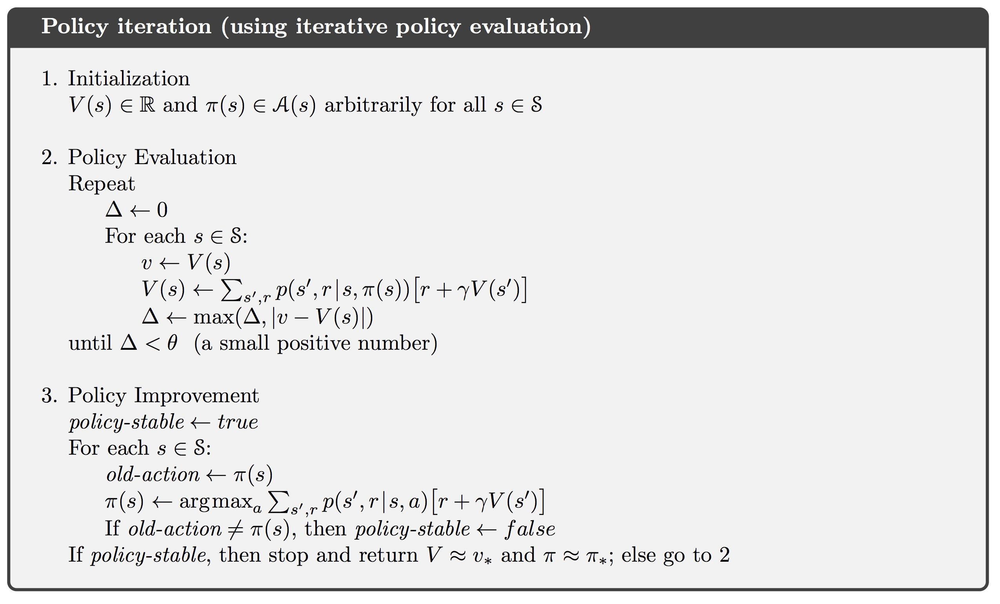

<div class="image_footer">Sutton & Barto</div>

---
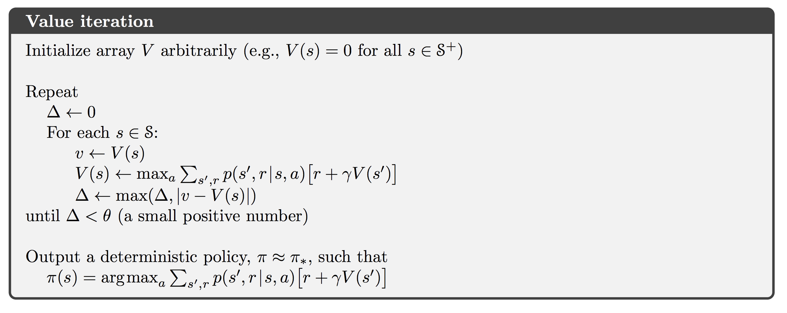

<div class="image_footer">Sutton & Barto</div>

---

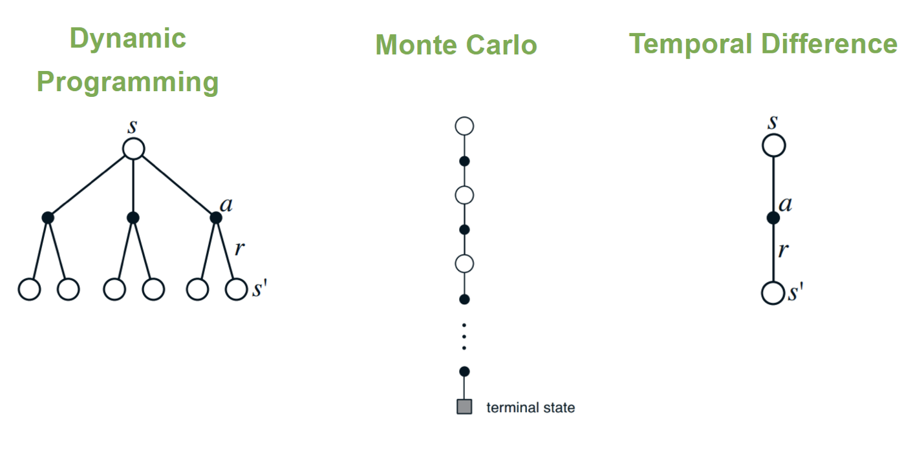

<div class="image_footer">Sutton & Barto</div>

---
## three
### value functions
### Bellman Equation
### approximation methods
### SARSA & Q-Learning
### DQN

---

### SARSA & Q-Learning

Approximation is a tool - **control** is what we really want

SARSA & Q-Learning are both based on the **action-value function** $Q(s,a)$

The practical today is based on DQN - the DeepMind implementation of Q-Learning

Why might we want to learn $Q(s,a)$ rather than $V(s)$?

---
### $V(s)$ versus $Q(s,a)$

Imagine a simple MDP

$$ \mathcal{S} = \{s_1, s_2, s_3\} $$

$$ \mathcal{A} = \{a_1, a_2\} $$

Our agent finds itself in state $s_2$

We use our value function $V(s)$ to calculate

$$V(s_1) = 10$$
$$V(s_2) = 5$$
$$V(s_3) = 20$$

Which action should we take?

---
### $V(s)$ versus $Q(s,a)$

Now imagine we had

$$Q(s\_{2}, a\_1) = 40$$

$$Q(s\_{2}, a\_2) = 20$$

It's now easy to pick the action that maximizes expected discounted return

$V(s)$ tells us how good a state is.  We require the state transition probabilities for each action to use $V(s)$ for control

$Q(s,a)$ tells us how good an **action** is

---
### SARSA

SARSA is an **on-policy** control method
- we approximate the policy we are following
- we improve the policy by being greedy wrt to our approximation

We use every element from our experience tuple $(s,a,r,s')$
- and also $a'$ - the next action selected by our agent

$$Q(s,a) \leftarrow Q(s,a) + \alpha [r + \gamma Q(s', a') - Q(s,a)] $$

Why is SARSA on-policy?

---
### SARSA

SARSA is on-policy because we learn about the action $a'$ that our agent choose to take

Our value function is always for the policy we are following
- the state transition probabilities depend on the policy

But we can improve it using general policy iteration (GPI)
- approximate $Q(s,a)$ for our current policy
- act greedily towards this approximation of $Q(s,a)$
- approximate $Q(s,a)$ for our new experience
- act greedily towards this new approximation
- repeat

---
### Q-Learning

Q-Learning allows **off-policy control**
- use every element from our experience tuple $(s,a,r,s')$

We take the **maximum over all possible next actions**
- we don't need to know what action our agent took next (i.e. $a'$)

This allows us to learn the optimal value function while following a sub-optimal policy

$$Q(s,a) \leftarrow Q(s,a) + \alpha [r + \gamma \underset{a}{\max} Q(s', a) - Q(s,a)] $$

Don't learn $Q_{\pi}$ - learn $Q^*$ (the optimal policy)

---

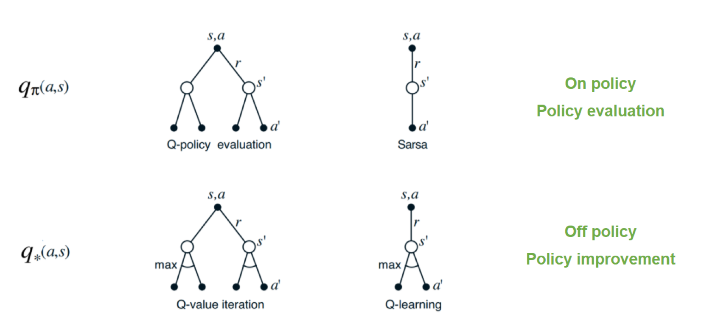

---
### Q-Learning

Selecting optimal actions in Q-Learning can be done by an $argmax$ across the action space

$$action = \underset{a}{argmax}Q(s,a)$$

The $argmax$ limits Q-Learning to **discrete action spaces only**

For a given approximation of $Q(s,a)$ acting greedy is deterministic

How then do we explore the environment?

---
### $\epsilon$-greedy exploration

A common exploration stragety is the **epsilon-greedy policy**

```
def epsilon_greedy_policy():
    if np.random.rand() < epsilon:
        #  act randomly
        action = np.random.uniform(action_space)

    else:
        #  act greedy
        action = np.argmax(Q_values)

    return action
```

$\epsilon$ is decayed during experiments to explore less as our agent learns (i.e. to exploit)

---
### Exploration strageties

Boltzmann (a softmax)
- temperature being annealed as learning progresses

Bayesian Neural Network
- a network that maintains distributions over weights -> distribution over actions
- this can also be performed using dropout to simulate a probabilistic network

Parameter noise
- adding adaptive noise to weights of network

[Action-Selection Strategies for Exploration](https://medium.com/emergent-future/simple-reinforcement-learning-with-tensorflow-part-7-action-selection-strategies-for-exploration-d3a97b7cceaf)

[Plappert et al. (2018) Paramter Space Noise for Exploration](https://arxiv.org/pdf/1706.01905.pdf)

---?image=assets/images/section_3/action_selection_exploration.png&size=60%

---
### Problems with vanilla Q-Learning

Correlations in our dataset (the list of experience tuples)
- combine this with bootstrapping and instability occurs

Small changes $Q(s,a)$ estimates can drastically change the policy

$$Q(s_1, a_1) = 10 $$
$$Q(s_1, a_2) = 11 $$

Then we do some learning and our estimates change

$$Q(s_1, a_1) = 12 $$
$$Q(s_1, a_2) = 11 $$

Now our policy is completely different!

---
### Deadly triad

Sutton & Barto discuss the concept of the **deadly triad**

Three mechanisms that combine to produce instability and divergence

1. off-policy learning - to learn about the optimal policy while following an exploratory policy

2. function approximation - for scalability and generalization

3. bootstrapping - computational & sample efficiency

---
### Deadly triad

It's not clear what causes instability
- dynamic programming can diverge with function approximation (so even on-policy learning can diverge)
- prediction can diverge
- linear functions can be unstable

Divergence is an emergent phenomenon

Up until 2013 the deadly triad caused instability when using Q-Learning with complex function approximators (i.e. neural networks)

Then came DeepMind & DQN

---
## three
### value functions
### Bellman Equation
### approximation methods
### SARSA & Q-Learning
### DQN

---
### DQN

In 2013 a small London startup published a paper
- an agent based on Q-Learning
- superhuman level of performance in three Atari games

In 2014 Google purchased DeepMind for around £400M

This is for a company with
- no product
- no revenue
- no customers
- a few world class employees

---

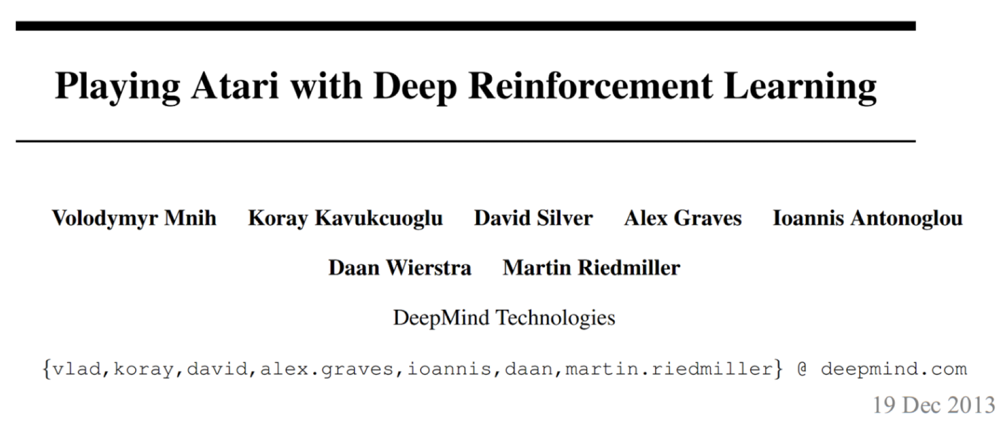
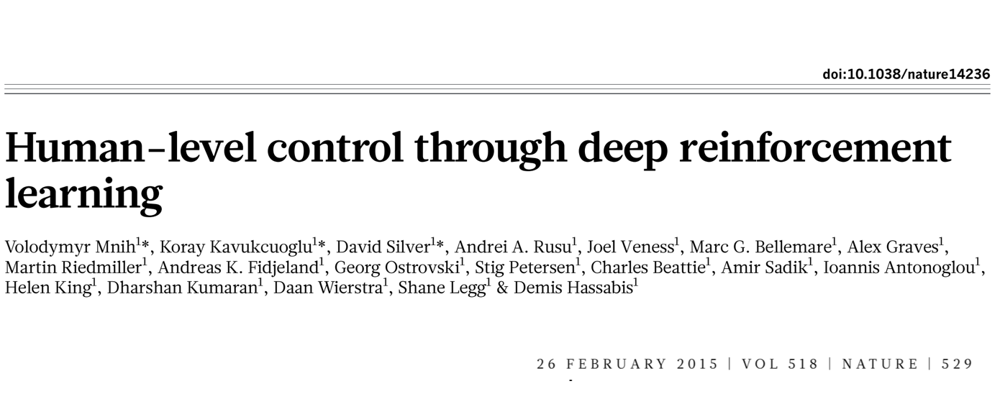

---
### Significance

End to end deep reinforcement learning
- Q-Learning with neural networks was historically unstable

Learning from high dimensional input
- raw pixels

Ability to **generalize**
- same algorithm, network strucutre and hyperparameters

---
### Reinforcement learning to play Atari

**State**

- Last four screens concatenated together
- Allows infomation about movement
- Grey scale, cropped & normalized

**Reward**

- Game score
- Clipped to [-1, +1]

**Actions**

- Joystick buttons (a discrete action space)

---?image=assets/images/section_3/atari_results.png&size=auto 80%

---?image=assets/images/section_3/atari_func.png&size=auto 80%

---?image=assets/images/section_3/atari_sea.png&size=auto 90%

---
### Two key innovations in DQN

Experience replay

Target network

Both improve learning **stability**

---
### Experience replay

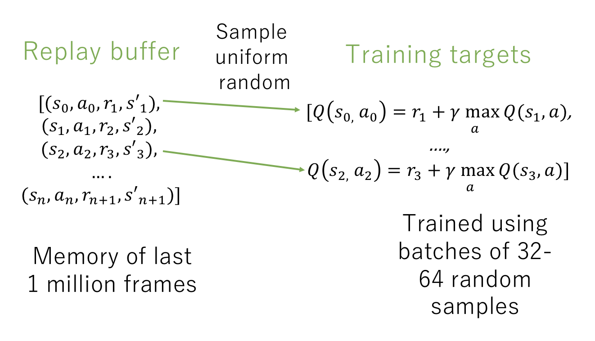

---
### Experience replay

Experience replay helps to deal with our non-iid dataset
- randomizing the sampling of experience -> more independent
- brings the batch distribution closer to the true distribution -> more identical

Data efficiency
- we can learn from experience multiple times

Allows seeding of the memory with high quality experience

---
### Biological basis for experience replay

Hippocampus may support an experience replay process in the brain

Time compressed reactivation of recently experienced trajectories during offline periods

Provides a mechanism where value functions can be efficiently updated through interactions with the basal ganglia

*Mnih et. al (2015)*

---
### Target network

Second innovation behind DQN

Parameterize two separate neural networks (identical structure) - two sets of weights $\theta$ and $\theta^{-}$

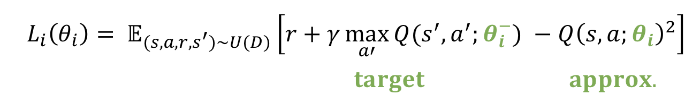

Original Atari work copied the online network weights to the target network every 10k - 100k steps

Can also use a small factor tau ($\tau$) to smoothly update weights at each step

---
### Target network

Changing value of one action changes value of all actions & similar states
- bigger networks less prone (less aliasing aka weight sharing)

Stable training
- no longer bootstrapping from the same function, but from an old & fixed version of $Q(s,a)$
- reduces correlation between the target created for the network and the network itself

---?image=assets/images/section_3/stability.png&size=auto 40%

---?image=assets/images/section_3/DQN_algo.png&size=auto 90%

---

### Huber loss


---
### Timeline

1986 - Backprop by Rumelhart, Hinton & Williams in multi layer nets

1989 - Q-Learning (Watkins)

1992 - Experience replay (Lin)

2010 - Tabular Double Q-Learning

2010's - GPUs used for neural networks

2013 - DQN

2015 - Prioritized experience replay

2016 - Double DQN (DDQN)

2017 - Distributional Q-Learning

2018 - Rainbow

---
## four
### eligibility traces
### prioritized experience replay
### DDQN
### Distributional Q-Learning
### Rainbow

---


<pre class="image_footer">Sutton - The Long-term of AI & Temporal-Difference Learning</pre>

---

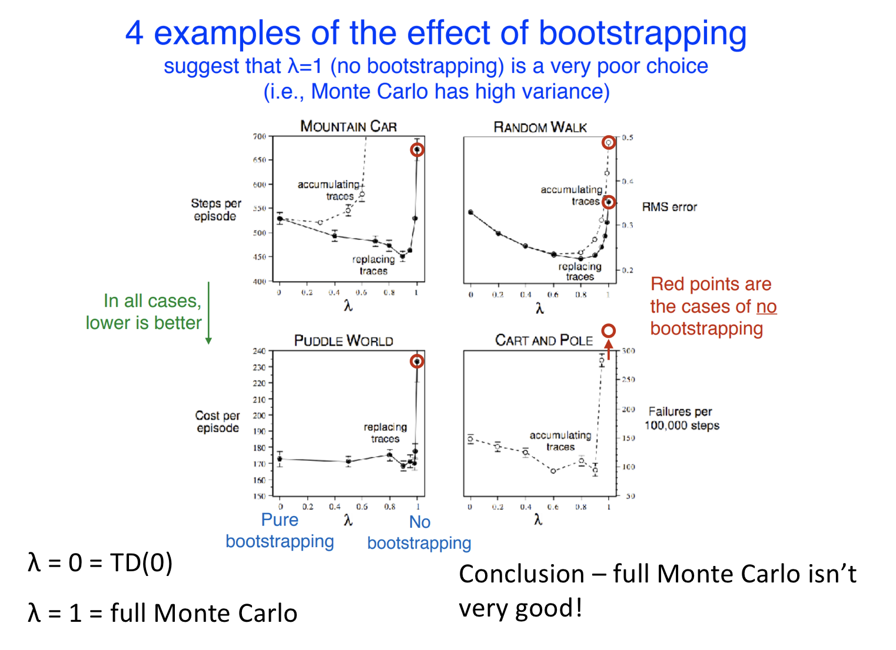

<pre class="image_footer">Sutton - The Long-term of AI & Temporal-Difference Learning</pre>

---

### Eligibility traces

Family of methods between Temporal Difference & Monte Carlo

Eligibility traces allow us to **assign TD errors** to different states
- can be useful with delayed rewards or non-Markov environments
- requires more computation
- squeezes more out of data

Allow us to tradeoff between bias and variance

---

In between TD and MC exist a family of approximation methods known as **n-step returns**

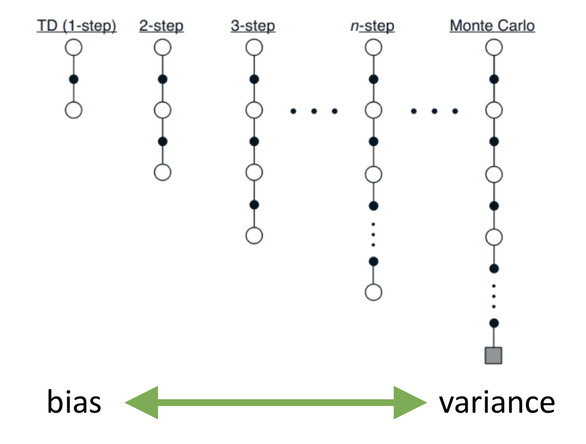

---
### Forward and backward view

We can look at eligibility traces from two perspectives

The **forward** view is helpful for understanding the theory

The **backward** view can be put into practice

---
### The forward view

We can decompose return into **complex backups**
- looking forward to future returns
- can use a combination of experience based and model based backups

$$R\_t = \frac{1}{2} R\_{t}^{2} + \frac{1}{2} R\_{t}^{4} $$

$$R\_t = \frac{1}{2} TD + \frac{1}{2} MC $$

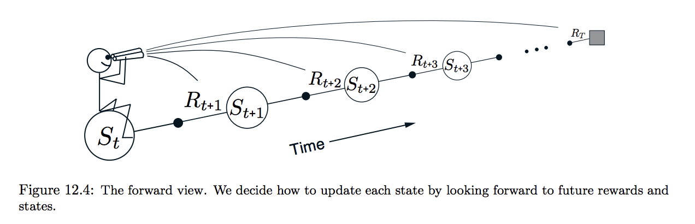

---
### The backward view

The backward view approximates the forward view
- forward view is not practical (requires knowledge of the future)

It requires an additional variable in our agents memory
- **eligibility trace $e_{t}(s)$**

At each step we decay the trace according to

$$ e\_{t}(s) = \gamma \lambda e\_{t-1}(s) $$

Unless we visited that state, in which case we accumulate more eligibility

$$ e\_{t}(s) = \gamma \lambda e\_{t-1}(s) + 1 $$

---
### The backward view

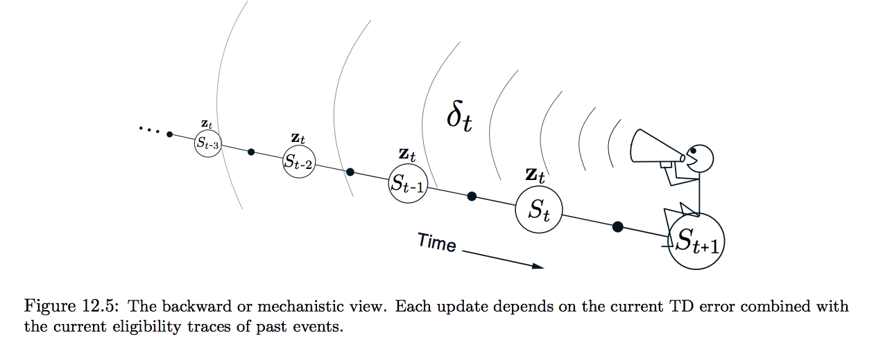

---
### Traces in a grid world

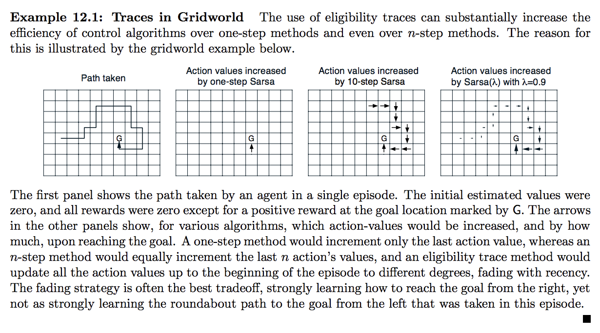

- one step method would only update the last $Q(s,a)$

- n-step method would update all $Q(s,a)$ equally

- eligibility traces updates based on how recently each $Q(s,a)$ was experienced

---
## four
### eligibility traces
### prioritized experience replay
### DDQN
### Distributional Q-Learning
### Rainbow

---
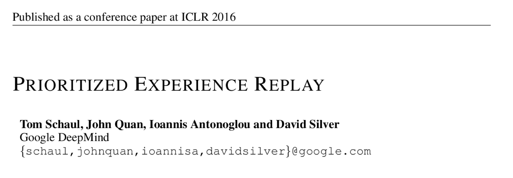

---
### Naive experience replay


---

### Prioritized Experience Replay

Naive experience replay randomly samples experience
- learning occurs at the same frequency as experience

Some experience is more useful for learning than others
- we can measure how useful experience is by the temporal difference error

$$ error = r + \gamma Q(s', a) - Q(s,a) $$

TD error measures suprise
- this transition gave a higher or lower reward than our value function expected

---
### Prioritized Experience Replay

Non-random sampling introduces two problems

1. loss of diversity - we will only sample from high TD error experiences
2. introduce bias - non-independent sampling

Schaul et. al (2016) solves these problems by

1. loss of diversity -> make the prioritization stochastic
2. correct bias -> use importance sampling

---
## four
### eligibility traces
### prioritized experience replay
### DDQN
### Distributional Q-Learing
### Rainbow

---
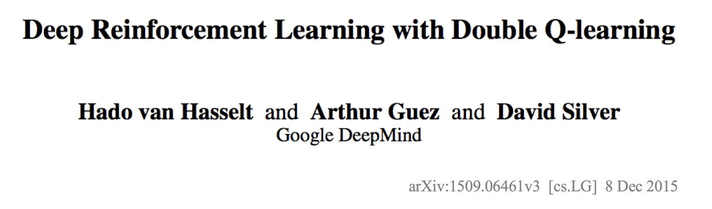
---

### DDQN

DDQN = Double Deep Q-Network
- first introducued in a tabular setting in 2010
- reintroduced in the content of DQN in 2016

DDQN aims to overcome the **maximization bias** of Q-Learning

---
### Maximization bias

Imagine a state where $Q(s,a) = 0$ for all $a$

Our estimates are normally distributed above and below 0

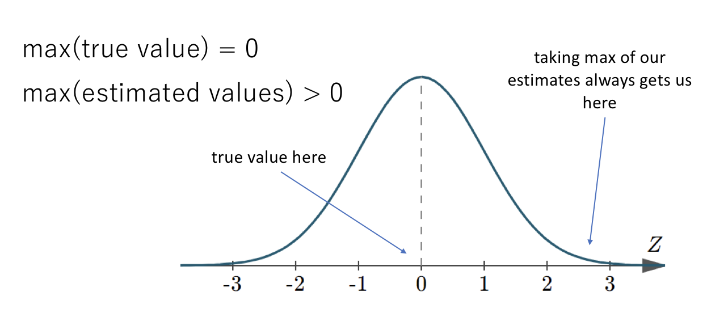

---
### DDQN

The DDQN modification to DQN makes use of the target network as a different function to approximate Q(s,a)

**Original DQN target**
$$ r + \gamma \underset{a}{\max} Q(s,a;\theta^{-}) $$

**DDQN target**
$$ r + \gamma Q(s', \underset{a}{argmax}Q(s',a; \theta); \theta^{-}) $$

- select the action according to the online network

- quanitfy the value that action using the target network

---

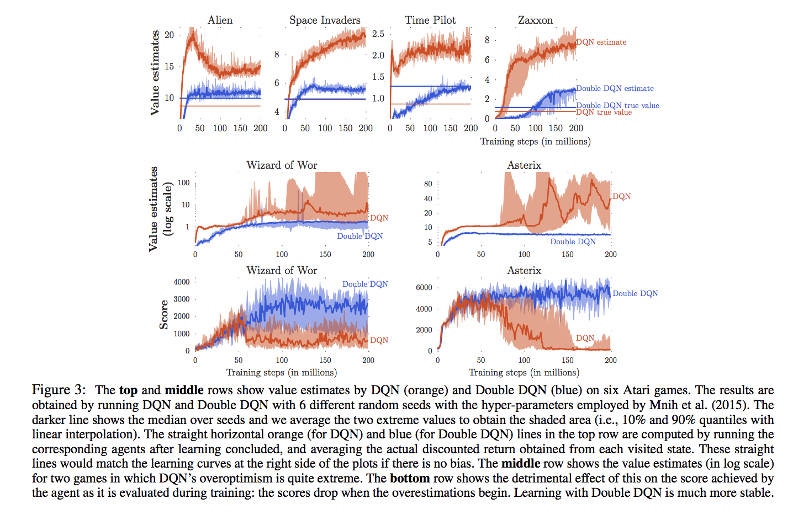

---
## four
### eligibility traces
### prioritized experience replay
### DDQN
### Distributional Q-Learning
### Rainbow
---

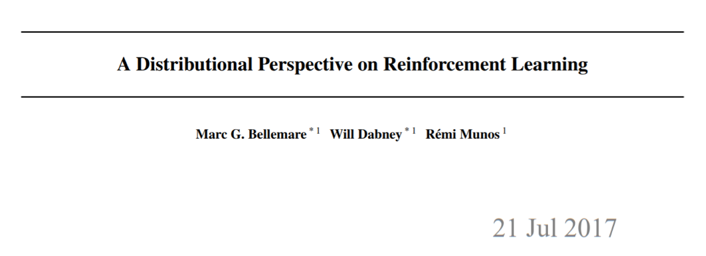

---
### Beyond the expectation

All the reinforcement learning we have seen focuses on the expectation (i.e. the mean)

$$Q(s,a) = \mathbf{E}[G_t] = \mathbf{E}[r + \gamma Q(s',a)] $$

In 2017 DeepMind introduced the idea of the value distribution

State of the art results on Atari (at the time - Rainbow is currently SOTA)

---
### Beyond the expectation

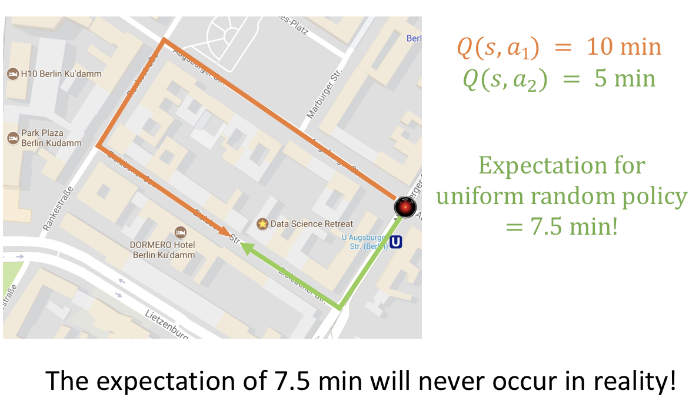

---?image=assets/images/section_8/value_dist.png&size=auto 70%

---?image=assets/images/section_8/value_dist_results.png&size=auto 70%

---
## four
### eligibility traces
### prioritized experience replay
### DDQN
### Distributional Q-Learning
### Rainbow

---
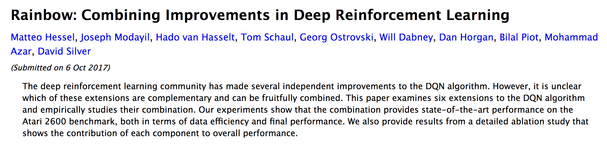

---
### Rainbow

All the various improvements to DQN address different issues

- DDQN - overestimation bias

- prioritized experience replay - sample efficiency

- dueling - generalize across actions

- multi-step bootstrap targets - bias variance tradeoff

- distributional Q-learning - learn categorical distribution of $Q(s,a)$

- noisy DQN - stochastic layers for exploration

Rainbow combines these improvements

---
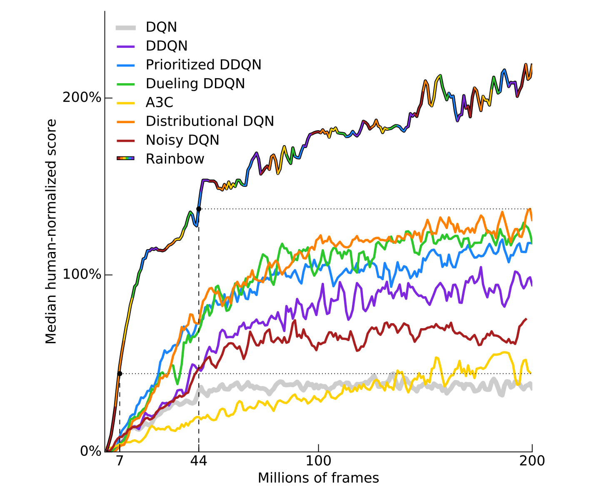

---
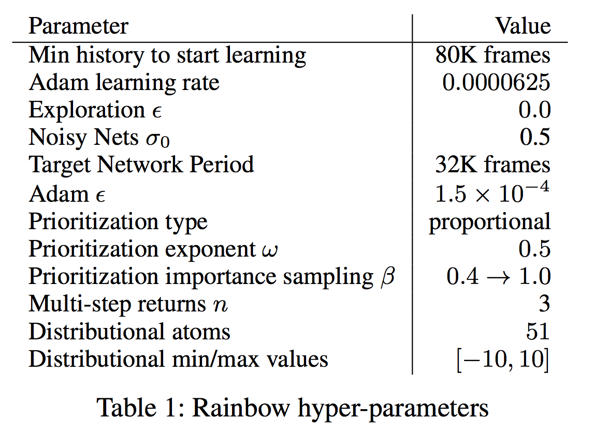

---

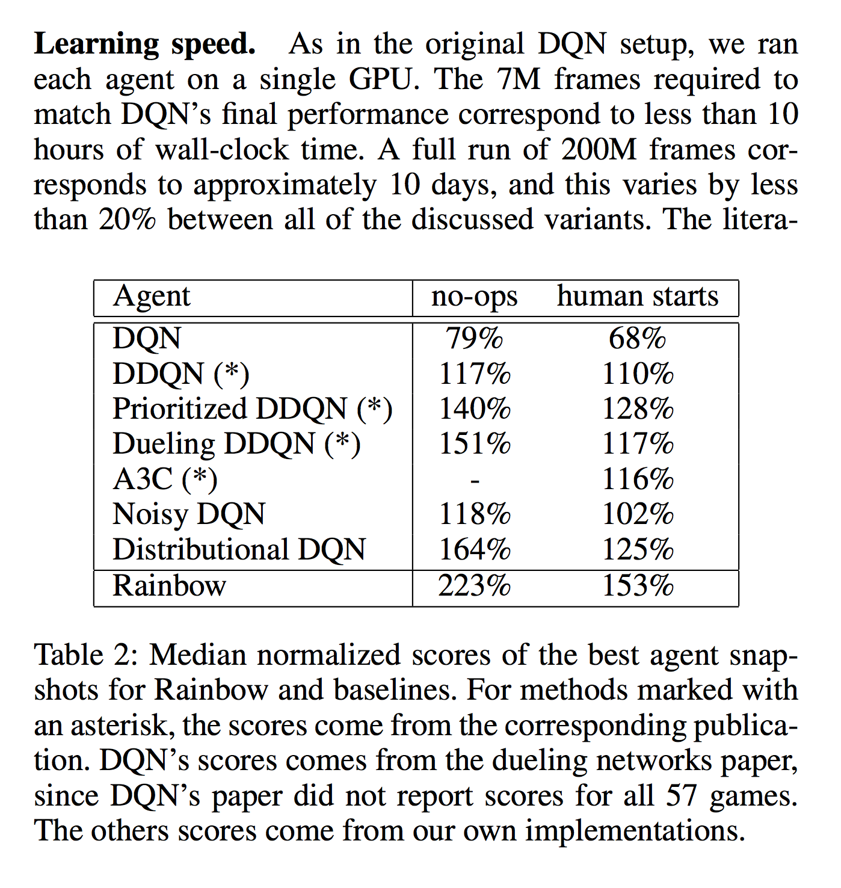

---
## five
### motivations for policy gradients
### introduction
### the score function
### REINFORCE
### Actor-Critic

---
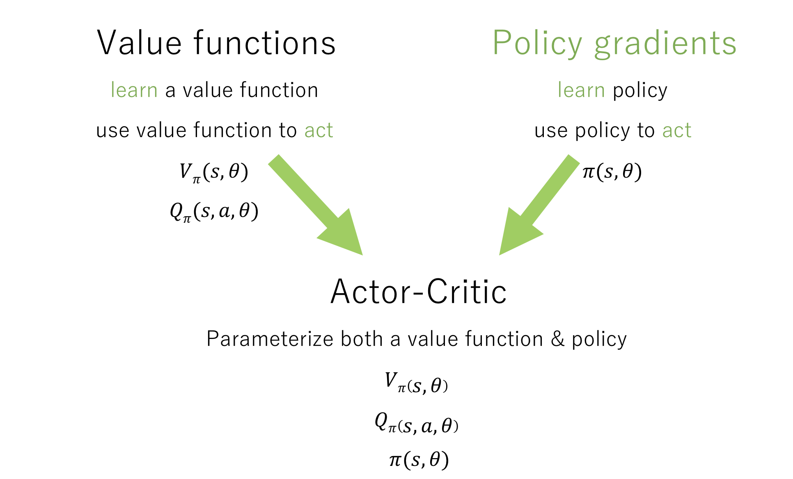

---
### Policy gradients

Previously we generated a policy from a value function

$$ a = \underset{a}{argmax} Q(s,a) $$

In policy gradients we **parameterize a policy directly**

$$ a \sim \pi(a_t|s_t;\theta) $$

---
### John Schulan - Berkley, Open AI

<iframe width="560" height="315" src="https://www.youtube.com/embed/PtAIh9KSnjo?rel=0&amp;showinfo=0&amp;start=2905" frameborder="0" allow="autoplay; encrypted-media" allowfullscreen></iframe>

---
### Motivation - stochastic policies


A determinstic policy (i.e. always rock) is eaisly exploited

A stochastic policy means exploration is built into the policy
- exploration can be controlled by the agent

---
### Motivation - high dimensional action spaces

Q-Learning requires a discrete action space to argmax across

Lets imagine controlling a robot arm in three dimensions in the range [0, 90] degrees

This corresponds to approx. 750,000 actions a Q-Learner would need to argmax across

We also lose shape of the action space by discretization

---?image=assets/images/section_5/disc_cont_act.png&size=auto 70%

---
### Motivation - optimize return directly

When learning value functions our optimizer is working towards improving the predictive accuracy of the value function
- our gradients point in the direction of predicting return

This isn't what we really care about - we care about maximizing return

Policy methods optimize return directly
- changing weights according to the gradient that maximizes future reward
- aligning gradients with our objective (and hopefully a business objective)
---

### Motivation - simplicity

Sometimes it's eaiser to pick an action
- rather than to quantify return for each action, then pick action

Policy gradients are more general and versatile

More compataible with recurrent neural networks

---


---
### Policy gradients versus value functions

**Policy gradients**
- optimize return directly
- work in continuous and discrete action spaces
- works better in high-dimensional action spaces

**Value functions**
- optimize value function accuracy
- off policy learning
- exploration
- better sample efficiency

---

## five
### motivations for policy gradients
### introduction
### the score function
### REINFORCE
### Actor-Critic
### Deterministic Policy Gradient
### A3C

---
### Parameterizing policies

The type of policy you parameterize depends on the **action space**

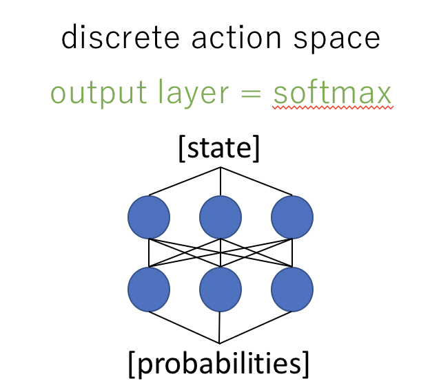

---
### Parameterizing policies

The type of policy you parameterize depends on the **action space**

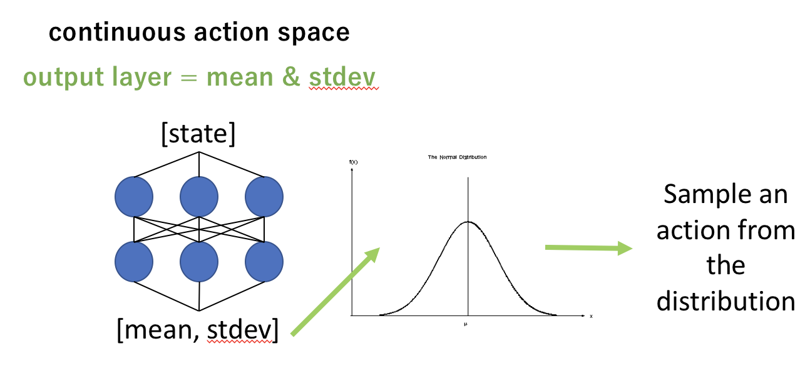

---
### Policy gradients without equations

We have a parameterized policy
- a neural network that outputs a distribution over actions

How do we improve it - how do we learn?
- change parameters to take actions that get more reward
- change parameters to favour probable actions

Reward function is not known
- but we can calculate the *gradient the expected reward*

---
### Policy gradients with a few equations

Our policy $\pi(a_t|s_t;\theta)$ is a **probability distribution over actions**

How do we improve it?
- change parameters to take actions that get more reward
- change parameters to favour probable actions

Reward function is not known
- but we can calculate the *gradient of the expectation of reward*

$$\nabla\_{\theta} \mathbf{E}[G\_t] = \mathbf{E}[\nabla\_{\theta} \log \pi(a|s) \cdot G\_t]$$

We can figure out how to change our parameters without actually knowing the reward function itself

---
### The score function in statistics

The **score function** comes from using the log-likelihood ratio trick

The score function allows us to get the gradient of a function by **taking an expectation**

Expectataions are averages
- use sample based methods to approximate them

$$\nabla\_{\theta} \mathbf{E}[f(x)] = \mathbf{E}[\nabla\_{\theta} \log P(x) \cdot f(x)]$$

---
### Deriving the score function

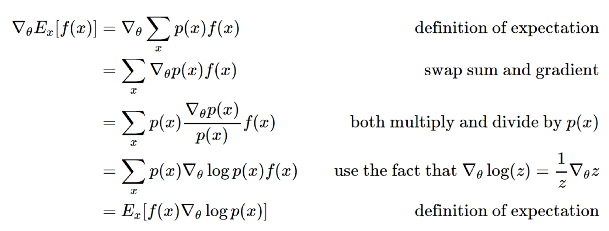

**http://karpathy.github.io/2016/05/31/rl/**

---
### The score function in reinforcement learning

$$\nabla\_{\theta} \mathbf{E}[G\_t] = \mathbf{E}[\nabla\_{\theta} \log \pi(a|s) \cdot G\_t]$$

` gradient of return = expectation of the gradient of the policy * return`

The RHS is an expectation - we can estimate it by sampling

The expectation is made up of things we can sample from
- we can sample from our policy
- we can sample the return (from experience)

---
### Training a policy

We use the score function to get the gradient, then follow the gradient

`gradient = log(probability of action) * return`

`gradient = log(policy) * return`

The score function limits us to on-policy learning
- we need to calculate the log probability of the action taken by the policy

---
### Policy gradient intuition

$$\nabla\_{\theta} \mathbf{E}[G\_t] = \mathbf{E}[\nabla\_{\theta} \log \pi(a|s) \cdot G\_t]$$

$\log \pi(a_t|s_t;\theta)$
- how probable was the action we picked
- we want to reinforce actions we thought were good

$ G_t $
- how good was that action
- we want to reinforce actions that were actually good

---
### REINFORCE

Different methods to approximate the return $G_t$

We can use a Monte Carlo estimate - this is known as REINFORCE

Using a Monte Carlo approach comes with all the problems we saw earlier
- high variance
- no online learning
- requires episodic environment

How can we get some the advantages of Temporal Difference methods?

---
### Baseline

We can introduce a baseline function
- this reduces variance without introducing bias
- a natural baseline is the value function (weights $w$).

$\log \pi(a_t|s_t;\theta) \cdot (G_t - B(s_t; w))$

This also gives rise to the concept of **advantage**
- how much better this action is than the average action (policy & env dependent)

$$A\_{\pi}(s\_t, a\_t) = Q\_{\pi}(s\_t, a\_t) - V\_{\pi}(s\_t)$$

---


---
### Actor-Critic

Actor-Critic brings together value functions and policy gradients

We parameterize two functions
- **actor** = policy
- **critic** = value function

We update our actor (i.e. the behaviour policy) in the direction suggested by the critic

---
### Actor-Critic Algorithm

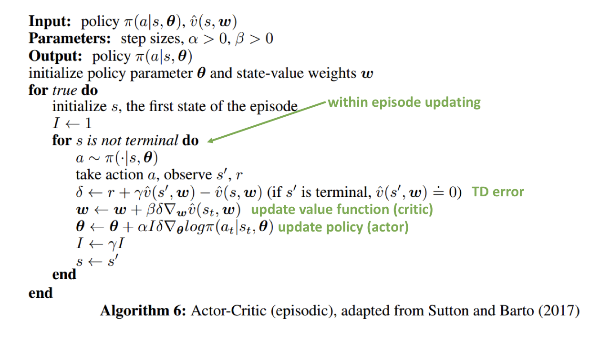

---
## five
### motivations for policy gradients
### introduction
### the score function
### REINFORCE
### Actor-Critic
### Deterministic Policy Gradient
### A3C

---


---
### Deterministic Policy Gradient

Actor Critic

Determinstic policy
- more efficient than stochastic

Continuous action spaces

Off-policy learning

Uses experience replay

Uses target networks

---
### Stochastic vs determinstic policies

Stochastic policy is a probability distribution over actions

Actions are selected by sampling from this distribution

$$ \pi_{\theta}(a|s) = P[a|s;\theta] $$

$$ a \sim \pi_{\theta}(a|s) $$

DPG parameterizes a determinstic policy

$$a = \mu_{\theta}(s) $$

---
### DPG components

Actor
- off policy
- function that maps state to action
- exploratory

Critic
- on-policy
- critic of the current policy
- estimates $Q(s,a)$

---
### Gradients

Stochastic integrates over both the state & action spaces:

$$ \nabla\_{\theta} G(\pi\_{\theta}) = \mathbf{E}\_{s \sim p\_{\pi{\theta}}, a \sim \pi\_{\theta}} \nabla\_{\theta} log \pi\_{\theta} (a|s) \cdot Q^{\pi} (s,a) $$

The deterministic gradient integrates only over the state space:

$$ \nabla\_{\theta} G(\mu\_{\theta}) = \mathbf{E}\_{s \sim p\_{\pi{\beta}}} \nabla\_{\theta} \mu\_{\theta} (s) \nabla\_{a} Q^{\mu} (s,a) |\_{a=\mu_\{theta}(s)} $$

---
### DPG results


---
## five
### motivations for policy gradients
### introduction
### the score function
### REINFORCE
### Actor-Critic
### Deterministic Policy Gradient
### A3C

---
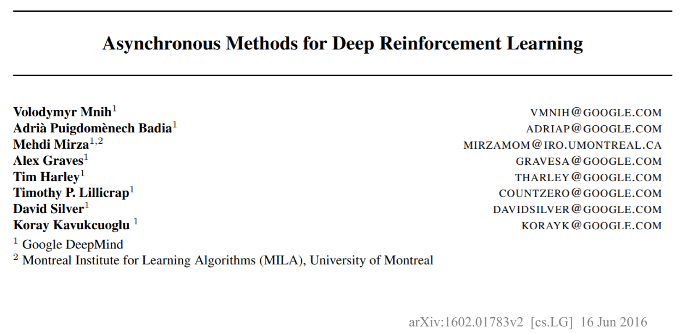

---
### A3C

Asynchronous Advantage Actor-Critic

We saw earlier that experience replay is used to make learning more stable & decorrelate updates
- but can only be used with off-policy learners

---
### **Asynchronous** Advantage Actor-Critic

Asynchronous
- multiple agents learning separately
- experience of each agent is independent of other agents
- learning in parallel stabilizes training
- allows use of on-policy learners
- runs on single multi-core CPU
- learns faster than many GPU methods

---
### Asynchronous **Advantage** Actor-Critic

Advantage = the advantage function

$$A\_{\pi}(s\_t, a\_t) = Q\_{\pi}(s\_t, a\_t) - V\_{\pi}(s\_t)$$

How much better an action is than the average action followed by the policy

---
### Natural Policy Gradients, TRPO and PPO

All three of these papers build on the same idea - that we **want to constrain policy updates** to get more stable learning

- Natural Policy gradients - rely on a computationally intense second order derivative method (inverse of the Fisher Infomation matrix)

- TRPO - uses the KL-divergence to hard constrain policy updates (avoids calculating the Fisher Infomation matrix, but uses Conjugate Gradient to solve a constrained optimization problem)

- PPO - uses clipped probability ratios to constrain policy updates

---

### PPO

PPO is the algorithm used by Open AI in their work on DOTA

The clipped loss function proposed in PPO is:

$$ L^{\text{CLIP}}(\theta) = \mathbf{E} [ min(r_t({\theta}) A_t, \text{clip}(r_t({\theta}), 1 - \epsilon, 1 + \epsilon) \cdot A_t)] $$

```python
clipped_loss = np.min(
  prob_ratio * advantage, 
  np.clip(prob_ratio, 1-epsilon, 1+epsilon))* advantage
```

---
## six
### AlphaGo
### AlphaGo Zero
### Residual networks

---
<iframe width="560" height="315" src="https://www.youtube.com/embed/8tq1C8spV_g?rel=0&amp;showinfo=0" frameborder="0" allow="autoplay; encrypted-media" allowfullscreen></iframe>

---
### IBM Deep Blue

First defeat of a world chess champion by a machine in 1997

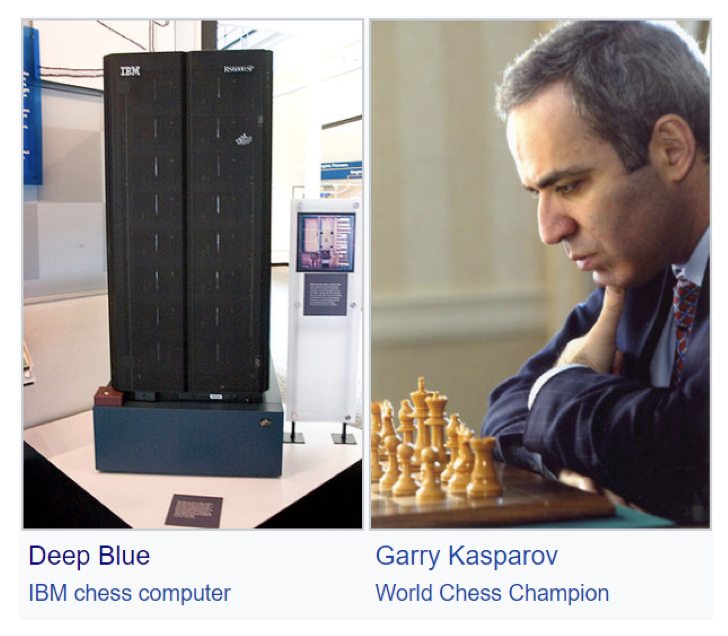

---
### Deep Blue vs AlphaGo

Deep Blue was handcrafted by programmers & chess grandmasters

AlphaGo **learnt** from human moves & self play

AlphaGo **evaluated fewer positions**

- reduce the width using a policy network 

- reduce the depth using a value function

---
### Why Go?

Long held as the most challenging classic game for artificial intelligence
- massive search space
- more legal positions than atoms in universe
- difficult to evaluate positions & moves
- sparse & delayed reward

---
### Components of the AlphaGo agent

Three policy networks $\pi(s)$
- fast rollout policy network – linear function
- supervised learning policy – 13 layer convolutional NN
- reinforcement learning policy – 13 layer convolutional NN

One value function $V(s)$
- convolutional neural network

Combined together using Monte Carlo tree search

---
### Learning


---
### Monte Carlo Tree Search

Value & policy networks combined using MCTS

Basic idea = analyse most promising next moves

Planning algorithm
- simulated (not actual experience)
- roll out to end of game (a simulated Monte Carlo return)

---
### Monte Carlo Tree Search

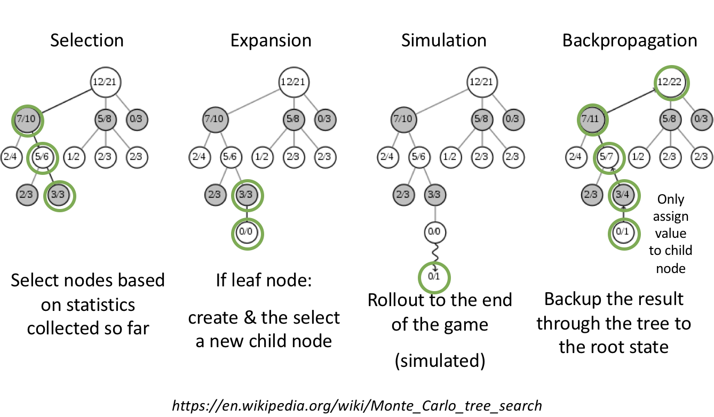

---
### Monte Carlo Tree Search in AlphaGo

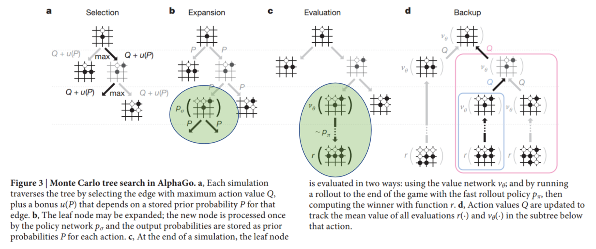

---
### Monte Carlo Tree Search in AlphaGo

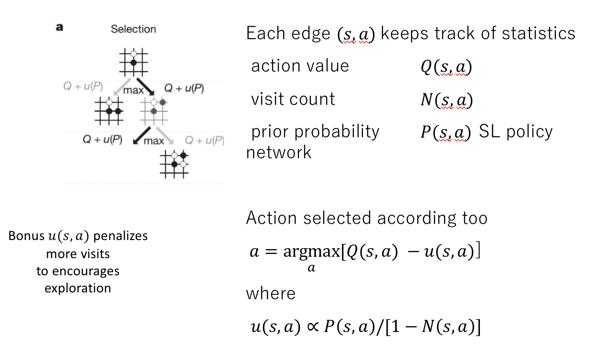

---
### Monte Carlo Tree Search in AlphaGo

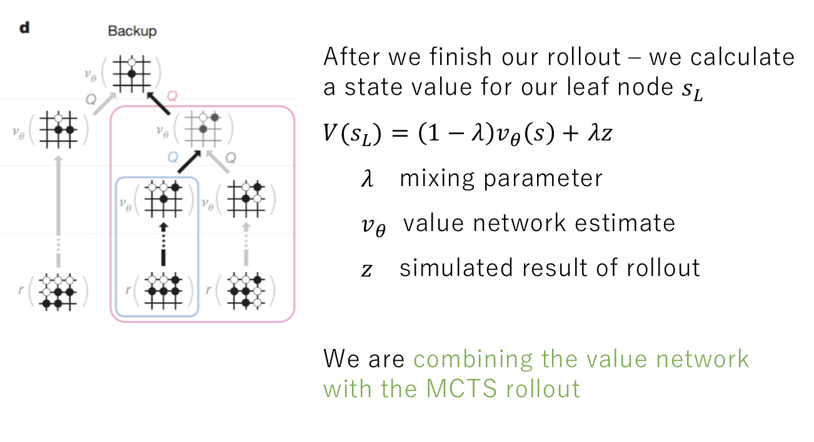

---
### Monte Carlo Tree Search in AlphaGo

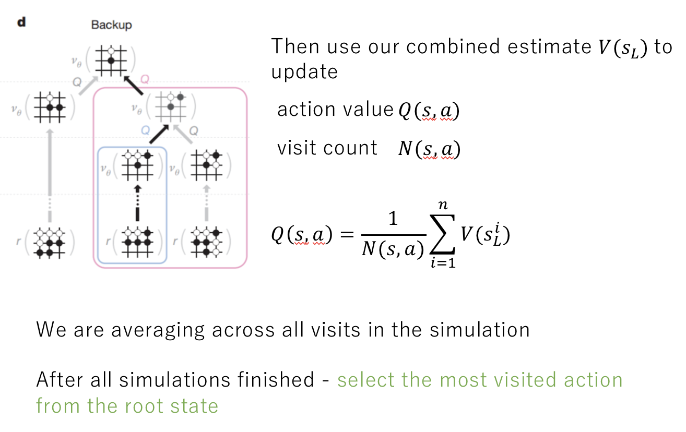

---
### AlphaGo, in context – Andrej Karpathy

Convenient properties of Go
- fully deterministic
- fully observed
- discrete action space
- access to perfect simulator
- relatively short episodes
- evaluation is clear
- huge datasets of human play
- energy consumption (human ≈ 50 W) 1080 ti = 250 W

*https://medium.com/@karpathy/alphago-in-context-c47718cb95a5*

---
## six
### AlphaGo
### AlphaGo Zero
### Residual networks

---
### Key ideas in AlphaGo Zero

Simpler

Search

Adversarial

Machine knowledge only

---
### AlphaGo Zero Results

Training time & performance
- AG Lee trained over several months
- AG Zero beat AG Lee 100-0 after 72 hours of training

Computational efficiency
- AG Lee = distributed w/ 48 TPU
- AG Zero = single machine w/ 4 TPU

---
### AlphaGo Zero learning curve

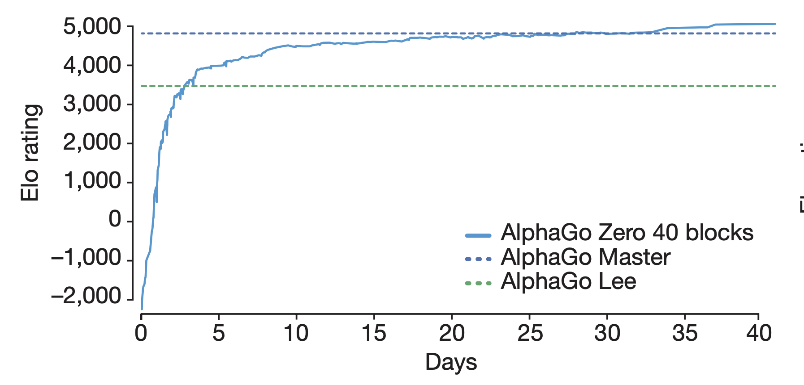

---
### AlphaGo Zero learning curves

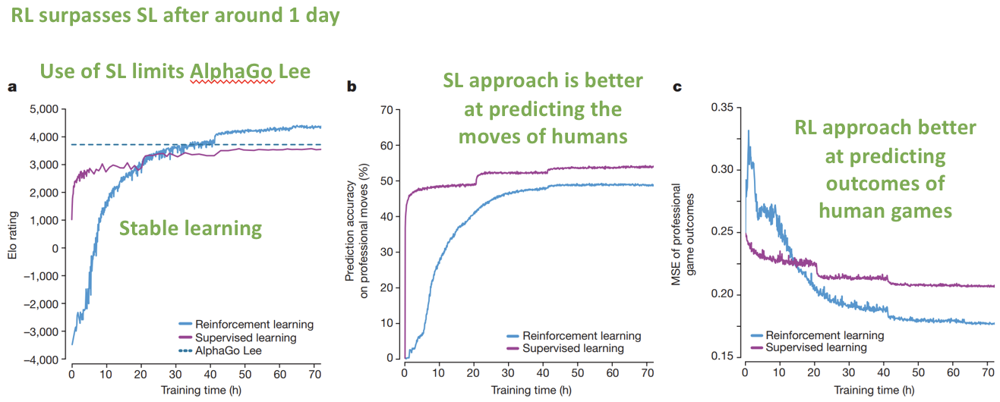

---
### AlphaGo Zero innovations

Learns using only self play
- no learning from human expert games
- no feature engineering
- learn purely from board positions

Single neural network
- combine the policy & value networks

MCTS only during acting (not during learning)

Use of residual networks

---
### AlphaGo Zero acting & learning

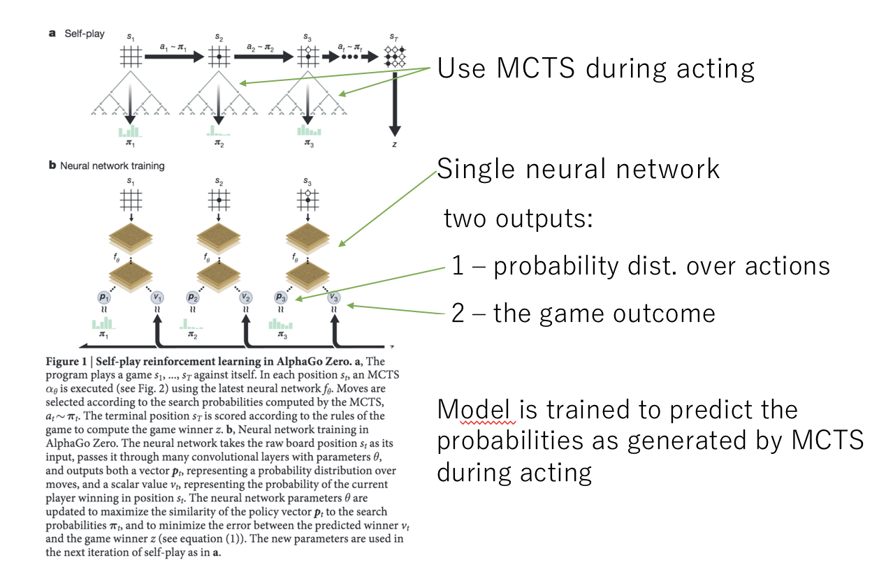

---
### Search in AlphaGo Zero

**Policy evaluation**

Policy is evaluated through self play

This creates high quality training signals - the game result

**Policy improvement**

MCTS is used during acting to create the improved policy

The improved policy generated during acting becomes the target policy during training

[Keynote David Silver NIPS 2017 Deep Reinforcement Learning Symposium AlphaZero
](https://www.youtube.com/watch?v=A3ekFcZ3KNw)

---
## six
### AlphaGo
### AlphaGo Zero
### Residual networks

---
### Residual networks

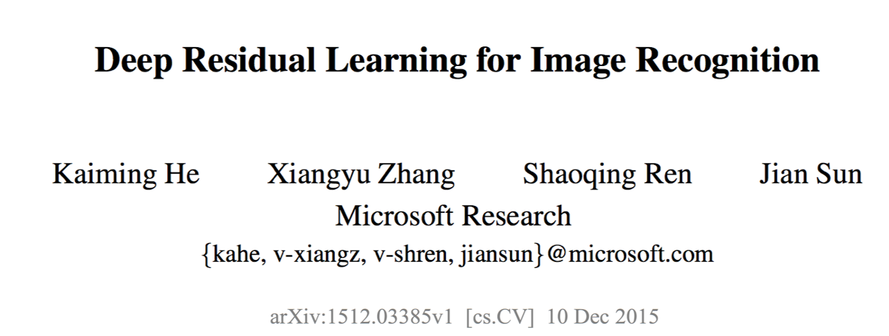

Convolutional network with skip connections

Layers are reformulated as residuals of the input

---
### Residual networks

Trying to learn $ H(x) $

Instead of learning $ F(x) = H(x) $

We learn the residual $ F(x) = H(x) - x $

And can get $ H(x) = F(x) + x $

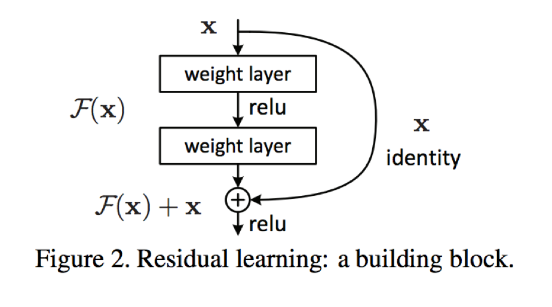

---
### DeepMind AlphaGo AMA

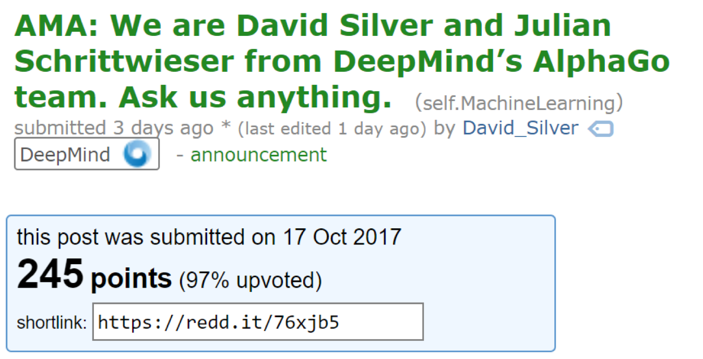

---
### DeepMind AlphaGo AMA

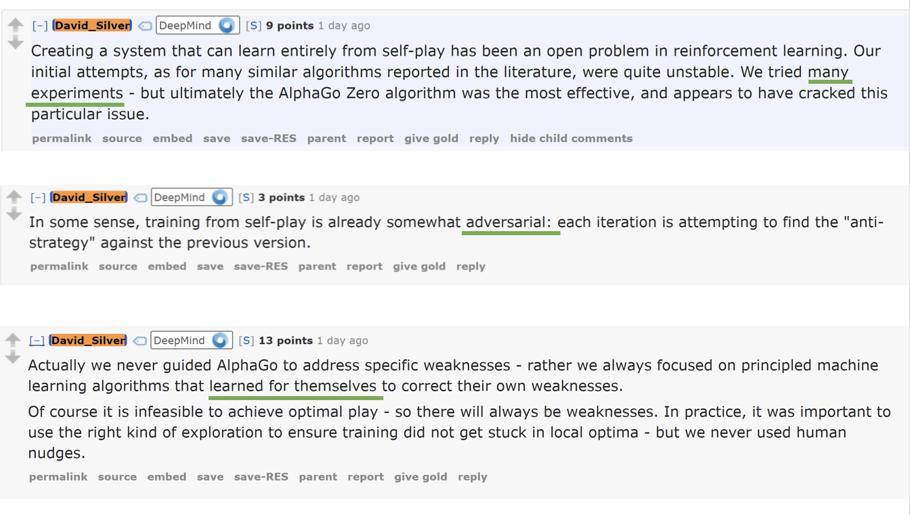

---
## seven
### practical concerns

---
### Should I use reinforcement learning for my problem?

What is the action space
- what can the agent choose to do
- does the action change the environment
- continuous or discrete

What is the reward function
- does it incentive behaviour

It is a complex problem
- classical optimization techniques such as linear programming or cross entropy may offer a simpler solution

Can I sample efficiently / cheaply
- **do you have a simulator**

---
### Reinforcement learning is hard

Debugging implementations is hard
- very easy to have subtle bugs that don't break your code

Tuning hyperparameters is hard
- tuning hyperparameters can also cover over bugs!

Results will succeed and fail over different random seeds (same hyperparameters!)

Machine learning is an empirical science, where the ability to do more experiments directly correlates with progress

---
### Mistakes I've made so far

Normalizing targets - a high initial target that occurs due to the initial weights can skew the normalization for the entire experiment

Doing multiple epochs over a batch

Not keeping batch size the same for experience replay & training

Not setting `next_observation = observation`

Not setting online & target network variables the same at the start of an experiment

Not gradient clipping
- clip the norm of the gradient (I've seen between 1 - 5)

---
### Mistakes DSR students have made in RL projects

Since I started teaching in Batch 10 we have had three RL projects

Saving agent brain
- not saving the optimizer state

Using too high a learning rate
- learning rate is always important!!!

Building both an agent and environment

---
### Hyperparameters

**Policy gradients**
- learning rate
- clipping of distribution parameters (stochastic PG)
- noise for exploration (deterministic PG)
- network structure

**Value function methods**
- learning rate
- exploration (i.e. epsilon)
- updating target network frequency
- batch size
- space discretization

---

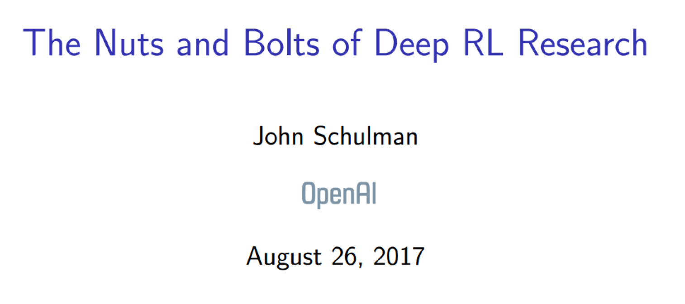

[John Schulman – Berkley Deep RL Bootcamp 2017](https://www.youtube.com/watch?v=8EcdaCk9KaQ)

---

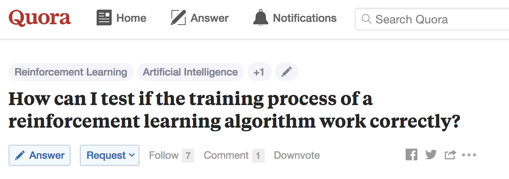

https://www.quora.com/How-can-I-test-if-the-training-process-of-a-reinforcement-learning-algorithm-work-correctly

---
### Best practices

Quick experiments on small test problems
- CartPole for discrete action spaces
- Pendulum for continuous action spaces

Compare to baselines - a random agent is a good idea

Be careful not to overfit these simple problems
- use low capacity neural networks

Interpret & visualize learning process
- state visitation, value functions

Make it easier to get learning to happen (initially)
- input features, reward function design

Always use multiple random seeds

Automate experiments - don't waste time watching them run!

---
### Best practices

In reinforcement learning we often don't know the true min/max/mean/standard deviation of observations/actions/rewards/returns

Standardize data
- if observations in unknown range, estimate running average mean & stdev
- use the min & max if known

Rescale rewards - but don’t shift mean

Standardize prediction targets (i.e. value functions) the same way

Batch size matters

Policy gradient methods – weight initialization matters
determines initial state visitation (i.e. exploration)

DQN converges slowly

---
### Best practices

Compute useful statistics
- explained variance (for seeing if your value functions are overfitting),
- computing KL divergence of policy before and after update (a spike in KL usually means degradation of policy)
- entropy of your policy

Visualize statistics
- running min, mean, max of episode returns
- KL of policy update
- explained variance of value function fitting
- network gradients

Gradient clipping is helpful - dropout & batchnorm not so much

---

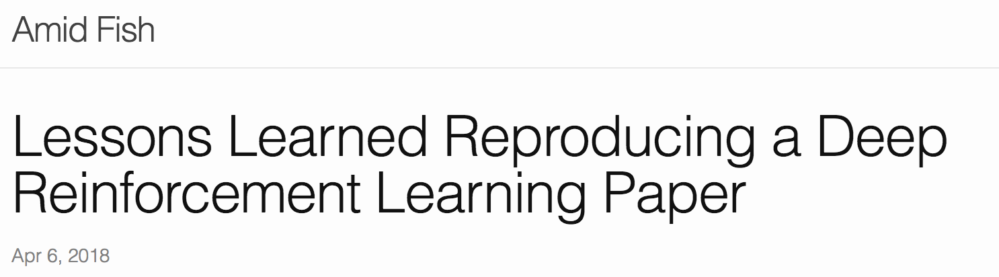

*http://amid.fish/reproducing-deep-rl*

---

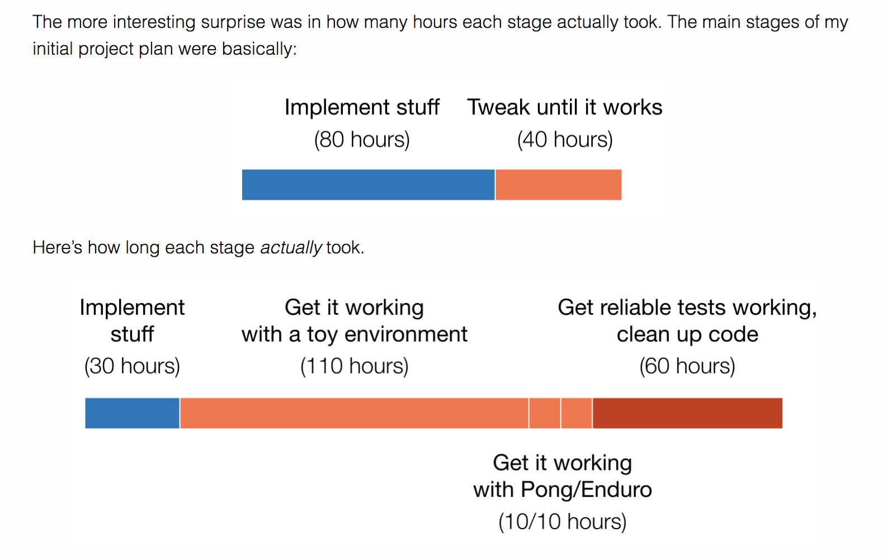

---


---

> Reinforcement learning can be so unstable that you need to repeat every run multiple times with different seeds to be confident.

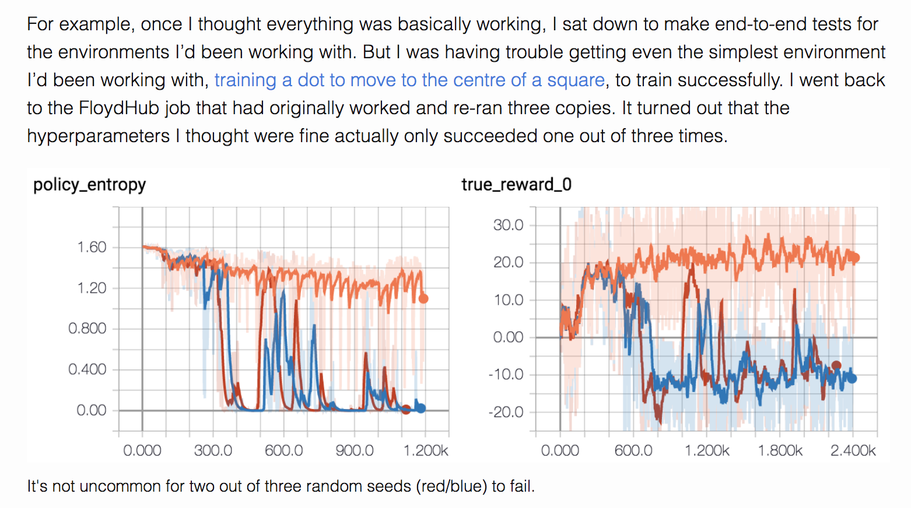

---
### Matthew Rahtz of Amid Fish

> It’s not like my experience of programming in general so far where you get stuck but there’s usually a clear trail to follow and you can get unstuck within a couple of days at most.

> It’s more like when you’re trying to solve a puzzle, there are no clear inroads into the problem, and the only way to proceed is to try things until you find the key piece of evidence or get the key spark that lets you figure it out.

---
### Debugging

Debugging in four steps
1. evidence about what the problem might be
2. form hypothesis about what the problem might be (evidence based)
3. choose most likely hypothesis, fix
4. repeat until problem goes away

Most programming involves rapid feedback
- you can see the effects of changes very quickly
- gathering evidence can be cheaper than forming hypotheses

In RL (and supervised learning with long run times) gathering evidence is expensive
- suggests spending more time on the hypothesis stage
- switch from experimenting a lot and thinking little to **experimenting a little and thinking a lot**
- reserve experiments for after you've really fleshed out the hypothesis space

---
### Get more out of runs

Reccomends keeping a detailed work log
- what output am I working on now
- think out loud - what are the hypotheses, what to do next
- record of current runs with reminder about what each run is susposed to answer
- results of runs (i.e. TensorBoard)

Log all the metrics you can
- policy entropy for policy gradient methods

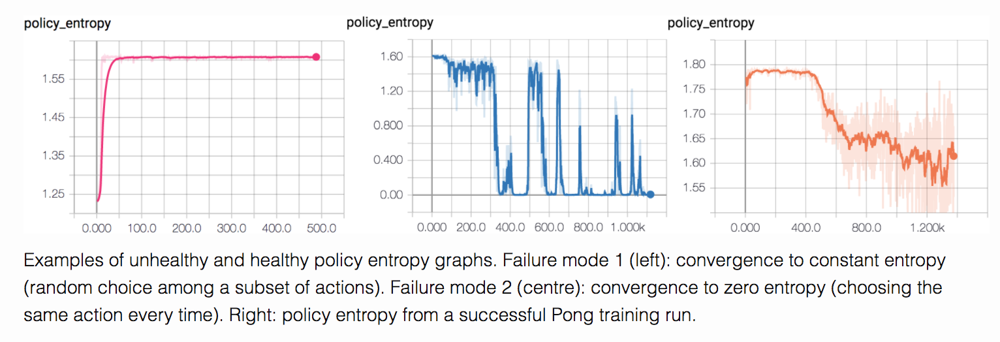

Try to predict future failures

---
### Matthew Rahtz of Amid Fish

RL specific
- end to end tests of training
- gym envs: -v0 environments mean 25% of the time action is ignored and previous action is repeated.  Use -v4 to get rid of the randomness

General ML
- for weight sharing, be careful with both dropout and batchnorm - you need to match additional variables
- spikes in memory usages suggest validation batch size is too big
- if you are struggling with the Adam optimizer, try an optimizer without momentum (i.e. RMSprop)

TensorFlow
- `sess.run()` can have a large overhead.  Try to group session calls
- use the `allow_growth` option to avoid TF reserving memory it doesn't need
- don't get addicted to TensorBoard - let your expts run!


---
## eight
### deep reinforcement learning doesn't work yet

---

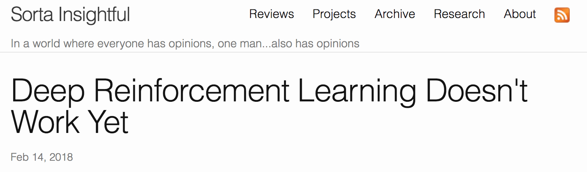


---
### Modern RL is sample inefficient

---


---

To pass the 100% median performance
- Rainbow = 18 million frames = 83 hours of play
- Distributional DQN = 70 million
- DQN = never (even after 200 million frames!)

We can ignore sample efficiency if sampling is cheap

In the real world it can be hard or expensive to generate experience

It's not about learning time - it's about the ability to sample

---
### Other methods often work better

Many problems are better solved by other methods
- allowing the agent access to a ground truth model (i.e. simulator)
- model based RL with a perfect model

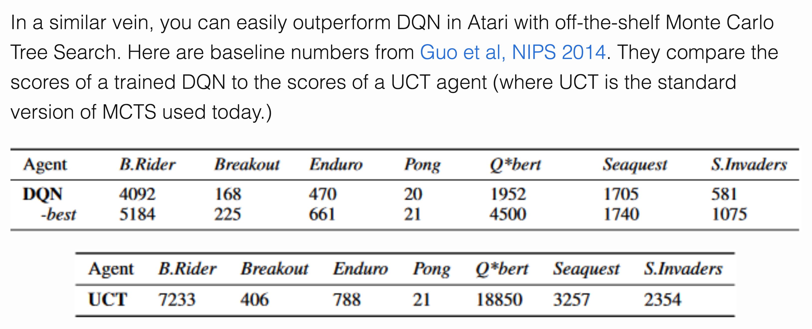

The generalizability of RL means that except in rare cases, domain specific algorithms work faster and better

---
### Requirement of a reward function

Reward function design is difficult
- need to encourage behaviour
- need to be learnable

Shaping rewards to help learning can change behaviour

---
### Unstable and hard to reproduce results

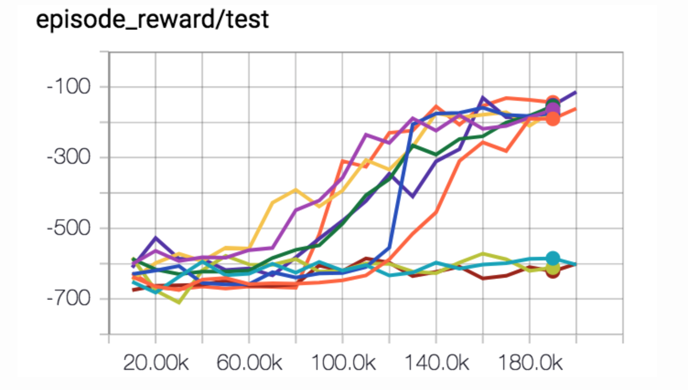

Only difference is the random seed!

30% failure rate counts as working

---

Machine learning adds more dimensions to your space of failure cases

RL adds an additional dimension - **random change**

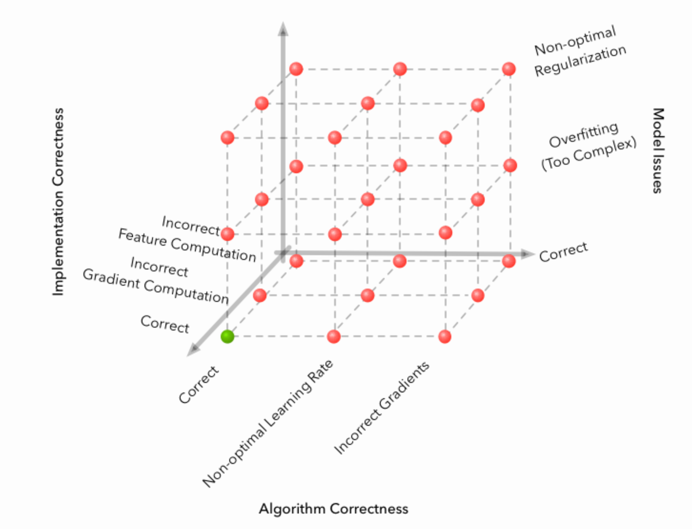

---

**A sample inefficient and unstable training algorithm heavily slows down your rate of productive research**

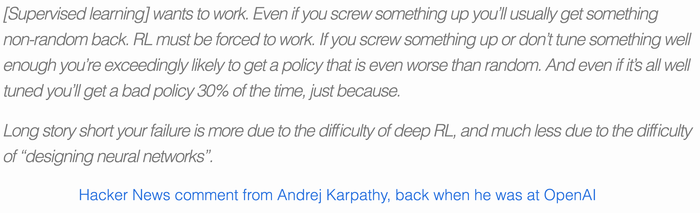

---
### Going forward & the future

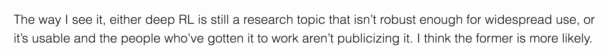

Make learning eaiser

- ability to generate near unbounded amounts of experience
- problem is simplified into an eaiser form
- you can introduce self-play into learning
- learnable reward signal
- any reward shaping should be rich

The future
- local optima are good enough (is any human behaviour globally optimal)
- improvements in hardware help with sample inefficiency
- more learning signal - hallucinating rewards, auxillary tasks, model learning
- model learning fixes a bunch of problems - difficulty is learning one

Many things need to go right for RL to work - success stories are the exception, not the rule

---

## Closing thoughts

Exploration versus exploitation - this is useful in daily life

Test your models on simple problems

Reinforcement learning is sample inefficient

## Thank you

Adam Green

adgefficiency.com

adam.green@adgefficiency.com
