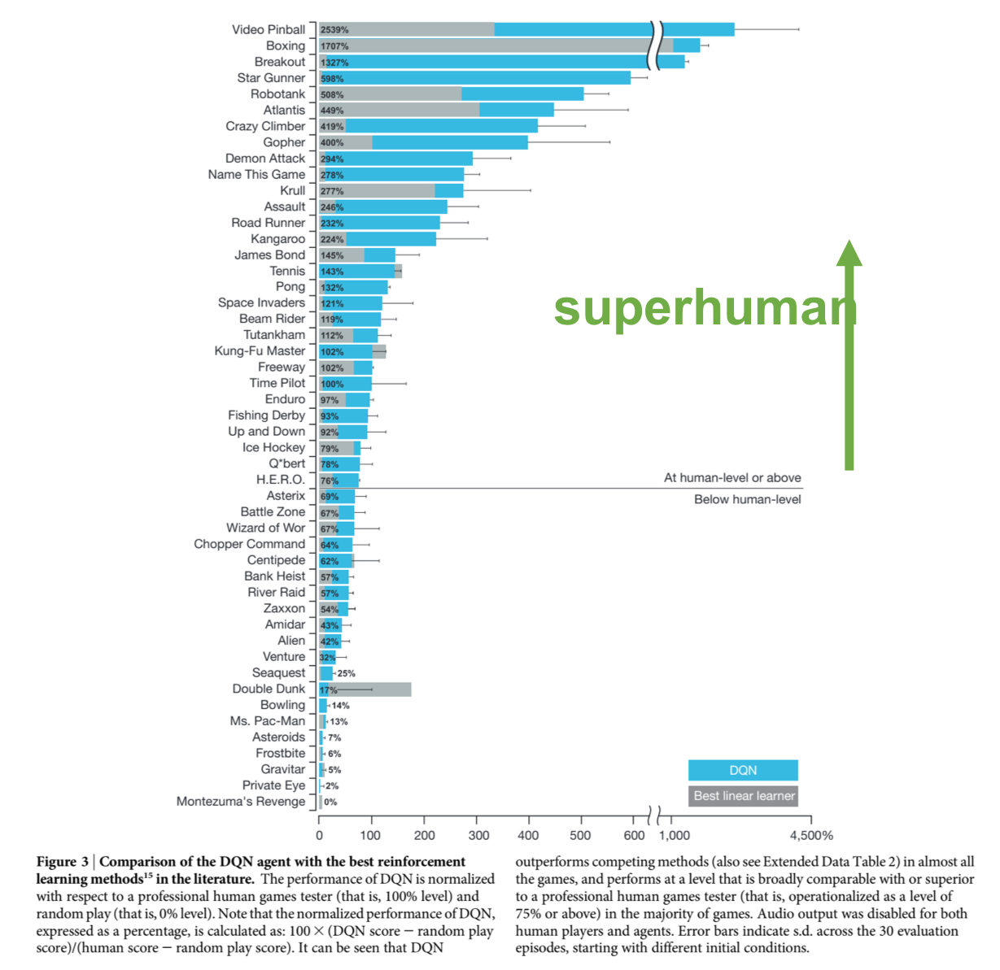
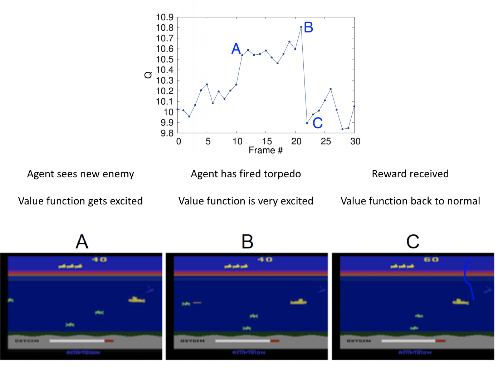

## Value functions

There are two value functions - the value function $V_\pi(s)$ and the action-value function $Q_\pi(s,a)$.  Both are defined to equal the future expected discounted reward (i.e. the return)

$$ V_{\pi}(s) = \mathbf{E}[G_t | s_t] = r_{t+1} + \gamma r_{t+2} + \gamma^2 r_{t+3} + ... = \sum_{t=0}^{\infty} \gamma^{t} r_{t} $$

$$ Q_{\pi}(s, a) = \mathbf{E}[G_t | s_t, a_t] = r_{t+1} + \gamma r_{t+2} + \gamma^2 r_{t+3} + ... = \sum_{t=0}^{\infty} \gamma^{t} r_{t} $$


The key difference is that the value function $V_{\pi}(s)$ tells us how good a state is, the action-value function $Q_{\pi}(s,a)$ tells us how good an action is.

Value functions are always conditioned on a policy.  The value function for a random policy will be different from the value function for the optimal policy.  The optimal policy will have higher values (i.e. return) associated with states and actions.  

This is true even for the same state and action. Both policies take the same action might end up in the same place (ie the same next state) and receive the same amount of reward on the way.

The difference is that after this transition, the optimal policy will select higher quality actions from that next state until the end of the episode. 

## Using a value function

Imagine you are given the optimal value function for free.  How would you use it?  Assume that

- given the optimal value function $Q_*(s,a)$
- we are in state $s$
- our set of actions $\mathcal{A} = \{a_1, a_2, a_3\}$

How can we act - use the value function to determine which action has the highest expected return.  This is known as a *greedy policy*.

Note that agents are not often given value functions for free - they must learn them.  This learning process is covered in the section on the Bellman Equation.

{ width=30%, height=30% }

``` python
def greedy_policy(state):
    #  get the Q values for each state_action pair
    q_values = value_function.predict(state)

    # select action with highest Q
    return np.argmax(q_values)
```

\newpage

## Approximation versus improvement

Prediction / approximation

- predicting return for given policy

Control 

- the optimal policy
- the policy that maximizes expected future discounted reward

A good approximation of the optimal value function helps us to improve our policy

1. improving the predictive power of our value function
2. improving the policy 

$$ V_{k+1} (s) = \max_a \sum_{s',r} P(s',r|s,a) [r + \gamma V_k(s')] $$

These two steps are done sequentially in a process known as **policy iteration**

- approximate our policy (i.e. $V_{\pi}(s)$)
- act greedy wrt value function 
- approximate our (better) policy
- act greedy 
- repeat 

A similar by slightly different process is **value iteration**, where we combine the policy approximation and improvement steps by using a maximization over all possible next states in the update.

### Generalized policy iteration
Letting policy evaluation and improvement processes interact  

Both of these can achieve the same result 

The policy and value functions interact to move both towards their optimal values - this is one source of non-stationary learning in RL

Policy iteration - sequence of approximating value function then making policy greedy wrt value function


```python
#  pseudocode for lookup table policy iteration 

#  policy iteration approximation

while error < threshold:

    for state in states:
        approx = value_func[state]

        target = env_transitions * (reward + gamma * value_func[next_state]
        error = approx - target

    values = []
    #  here we need to calculate the value based on the
    #  env model and our value function
    for transition in transitions:
        values.append(
            probability * (reward + gamma * value_func[next_state]
        )

    value_func[state] = sum(values)

#  policy iteration improvement

for state in states:

    old_action = policy(state)

    returns = []
    for transition in transitions:
        returns.append(
         transition.reward + value_function[transition.next_state]
         )

    action = argmax(returns)

    if action == old_action:
        policy = stable
```

Value iteration - single iteration of policy evaluation done inbetween each policy improvement


```python
#  pseudocode for lookup table value iteration

while error < threshold:

    for state in states:

        approx = value_func[state]

        for transition in transitions:
            returns.append(
             transition.reward + value_function[transition.next_state]
             )

        target = max(returns)

        error = approx - target

#  we can then use this value function to generate a policy

action = argmax([value_func[state] for state in next_states])
```

## Value function approximation

To approximate a value function we can use one of the methods we looked at in the first section

- lookup table
- linear function
- non-linear function

Linear functions are appropriate with some agents or environments.  Modern reinforcement learning is based on using neural networks.

\newpage

## The Bellman Equation

### Richard Bellman


Invented dynamic programming in 1953.  Also introduced the curse of dimensionality - number of states $\mathcal{S}$ increases exponentially with number of dimensions in the state

[On the naming of dynamic programming](ttp://arcanesentiment.blogspot.com.au/2010/04/why-dynamic-programming.html)

> I was interested in planning, in decision making, in thinking. But planning, is not a good word for various reasons. I decided therefore to use the word, ‘programming.’ I wanted to get across the idea that this was dynamic, this was multistage, this was time-varying...

###  Bellman Equation

Bellman's contribution is remembered by the Bellman Equation

$$ G_{\pi}(s) = r + \gamma G_{\pi}(s') $$

The Bellman equation relates the expected discounted return of the **current state** to the discounted value of the **next state**.  The Bellman equation is a recursive definition - it is bootstrapped.  We can apply it to value functions

$$ V_{\pi}(s) = r + \gamma V_{\pi}(s') $$
$$ Q_{\pi}(s,a) = r + \gamma Q_{\pi}(s', a') $$

### How do we use the Bellman Equation? 

Create **targets for learning**.  For an experience sample of $(s, a, r, s')$, we create a Bellman target:

$$ target = r + Q(s',a) $$

Combining this Bellman target with our current value function gives us an error - this is known as the **temporal difference error**.  The temporal difference error is a fundamental primitive in reinforcement learning - it is used in prioritized experience replay to quantify how 'suprising' experience is to the agent.

$$ error = r + Q(s',a) - Q(s,a) $$

If we are using a lookup table, we can update it using a learning rate $\alpha$ and the temporal difference error

$$ approximation = Q(s, a) + \alpha [r + Q(s',a) - Q(s,a)] $$

If we are using a neural network, we backpropagate this error back through the network using a loss function

$$ loss = r + Q(s',a) - Q(s,a) $$

\newpage

## Approximation methods

We look at three different methods for approximation.  Note that all of these methods are doing the **policy approximation** step - they are creating targets for us to improve our value function with

1. dynamic programming
2. Monte Carlo
3. temporal difference

The **policy improvement** step can be done using this target to create an error.  This error can be used to update lookup tables or to find gradients for neural networks to follow.

### Dynamic programming

Imagine you had a perfect environment model - the state transition function $P(s'|s,a)$ and the reward transition function $R(r|s,a,s')$.

Can we use our perfect environment model for value function approximation?  Note that the probabilities here depend both on the environment and the policy.  We can perform iterative backups of the expected return for each state.

{ width=30%, height=30% }

The return for all terminal states is zero

$$V(s_2) = 0$$
$$V(s_4) = 0$$

We can then express the value functions for the remaining two states

$$V(s_3) = P_{34}[r_{34} + \gamma V(s_4)]$$
$$V(s_3) = 1 \cdot [5 + 0.9 \cdot 0] = 5 $$

$$V(s_1) = P\_{12}[r_{12} + \gamma V(s_2) + P_{13}[r_{13} + \gamma V(s_3)]$$
$$V(s_1) = 0.5 \cdot [1 + 0.9 \cdot 0] + 0.5 \cdot [2 + 0.9 \cdot 5] = 3.75 $$

Our value function approximation depends on

- our policy (what actions we pick)
- the environment (where our actions take us and what rewards we get)
- our current estimate of $V(s')$

A dynamic programming update is expensive 

- our new estimate $V(s)$ depends on the value of all other states (even if the probability is zero)

Asynchronous dynamic programming addresses this by updating states in an arbitrary order

### Dynamic programming summary

Requries a **perfect environment model** 
- we don't need to sample experience at all 
- we don't ever actually take actions)

We make **full backups** 
- the update to the value function is based on the probability distribution over all possible next states

**Bootstrapped** 
- we use the recursive Bellman Equation to update our value function

Limited utility in practice but they provide an **essential foundation** for understanding reinforcement learning 
- all RL can be thought of as attempts to achieve what DP can but without a model and with less computation

\newpage

## Backwards induction

Backwards induction (BI) is introduced here because of it's **usefulness in industry**

- environment models can be built for many systems (ie a computer simulation)
- it allows testing the quality of environment models that are not perfect

Basic idea
- start at the end of an episode and work backwards in time
- use an environment model to understand the state transitions and rewards at each step

After backing up the entire episode, we can now look at what the returns are for any step, and select an optimal action based on an argmax across viable transitions

[Wikipedia](https://en.wikipedia.org/wiki/Backward_induction)

> Backward induction is the process of reasoning backwards in time, from the end of a problem or situation, to determine a sequence of optimal actions. It proceeds by first considering the last time a decision might be made and choosing what to do in any situation at that time. Using this information, one can then determine what to do at the second-to-last time of decision. This process continues backwards until one has determined the best action for every possible situation (i.e. for every possible information set) at every point in time.

Backwards induction is a **model based algorithm**.  The environment model is used to understand whatever state or reward transitions the agent want's to investigate

BI is useful in industry because often we have access to a simulator.  If an environment model incorrectly models the dynamics of the environment, then BI can be used to measure how costly the errors made by this model are.

```python
#  pseudocode for BI

for step in steps[::-1]:

    #  first we get all the possible state actions at this step
    state_actions = model.state_actions
    
    viable_transitions = []
    
    for next_state in model.states:
        viable_transitions.extend(get_viable_transitions(step, next_state, model))
    
    new_state_payoffs = defaultdict(list)
    
    for t in viable_transitions:
        
        payoff = t.reward + previous_state_payoffs[t.next_state]
        
        new_state_payoffs[t.state].append(payoff)
        
    for k, v in new_state_payoffs.items():
        new_state_payoffs[k] = np.max(v)
    
    previous_state_payoffs = new_state_payoffs
    
    if step % 10000 == 0:
        print(step)
        print(previous_state_payoffs)
```

Further reading on BI

- [Backward Induction and Subgame Perfectioni - Ohio State](http://www.econ.ohio-state.edu/jpeck/Econ601/Econ601L10.pdf)
-[Game Theory Lecture Notes Lectures 7-9 - MIT](http://web.mit.edu/14.12/www/02F_lecture7-9.pdf)
- [Backward Induction and Subgame Perfection - Carlos Hurtado - University of Illinois](http://www.econ.uiuc.edu/~hrtdmrt2/Teaching/GT_2016_19/L5.pdf)

\newpage

## Monte Carlo

Monte Carlo methods = finding the expected value of a function of a random variable

Estimate the value of a state by averaging the true discounted return observed after each visit to that state.  As we run more episodes, our estimate should converge to the true expectation.


```python
#  pseudocode for lookup table Monte Carlo
returns = defaultdict(list)

episode = run_full_episode(env, policy)

for experience in episode:
    return = episode.calc_return(experience)

    returns[experience.state].append(return)

value_estimate = np.mean(returns[state])
```

### Bias & variance of Monte Carlo

High variance

- we need to sample enough episodes for our averages to converge
- can be a lot for stochastic or path dependent environments

Low bias

- we are using actual experience
- no chance for a bootstrapped function to mislead us

### Interesting feature of Monte Carlo

Computational expense of estimating the value of state $s$ is independent of the number of states $\mathcal{S}$. This is because we use experienced state transition.

{ width=30%, height=30% }

### Monte Carlo summary

**No model** 
- we learn from actual experience 

We can also learn from **simulated experience** 
- we don't need to know the whole probability distribution 
- just be able to generate sample trajectories

**No boostrapping** 
- we take the average of the true discounted return

**Episodic only** 
- because we need to calculate the true discounted return

Ability to **focus** on interesting states and ignore others

High variance & low bias

\newpage

## Temporal difference 

Use the Bellman Equation to approximate $V(s)$ using $V(s')$ 

$$actual = r + \gamma V(s') $$
$$predicted = V(s) $$

$$error = actual - predicted $$
$$error = r + \gamma V(s') - V(s) $$

Update rule for a table TD(0) approximation

$$ V(s) \leftarrow + \alpha [r + \gamma V(s') - V(s)]   $$

{ width=30%, height=30% }

### Temporal difference summary 

Learn from **actual experience** 

- like Monte Carlo
- no environment model

**Bootstrap** 

- like dynamic programming
- learn online

Episodic & non-episodic problems

\newpage

## You are the predictor

Example 6.4 from Sutton & Barto

Imagine you observe the following episodes 
- format of (State Reward, State Reward)
- i.e. A 0 B 0 = state A, reward 0, state B, reward 0

| Episode | Number times observed |
|---|---|
|A 0, B 0| 1 |
|B 1 | 6 |
|B 0 | 1 |

What are the optimal predictions for $V(A)$ and $V(B)$?

We can estimate the expected return from state $B$ by averaging the rewards

$$V(B) = 6/8 \cdot 1 + 2/6 \cdot 0 = 3/4 $$

What about $V(A)$?  

- We observed that every time we were in $A$ we got $0$ reward and ended up in $B$
- Therefore $V(A) = 0 + V(B) = 3/4$

or

- We observed a discounted return of $0$ each time we saw $A$ 
- therefore $V(A) = 0$

Which is the Monte Carlo approach, which is the TD approach?

Estimating $V(A) = 3/4$ is the answer given by TD(0)

Estimtating $V(A) = 0$ is the answer given by Monte Carlo

The MC method gives us the lowest error on fitting the data (i.e. minimizes MSE)

The TD method gives us the **maximum-likelihood estimate**

The maximum likelihood estimate of a parameter is the parameter value whose probabilty of generating the data is greatest

We take into account the transition probabilities, which gives us the **certanitiy equivilance estimate** - which is the estimate we get when assuming we know the underlying model (rather than approximating it)

{ width=30%, height=30% }

\newpage

## SARSA & Q-Learning

Approximation is a tool - **control** is what we really want

SARSA & Q-Learning are both based on the **action-value function** $Q(s,a)$

The practical today is based on DQN - the DeepMind implementation of Q-Learning

### $V(s)$ versus $Q(s,a)$ 

Why might we want to learn $Q(s,a)$ rather than $V(s)$?  Imagine a simple MDP

$$ \mathcal{S} = \{s_1, s_2, s_3\} $$
$$ \mathcal{A} = \{a_1, a_2\} $$

Our agent finds itself in state $s_2$.  We use our value function $V(s)$ to calculate 

$$V(s_1) = 10$$
$$V(s_2) = 5$$
$$V(s_3) = 20$$

Which action should we take is not clear from this information!  Now imagine we had

$$Q(s\_{2}, a\_1) = 40$$
$$Q(s\_{2}, a\_2) = 20$$

It's now easy to pick the action that maximizes expected discounted return

$V(s)$ tells us how good a state is.  We require the state transition probabilities for each action to use $V(s)$ for control

$Q(s,a)$ tells us how good an **action** is

### SARSA

SARSA is an **on-policy** control method

- we approximate the policy we are following
- we improve the policy by being greedy wrt to our approximation 

We use every element from our experience tuple $(s,a,r,s')$ 
- and also $a'$ - the next action selected by our agent

$$Q(s,a) \leftarrow Q(s,a) + \alpha [r + \gamma Q(s', a') - Q(s,a)] $$

SARSA is on-policy because we learn about the action $a'$ that our agent choose to take 

Our value function is always for the policy we are following 
- the state transition probabilities depend on the policy

But we can improve it using general policy iteration (GPI) 

- approximate $Q(s,a)$ for our current policy
- act greedily towards this approximation of $Q(s,a)$
- approximate $Q(s,a)$ for our new experience
- act greedily towards this new approximation
- repeat

### Q-Learning

Q-Learning allows **off-policy control** 
- use every element from our experience tuple $(s,a,r,s')$

We take the **maximum over all possible next actions**
- we don't need to know what action our agent took next (i.e. $a'$) 

This allows us to learn the optimal value function while following a sub-optimal policy 

$$ Q(s,a) \leftarrow Q(s,a) + \alpha [r + \gamma \underset{a}{\max} Q(s', a') - Q(s,a)] $$

Don't learn $Q_{\pi}$ - learn $Q^*$ (the optimal policy)

{ width=50%, height=50% }

### Q-Learning

Selecting optimal actions in Q-Learning can be done by an $argmax$ across the action space

$$action = \underset{a}{argmax}Q(s,a)$$

The $argmax$ limits Q-Learning to **discrete action spaces only**

For a given approximation of $Q(s,a)$ acting greedy is deterministic

How then do we explore the environment?

### $\epsilon$-greedy exploration

A common exploration stragety is the **epsilon-greedy policy**

```python
def epsilon_greedy_policy():
    if np.random.rand() < epsilon:
        #  act randomly
        action = np.random.uniform(action_space)

    else:
        #  act greedy
        action = np.argmax(Q_values)

    return action
```

$\epsilon$ is decayed during experiments to explore less as our agent learns (i.e. to exploit)

### Exploration strageties

Boltzmann (a softmax) 

- temperature being annealed as learning progresses

Bayesian Neural Network 

- a network that maintains distributions over weights -> distribution over actions  
- this can also be performed using dropout to simulate a probabilistic network

Parameter noise

- adding adaptive noise to weights of network 

[Action-Selection Strategies for Exploration](https://medium.com/emergent-future/simple-reinforcement-learning-with-tensorflow-part-7-action-selection-strategies-for-exploration-d3a97b7cceaf)

[Plappert et al. (2018) Paramter Space Noise for Exploration](https://arxiv.org/pdf/1706.01905.pdf)

{ width=50%, height=50% }

### Problems with vanilla Q-Learning

Correlations in our dataset (the list of experience tuples)
- combine this with bootstrapping and instability occurs

Small changes $Q(s,a)$ estimates can drastically change the policy 

$$Q(s_1, a_1) = 10 $$
$$Q(s_1, a_2) = 11 $$

Then we do some learning and our estimates change

$$Q(s_1, a_1) = 12 $$
$$Q(s_1, a_2) = 11 $$

Now our policy is completely different!  

### Deadly triad

Sutton & Barto discuss the concept of the **deadly triad** 

Three mechanisms that combine to produce instability and divergence

1. off-policy learning - to learn about the optimal policy while following an exploratory policy
2. function approximation - for scalability and generalization
3. bootstrapping - computational & sample efficiency

It's not clear what causes instability.  Divergence is an emergent phenomenon.

- dynamic programming can diverge with function approximation (so even on-policy learing can diverge)
- prediction can diverge
- linear functions can be unstable

Up until 2013 the deadly traid caused instability when using Q-Learning with complex function approximators (i.e. neural networks) - then came DeepMind & DQN.

\newpage

## DQN

In 2013 a small London startup published a paper 
- an agent based on Q-Learning 
- superhuman level of performance in three Atari games

In 2014 Google purchased DeepMind for around £400M

This is for a company with 
- no product
- no revenue
- no customers 
- a few world class employees

References

- [Mnih et. al (2013) Playing Atari with Deep Reinforcement Learning](https://github.com/ADGEfficiency/dsr_rl/blob/master/literature/reinforcement_learning/2013_Mnih_Atari.pdf)

- [Mnih et. al (2015) Human-level control through deep reinforcement learning](https://github.com/ADGEfficiency/dsr_rl/blob/master/literature/reinforcement_learning/2015_Minh_Atari_Nature.pdf)

### Significance of DQN

End to end deep reinforcement learning

- Q-Learning with neural networks was historically unstable

Learning from high dimensional input 

- raw pixels

Ability to **generalize**

- same algorithm, network structure and hyperparameters

### Reinforcement learning to play Atari

**State**

- Last four screens concatenated together
- Allows infomation about movement
- Grey scale, cropped & normalized

**Reward**

- Game score
- Clipped to [-1, +1]

**Actions**

- Joystick buttons (a discrete action space)

{ width=100%, height=100% }

{ width=80%, height=80% }

{ width=80%, height=80% }

\newpage

### Two key innovations in DQN

Two main technical innovations powered DQN's success.  Both of these are design to improve learning stability.

### Experience replay

{ width=30%, height=30% }

Experience replay helps to deal with our non-iid dataset 

- randomizing the sampling of experience -> more independent
- brings the batch distribution closer to the true distribution -> more identical 

Data efficiency 

- we can learn from experience multiple times

Allows seeding of the memory with high quality experience

### Biological basis for experience replay

Hippocampus may support an experience replay process in the brain

Time compressed reactivation of recently experienced trajectories during offline periods

Provides a mechanism where value functions can be efficiently updated through interactions with the basal ganglia

### Target network

Second innovation behind DQN

Parameterize two separate neural networks (identical structure) - two sets of weights $\theta$ and $\theta^{-}$

$$ loss(\theta_i) = [r + \gamma \underset{a}{max} Q(s',a;\theta_{-} - Q(s,a;\theta_i ]^2 $$

Original Atari work copied the online network weights to the target network every 10k - 100k steps

Can also use a small factor tau ($\tau$) to smoothly update weights at each step

Changing value of one action changes value of all actions & similar states 

- bigger networks less prone (less aliasing aka weight sharing)
 
Stable training 

- no longer bootstrapping from the same function, but from an old & fixed version of $Q(s,a)$ 
- reduces correlation between the target created for the network and the network itself 

{ width=30%, height=30% }

{ width=100%, height=100% }

{ width=50%, height=50% }

\newpage

## Timeline

1986 - Backprop by Rumelhart, Hinton & Williams in multi layer nets

1989 - Q-Learning (Watkins)

1992 - Experience replay (Lin)

2010 - Tabular Double Q-Learning 

...

2010's - GPUs used for neural networks

2013 - DQN

2015 - DQN (Nature)

2015 - Prioritized experience replay

2016 - Double DQN (DDQN)

2017 - Distributional Q-Learning

2018 - Rainbow
