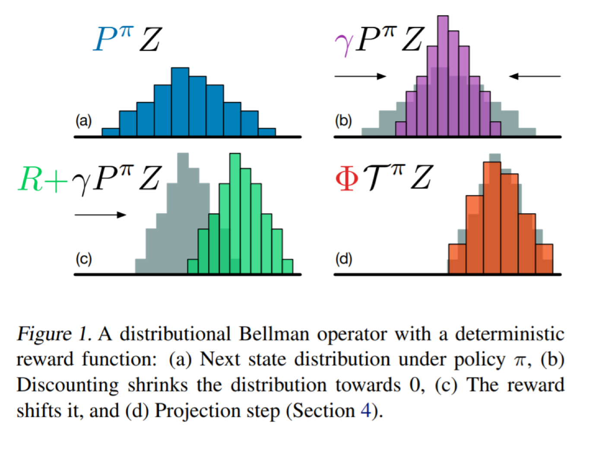
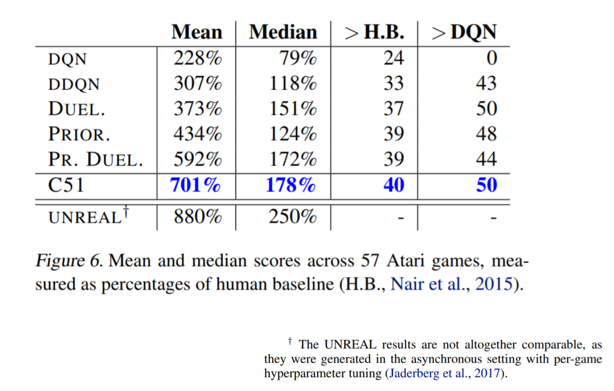
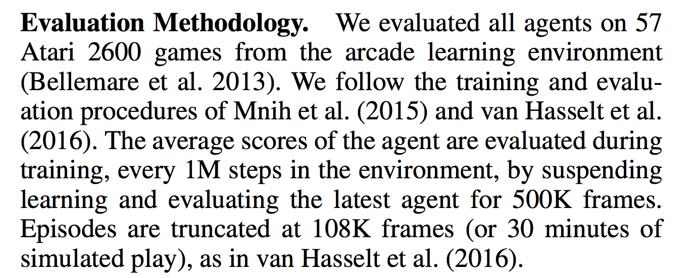

## Eligibility Traces

](../../assets/images/section_4/unified_view.png){ width=30%, height=30% }

Family of methods between Temporal Difference & Monte Carlo

Eligibility traces allow us to **assign TD errors** to different states 
- can be useful with delayed rewards or non-Markov environments
- requires more computation 
- squeezes more out of data

Allow us to tradeoff between bias and variance

### The space between TD and MC

In between TD and MC exist a family of approximation methods known as **n-step returns**

{ width=30%, height=30% }

### Forward and backward view

We can look at eligibility traces from two perspectives

The **forward** view is helpful for understanding the theory

The **backward** view can be put into practice

We can decompose return into **complex backups**
- looking forward to future returns 
- can use a combination of experience based and model based backups 

$$ R\_t = \frac{1}{2} R\_{t}^{2} + \frac{1}{2} R\_{t}^{4} $$

$$ R\_t = \frac{1}{2} TD + \frac{1}{2} MC $$

{ width=30%, height=30% }

### The backward view

The backward view approximates the forward view
- forward view is not practical (requires knowledge of the future)

It requires an additional variable in our agents memory 
- **eligibility trace $e_{t}(s)$**

At each step we decay the trace according to

$$ e\_{t}(s) = \gamma \lambda e\_{t-1}(s) $$

Unless we visited that state, in which case we accumulate more eligibility

$$ e\_{t}(s) = \gamma \lambda e\_{t-1}(s) + 1 $$

{ width=30%, height=30% }

### Traces in a grid world

{ width=30%, height=30% }

- one step method would only update the last $Q(s,a)$
- n-step method would update all $Q(s,a)$ equally
- eligibility traces updates based on how recently each $Q(s,a)$ was experienced

## Prioritized experience replay

{ width=30%, height=30% }

### Naive experience replay

Naive experience replay randomly samples experience
- learning occurs at the same frequency as experience

### Prioritized Experience Replay

Some experience is more useful for learning than others
- we can measure how useful experience is by the temporal difference error

$$ error = r + \gamma Q(s', a) - Q(s,a) $$

TD error measures suprise 
- this transition gave a higher or lower reward than our value function expected

Non-random sampling introduces two problems

1. loss of diversity - we will only sample from high TD error experiences 
2. introduce bias - non-independent sampling 

Schaul et. al (2016) solves these problems by

1. loss of diversity -> make the prioritization stochastic
2. correct bias -> use importance sampling

### DDQN

{ width=30%, height=30% }

DDQN = Double Deep Q-Network
- first introducued in a tabular setting in 2010
- reintroduced in the content of DQN in 2016

DDQN aims to overcome the **maximization bias** of Q-Learning 

### Maximization bias

Imagine a state where $Q(s,a) = 0$ for all $a$

Our estimates are normally distributed above and below 0

{ width=30%, height=30% }

The DDQN modification to DQN makes use of the target network as a different function to approximate Q(s,a)

**Original DQN target**
$$ r + \gamma \underset{a}{\max} Q(s,a;\theta^{-}) $$

**DDQN target**
$$ r + \gamma Q(s', \underset{a}{argmax}Q(s',a; \theta); \theta^{-}) $$ 

- select the action according to the online network

- quanitfy the value that action using the target network

{ width=30%, height=30% }

## Distributional Q-Learning

{ width=30%, height=30% }

### Beyond the expectation

All the reinforcement learning we have seen focuses on the expectation (i.e. the mean)

$$Q(s,a) = \mathbf{E}[G_t] = \mathbf{E}[r + \gamma Q(s',a)] $$

In 2017 DeepMind introduced the idea of the value distribution

State of the art results on Atari (at the time - Rainbow is currently SOTA)

{ width=30%, height=30% }

{ width=30%, height=30% }

{ width=30%, height=30% }

### Rainbow

{ width=30%, height=30% }

All the various improvements to DQN address different issues

- DDQN - overestimation bias
- prioritized experience replay - sample efficiency
- dueling - generalize across actions
- multi-step bootstrap targets - bias variance tradeoff
- distributional Q-learning - learn categorical distribution of $Q(s,a)$
- noisy DQN - stochastic layers for exploration

Rainbow combines these improvements

{ width=30%, height=30% }

{ width=30%, height=30% }

{ width=30%, height=30% }

{ width=30%, height=30% }
