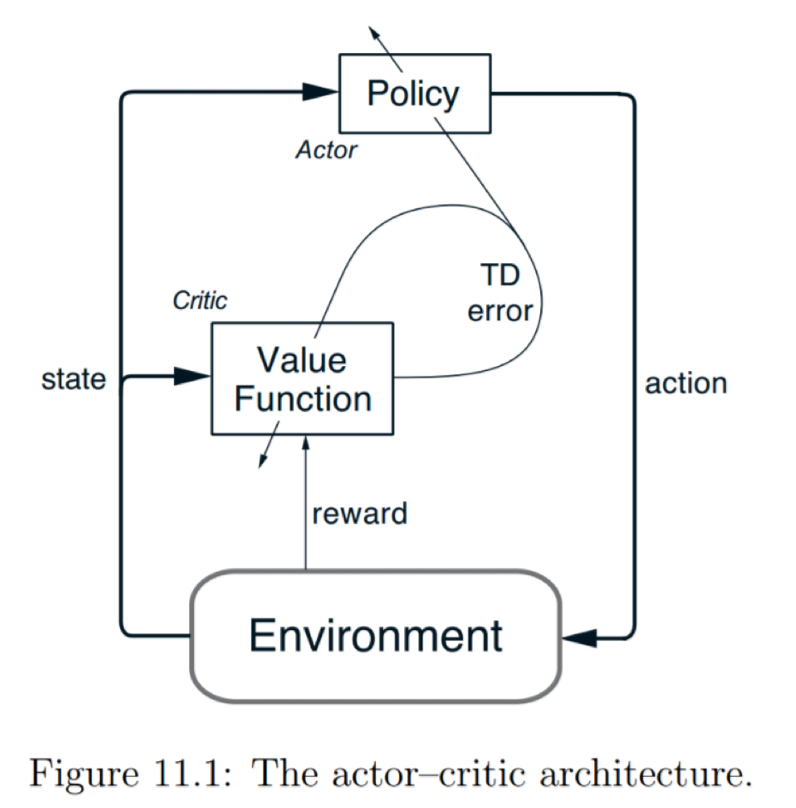
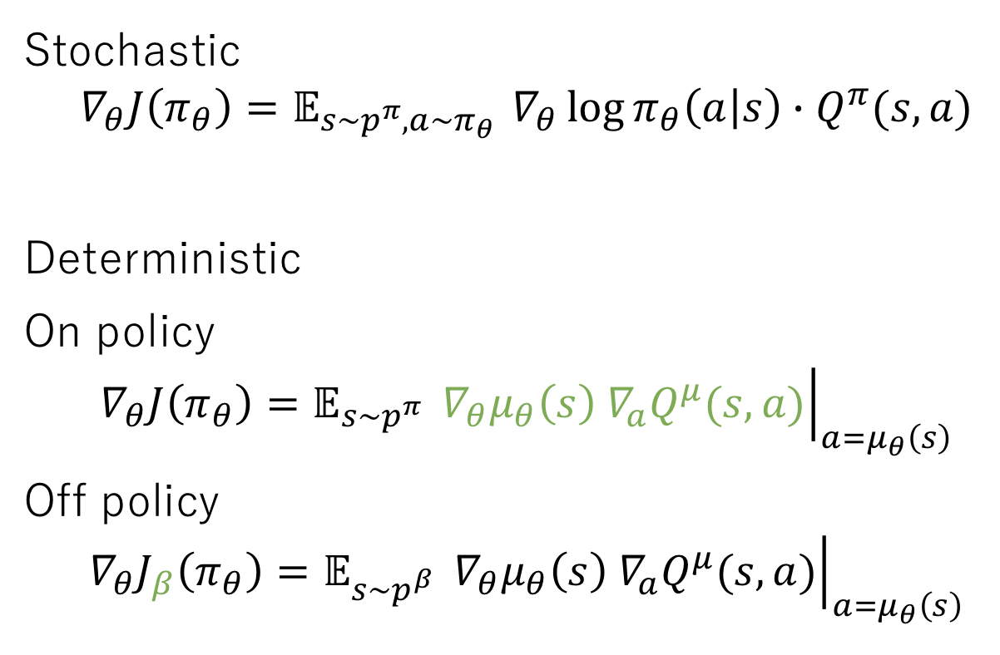
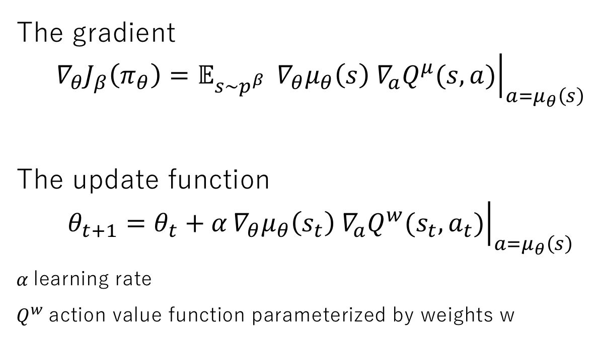
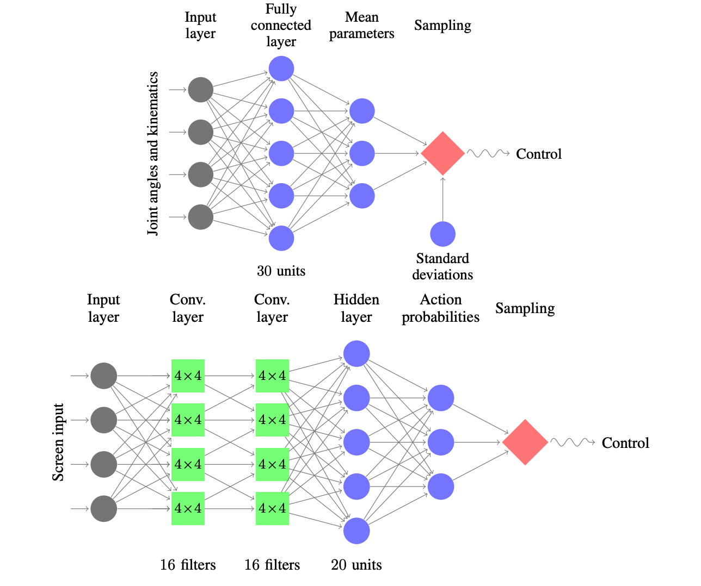

# Five - Policy Gradients

Motivations for using policies, how to use a policy, the score function, Actor-Critic, DPG, PPO.

---

## Contrast with value function methods

Previously we generated a policy from a value function.

$$ a = \underset{a}{argmax} Q(s,a) $$

In policy gradients we **parameterize a policy directly**.  This policy is a probability distribution over actions.

$$ a \sim \pi(a_t|s_t;\theta) $$

## Policy gradients versus value functions

**Policy gradients**

- optimize return directly
- work in continuous and discrete action spaces
- works better in high-dimensional action spaces
- usually on-policy - meaning it is hard to escape the bias of a bad initial policy
-

**Value functions**

- optimize value function accuracy
- off policy learning
- exploration
- better sample efficiency

{ width=20%, height=20% }

\newpage

## Motivations for policy gradients

### Stochastic policies

{ width=20%, height=20% }

A stochastic policy means exploration is built into the policy -> exploration can be controlled by the agent by changing parameters.  A common example of this is for the agent to be able to learn the standard deviation of an action.

### High dimensional action spaces

Q-Learning requires a discrete action space to $argmax$ across

Lets imagine controlling a robot arm in three dimensions in the range [0, 90] degrees

This corresponds to approx. 750,000 actions a Q-Learner would need to argmax across

We also lose shape of the action space by discretization.  By this I mean that the agent now has an action space of discrete actions with no understanding of how they relate to each other

\newpage

{ width=80%, height=80% }

### Optimize return directly

When learning value functions our optimizer is working towards improving the predictive accuracy of the value function
- our gradients point in the direction of predicting return

This isn't what we really care about - we care about maximizing return

Policy methods optimize return directly
- changing weights according to the gradient that maximizes future reward
- aligning gradients with our objective (and hopefully a business objective)

### Simplicity

Learning a value function and deriving a policy from it is more complex than simply parameteterizing a policy.  Some states don't require exact quantification of return for each action - it's very obvious what is the correct action.

Policy gradient methods are often trained on-policy using sequences of experience, making them more compatible with recurrent neural networks.

\newpage

## Parameterizing policies

The type of policy you parameterize depends on the **action space**.  We can select actions from discrete spaces using a softmax policy:

{ width=20%, height=20% }

We can select actions from a continuous action space by parameterizing the statistics of a Gaussian distribution, and then sampling from that distribution:

{ width=20%, height=20% }

\newpage

## Policy gradients without equations

We have a parameterized policy

- a neural network that outputs a distribution over actions

How do we improve it - how do we learn?

- change parameters to take actions that get more reward
- change parameters to favour probable actions

Reward function is not known

- but we can calculate the *gradient the expected reward*

## Policy gradients with a few equations

Our policy $\pi(a_t|s_t;\theta)$ is a **probability distribution over actions**

How do we improve it?

- change parameters to take actions that get more reward
- change parameters to favour probable actions

Reward function is not known
- but we can calculate the *gradient of the expectation of reward*

$$\nabla_{\theta} \mathbb{E}[G_t] = \mathbb{E}[\nabla_{\theta} \log \pi(a|s) \cdot G_t]$$

We can figure out how to change our parameters without actually knowing the reward function itself

## The score function in statistics

The **score function** comes from using the log-likelihood ratio trick

The score function allows us to get the gradient of a function by **taking an expectation**

Expectataions are averages
- use sample based methods to approximate them

$$\nabla_{\theta} \mathbb{E}[f(x)] = \mathbb{E}[\nabla_{\theta} \log P(x) \cdot f(x)]$$

](../../assets/images/section_5/score_derivation.png){ width=20%, height=20% }

## The score function in reinforcement learning

$$\nabla_{\theta} \mathbb{E}[G_t] = \mathbb{E}[\nabla_{\theta} \log \pi(a|s) \cdot G\_t]$$

` gradient of return = expectation of the gradient of the policy * return`

The RHS is an expectation - we can estimate it by sampling

The expectation is made up of things we can sample from

- we can sample from our policy
- we can sample the return (from experience)

## Training a policy

We use the score function to get the gradient, then follow the gradient

`gradient = log(probability of action) * return`

`gradient = log(policy) * return`

The score function limits us to on-policy learning
- we need to calculate the log probability of the action taken by the policy

## Policy gradient intuition

$$ \nabla_{\theta} \mathbb{E}[G_t] = \mathbb{E}[\nabla_{\theta} \log \pi(a|s) \cdot G_t] $$

$$ \log \pi(a_t|s_t;\theta) $$

- how probable was the action we picked
- we want to reinforce actions we thought were good

$$ G_t $$

- how good was that action
- we want to reinforce actions that were actually good

Different methods to approximate the return $G_t$

We can use a Monte Carlo estimate - this is known as REINFORCE

Using a Monte Carlo approach comes with all the problems we saw earlier

- high variance
- no online learning
- requires episodic environment

How can we get some the advantages of Temporal Difference methods?

## Baseline

We can introduce a baseline function

- this reduces **variance without introducing bias** - as long as the baseline parameters are separate from the policy parameters
- a natural baseline is the value function (weights $w$)
- baseline should not be dependent on our policy parameters $\theta$

$$\log \pi(a_t|s_t;\theta) \cdot (G_t - B(s_t; w))$$

This also gives rise to the concept of **advantage** - how much better this action is than the average action (policy & env dependent):

$$A_{\pi}(s_t, a_t) = Q_{\pi}(s_t, a_t) - V_{\pi}(s_t)$$

The advantage function replaces either the Monte Carlo return or the action-value function in the score function update for modern policy gradient algorithms.

### Actor-Critic

{ width=30%, height=30% }

We parameterize two functions

- **actor** = policy
- **critic** = value function

We update our actor (i.e. the behaviour policy) in the direction suggested by the critic

{ width=30%, height=30% }

{ width=30%, height=30% }

\newpage

## Deterministic Policy Gradient

Actor Critic

Determinstic policy - more efficient than stochastic

Continuous action spaces

Off-policy learning

Uses experience replay

Uses target networks

### Stochastic vs determinstic policies

Stochastic policy is a probability distribution over actions

Actions are selected by sampling from this distribution

$$ \pi_{\theta}(a|s) = P[a|s;\theta] $$

$$ a \sim \pi_{\theta}(a|s) $$

DPG parameterizes a deterministic policy

$$ a = \mu_{\theta}(s) $$

### DPG components

Actor
- off policy
- function that maps state to action
- exploratory

Critic
- on-policy
- critic of the current policy
- estimates $Q(s,a)$

### Gradients

{ width=30%, height=30% }

Stochastic integrates over both the state & action spaces

Deterministic integrates over only the state space -> leading to better sample efficiency

### Updating policy weights

{ width=30%, height=30% }

{ width=30%, height=30% }

\newpage

## Asynchronous Advantage Actor-Critic (A3C)

We saw earlier that experience replay is used to make learning more stable & decorrelate updates, but can only be used with off-policy learners.

**Asynchronous**

- multiple agents learning separately
- experience of each agent is independent of other agents
- learning in parallel stabilizes training
- allows use of on-policy learners
- runs on single multi-core CPU
- learns faster than many GPU methods

**Advantage**

- the advantage function

$$A_{\pi}(s_t, a_t) = Q_{\pi}(s_t, a_t) - V_{\pi}(s_t)$$

How much better an action is than the average action followed by the policy

\newpage

## Natural Policy Gradients, TRPO and PPO

These three pieces of work can be understood in order.  The central idea behind all three is that **we want to constrain and limit how much we change a policy each time we do a gradient update**.  This improves the stability of the policy and avoids collapses.  

Remember that because policy gradients are usually on-policy, so poor quality updates also affect exploration.

- Natural Policy gradients - rely on a computationally intense second order derivative method (inverse of the Fisher Infomation matrix)
- TRPO - uses the KL-divergence to hard constrain policy updates (avoids calculating the Fisher Infomation matrix, but uses Conjugate Gradient to solve a constrained optimization problem)
- PPO - uses clipped probability ratios to constrain policy updates

## Natural Policy Gradient

- Kakde (2002) A Natural Policy Gradient - [paper](https://papers.nips.cc/paper/2073-a-natural-policy-gradient.pdf)
- Natural Policy Gradient Explained - Jonathan Hui - [Medium blog post](https://medium.com/@jonathan_hui/rl-natural-policy-gradient-actor-critic-using-kronecker-factored-trust-region-acktr-58f3798a4a93)
- Policy gradient methods - [Scholarpedia](http://www.scholarpedia.org/article/Policy_gradient_methods#Natural_Policy_Gradients)

Standard gradient descent will follow the direction of steepest descent.  This is a metric that is defined based on the choice of co-ordinates of the parameters - it is non-covariant.  Ideally we want updates that find gradients no matter the parameterization of our policy.

The exact gradient of the average reward of a policy parameterized by $\theta$:

$$ \nabla \eta(\theta) = \sum \rho^{\pi}(s) \nabla \pi(a;s,\theta)Q^{\pi}(s,a) $$

The natural gradient is an alternative gradient which is based on the structure of the parameter space.  The natural gradient makes use of the Fisher infomation matrix, which is a matrix to measure the distance between distributions, regardless of the co-ordinates.

Regular policy gradients can point towards plateaus.  The natural gradient instead points towards the optimal solution - and finds the greedy action that would be chosen under one step of policy iteration.

Calculating the gradient requires us to take the inverse of the Fisher infomation matrix $F(\theta)$, which is computationally expensive (second order derivative):

$$ {\tilde{\nabla}} \equiv F(\theta)^{-1} \nabla \eta (\theta) $$

The update rule for the natural policy gradient is then:

$$ f \leftarrow f + \nabla log \pi(a_t;s_t,\theta) \nabla log \pi(a_t; s_t, \theta)^T $$

\newpage

## Trust Region Policy Optimization (TRPO)

- Schulman et. al (2015)  Trust Region Policy Optimization - [paper](https://arxiv.org/pdf/1502.05477.pdf)
- Towards Data Science - [blog post](https://towardsdatascience.com/introduction-to-various-reinforcement-learning-algorithms-part-ii-trpo-ppo-87f2c5919bb9)
- Max's Blog - Notes on Trust Region Policy Optimization - [blog post](http://178.79.149.207/posts/trpo.html)

The idea behind a trust region is that we constrain how far we update our policy - contrast this with line search algorithms which follow gradients wherever they go.  

TRPO uses a miniorization-maximization algorithm to find a lower bound on our original objective as the surrogate objective, and then maximize this approximated lower bound so as to optimize the original objective.  In TRPO the original objective is the expected cumulative return of the policy.

Constraining the policy updates to this trust region improves the stability of learning.  TRPO is able to achieve monotonic improvement in policy performance - i.e. each update gives us a better (or the same) policy.

TRPO uses the Conjugate Gradient algorithm to avoid explicitly calculating the Fisher Infomation Matrix (as we do in Natural Gradients) - but this is a complicated constrained optimization problem.  TRPO makes a linear approximation of the objective and a quadratic approximation of the constraint.

TRPO has the following variants:

- approximate the objective using a linear method.  Approximate the KLD using a quadratic (second order) method.  Use conjugate gradient to approixmate the inverse of the Fisher Infomation Matrix.
- place a hard constraint on the KLD, and use Conjugate Gradient to solve the formulation given below:

In TRPO we optimize the objective function based on the probability ratio and advantage function, over trajectories sampled from our old policy:  

$$ \textrm{maximize} \quad \mathbb{E}_{s \sim \pi_{\theta_{old}}, a \sim \pi_{\theta_{old}}} \frac{\pi_{\theta}(a_t | s_t)}{\pi_{\theta_{old}}(a_t | s_t)} A_t  $$

$$ \textrm{subject to} \quad D_{KL}^{\rho_{\theta_{old}}} (\theta_{old}, \theta) \leq \delta $$

Note that the constraint we use here is not the one suggested by the theory.  The theory suggests using the maximum KL-divergence over the entire state space - which is impractical to solve.  Instead the expectation over states is used:

$$ D_{KL}^{\rho}(\theta_1, \theta_2) := \mathbb{E}_{s \sim \rho} [D_{KL}[\pi_{\theta_{1}}(\cdot|s), \pi_{\theta_2}(\cdot | s)]] $$

{ width=20%, height=20% }

The 2015 TRPO paper compared the following algorithms

-

\newpage

## Proximal Policy Optimization (PPO)

- Schulman et. al (2017) Proximal Policy Optimization Algorithms - [paper](https://arxiv.org/pdf/1707.06347.pdf)
- Proximal Policy Optimization (PPO) Explained - [blog post](https://medium.com/@jonathan_hui/rl-proximal-policy-optimization-ppo-explained-77f014ec3f12)

*Context - used in Open AI DOTA work (single 1024 node LSTM layer).*

> Q-learning (with function approximation) fails on many simple problems and is poorly understood, vanilla policy gradient methods have poor data efficiency and robustness; and trust region policy optimization (TRPO) is relatively complicated, and is not compatible with architectures that include noise (such as dropout) or parameter sharing (between the policy and value function, or with auxiliary tasks).

PPO builds upon TRPO. It is simpler (only first order derivatives) & more sample efficient.  Multiple epochs of batch updates (rather than a single gradient update per sample).

The 2016 PPO paper proposes two methods - the first based on **clipped probability ratios**, and the second based on an adaptive KL penalty.

### Clipped probability ratio

Recall in TRPO we optimize an objective:

$$ \textrm{maximize} \quad \mathbb{E} [\frac{\pi_{\theta}(a_t | s_t)}{\pi_{\theta_{old}}(a_t | s_t)} A_t ] = \mathbb{E} [r_t(\theta) A_t] $$

The clipped loss function proposed in PPO is:

$$ L^{\text{CLIP}}(\theta) = \mathbb{E} [ min(r_t{\theta} A_t, \text{clip}(r_t{\theta}, 1 - \epsilon, 1 + \epsilon) A_t)] $$

Written out in code form:

```python
clipped_loss = np.min(prob_ratio * advantage, clip(prob_ratio, 1-epsilon, 1+epsilon) * advantage
```

### Adaptive KL penalty

PPO also introduces an algorithm with a soft constraint on the KL-divergence, but note that it performs worse than the clipped probability ratio algorithm.

$$ L(\theta) = \mathbb{E} [\frac{\pi_{\theta}(a_t | s_t)}{\pi_{\theta_{old}}(a_t | s_t)} A_t - \beta \cdot KL[\pi_{\theta_{\text{old}}}(\cdot|s_t), \pi_{\theta}(\cdot | s_t)]] $$

$\beta$ is dynamically adjusted between policy updates based on the KL-divergence itself

PPO uses a fully connected neural network with two hidden layers of 64 units, with tanh non-linearities.  The policy outputs the mean of a standard deviation for continuous control tasks, with variable standard deviations.
