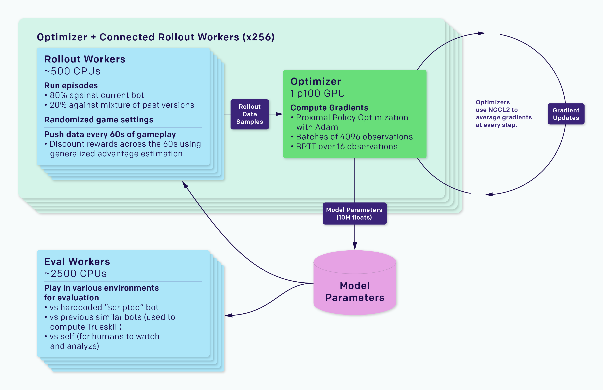
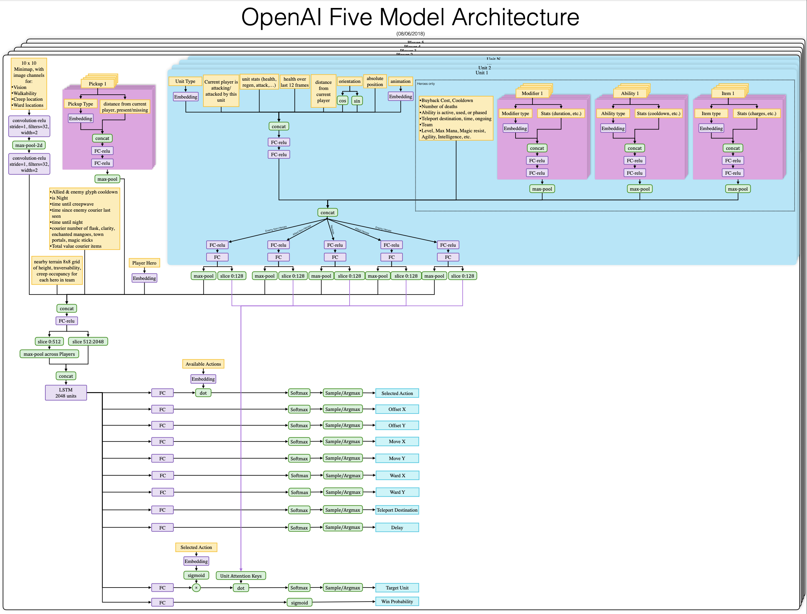
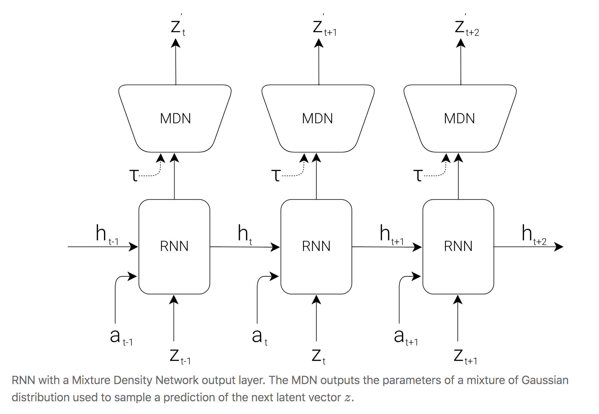
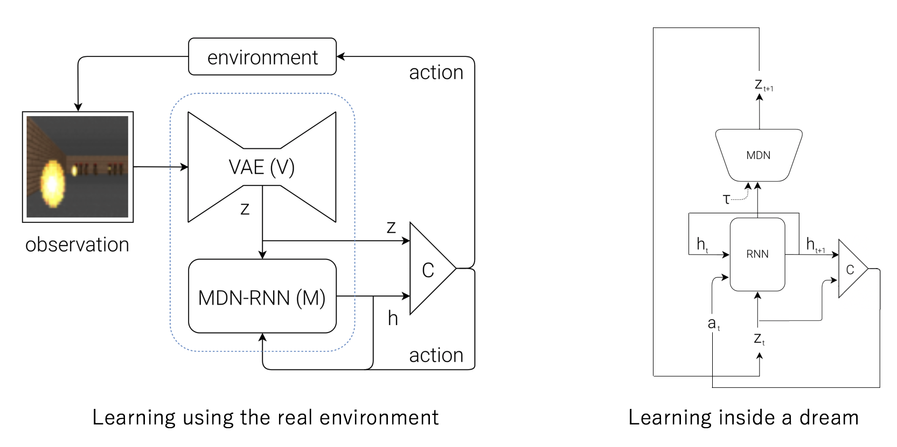

## Where is modern reinforcement learning today

The material for this section comes primarily from

- Deep Reinforcement Learning Doesn't Work Yet - Alex Irpan - [blog post](https://www.alexirpan.com/2018/02/14/rl-hard.html)
- Machines that Learn by Doing - Prof. Sergey Levine (Google Brain/Berkeley) - [youtube](https://www.youtube.com/watch?v=yLHzDky2ApI)

{ width=30%, height=30% }

While the reinforcement learning problem is different from supervised and unsupervised learning, reinforcement has benefitted from work in the other two areas in machine learning.

Two of the most impressive projects in reinforcement learning (AlphaGo & Atari work) both take advantage of modern convolutional neural networks - for example, AlphaGo Zero uses residual connections.

Policy gradient algorithms make use of recurrent neural networks, such as in the Open AI DOTA work.

AlphaGo also reflects advances in unsupervised learning - namely generative adversarial networks.  AlphaGo uses adversarial learning to blow past the limits of experience generated by human Go players.

Andrew Ng estimated that supervised learning provides the vast majority of machine learning business value - reinforcement learning is still immature in real world production systems.

The defining feature of modern reinforcement learning is **sample inefficiency**.

### Sample inefficient

Modern reinforcement learning is **sample inefficient**.  This sample inefficiency means that reinforcement learning **requires simulation**.  All of modern reinforcement learning's achievements have been on easily simulateable environments (games).

{ width=80%, height=80% }

To pass the 100% median performance

- Rainbow = 18 million frames = 83 hours of play
- Distributional DQN = 70 million
- DQN = never (even after 200 million frames!)

We can ignore sample efficiency if sampling is cheap.  In the real world it can be hard or expensive to generate experience.

It's not about learning time - it's about the ability to sample experience (i.e. to go around the MDP loop).

### Generalization to the real world

The tasks typically solved by modern reinforcement learning agents are small and uniform. The goal is mastery, with test and training being the same environment.

The real world is huge, highly varied.  The goal is to not screw up too much, and the test set is an unmitigated disaster of complexity.  The real world also presents more unexpected situations than the simulations used for learning in reinforcement learning.

### How good is good enough

RL solution doesn’t have to achieve a global optima, as long as its local optima is better than the human baseline

### Importance of simulation design

The generalization challenge between the simulation for learning and acting in the real world

Requirement of a reward function - this is true for all MDPs.  But the requirement to design one is an additional challenge

Reward function design is difficult
- need to encourage behaviour
- need to be learnable

Shaping rewards to help learning can change behaviour

### Model based planning using simulation

The simulation can be used with model based methods (i.e. Monte Carlo Tree Search).  With a good model, model based methods can outperform model based methods in sample efficiency.  See [Guo et. al (2014) Deep Learning for Real-Time Atari Game Play Using Offline Monte-Carlo Tree Search Planning](https://papers.nips.cc/paper/5421-deep-learning-for-real-time-atari-game-play-using-offline-monte-carlo-tree-search-planning).

{ width=20%, height=20% }

Learning from a small number of samples is a key research field.  Design of simulation environments is another.

Domain specific algorithms can work faster & better.  The generalizability of RL means that except in rare cases, domain specific algorithms work faster and better

AlphaGo is model based (policy + rules = an environment model)

### Instability

> [Supervised learning] wants to work. Even if you screw something up you’ll usually get something non-random back. RL must be forced to work. If you screw something up or don’t tune something well enough you’re exceedingly likely to get a policy that is even worse than random. And even if it’s all well tuned you’ll get a bad policy 30% of the time, just because.
>
> Long story short your failure is more due to the difficulty of deep RL, and much less due to the difficulty of “designing neural networks” - Andrej Karpathy

Results can be unstable and hard to produce (this applies to a lot of scientific literature).  Different random seeds can lead to dramatically different results.  30% failure rate counts as working.

**A sample inefficient and unstable training algorithm heavily slows down your rate of productive research**

{ width=30%, height=30% }

{ width=40%, height=40% }

\newpage

### Going forward & the future

> The way I see it, either deep RL is still a research topic that isn’t robust enough for widespread use, or it’s usable and the people who’ve gotten it to work aren’t publicizing it. I think the former is more likely - Alex Irpan

Make learning eaiser

- ability to generate near unbounded amounts of experience
- problem is simplified into an eaiser form
- you can introduce self-play into learning
- learnable reward signal
- any reward shaping should be rich

The future

- local optima are good enough (is any human behaviour globally optimal)
- improvements in hardware help with sample inefficiency
- more learning signal - hallucinating rewards, auxillary tasks, model learning
- model learning fixes a bunch of problems - difficulty is learning one

Many things need to go right for RL to work - success stories are the exception, not the rule

\newpage

## Inverse reinforcement learning

The basic idea in inverse reinforcement is to learn a reward function from rollouts of high quality (i.e. human) demonstrations.  Sometimes it is eaiser to sample a rollout that to design the reward function.

{ width=50%, height=50% }

\newpage

## Open AI Dota - [blog post](https://blog.openai.com/openai-five/)

180 years worth of games per day.  Self play.  Using Proximal Policy Optimization (PPO).  256 GPU, 128,000 CPU cores.  Separate LSTM for each hero, no human data.

Single layer, 1024 unit LSTM.  State from an API.  Actions through action heads, each with a semantic meaning.

Batch size of 1,048,576 observations, 60 batches per minute.  Annealed discount rate from 0.998 (46 second half life) to 0.9997 (5 minute half life).

Trains 80% of games against itself, 20% against past selves.  Concepts emerge after several hours of training.

Randomizes properties of the game to encourage exploration - this improved performance.  Robotics team applied similar ideas to generalize robots to the real world.

Reward is metrics humans track to decide how the game is going.  Postprocess each reward by subtracting the other teams average reward to prevent agents from finding positive-sum situations (i.e. someone has to lose).

No explicit communication channel.  Teamwork controlled by a hyperparameter *team spirit*, which weights how much a hero should value it's versus the average of the team's reward functions.  Annealed over training.

Max pool across players - does this telepathically link them?  Is this communication?

Agent has instant access to infomation (positions, healths, inventories etc) that humans have to check manually.  Learning from pixels would require thousands of GPUs.  Average reaction time of 80 ms, which is faster than humans.

Binary rewards give good performance - shaped reward better than the sparser winning or losing reward function.

### Challenges of DOTA

- long time horizions
- partially-observed state
- high-dimensional, continuous action space
- high-dimensional, continuous observation space (not pixels - 20,000 floats.  Go is 400, chess 70)

\newpage

{ width=60%, height=60% }

\newpage

### [Model architecture](https://s3-us-west-2.amazonaws.com/openai-assets/dota_benchmark_results/network_diagram_08_06_2018.pdf)

{ width=100%, height=100% }

\newpage

## Learning Montezuma's Revenge

Kaplan et. al 2017 Beating Atari with Natural Language Guided Reinforcement Learning - [paper](https://arxiv.org/abs/1704.05539)

Learning Montezuma’s Revenge from a Single Demonstration - [blog post](https://blog.openai.com/learning-montezumas-revenge-from-a-single-demonstration/)

On “solving” Montezuma’s Revenge - Arthur Juliani - [Medium](https://medium.com/@awjuliani/on-solving-montezumas-revenge-2146d83f0bc3)

\newpage

## Ha & Schmidhuber (2018) World Models

[paper](https://arxiv.org/pdf/1803.10122.pdf) - [blog post](https://worldmodels.github.io/) - [blog post appendix](https://worldmodels.github.io/#appendix)

Unsupervised + reinforcement learning agent learns from it's own generative model of the environment.

One key idea is **compression**

- compresses the dimensionality of the observation into a latent representation
- compresses the latent representation over time

This allows a compact linear policy to be used for control - the policy parameters are learnt using an evolutionary algorithm.

### Inspiration

We use low dimensional mental models to represent the world around us.

Our brain learns abstract representations of spatial and temporal infomation.  Evidence also suggests that perception itself is governed by an internal prediction of the future, using our mental models.

This predictive model can be used to perform fast reflexive behaviours when we face danger.

### The agent

{ width=60%, height=60% }

Solves a car racing task that previously hadn't been solved.

Unsupervised learning is used to train a generative environment model.  This environment model is then used by the agent to learn a policy.  Policy is then transferred back to the real environment.

Agent has

- visual sensory component (V) that compresses pixels into lower dimensional representation
- memory component (M) that makes predictions based on past sequences
- decision making component (C) decides what action to take based on vision and memory

| Model | Parameter Count |
|---|---|
|VAE|4,348,547|
|MDN-RNN|422,368|
|Controller|867|

V is a Variational Auto Encoder - a network that compresses and reproduces the observation of the environment.  The reconstructed observation is not used - what is valuable is the compressed version of the observation (aka the **latent representation**).  This lower dimensional representation is more useful (TODO).

VAE is trained using dataset of 10,000 random rollouts.  Minimize the different between a frame and the reconstructed version.  **How is this distance measured????**

{ width=30%, height=30% }

Uses a temperature parameter to control amount of uncertainty in generated environments.  Show that noisier environments help prevent agent from taking advantage of imperfections of its internal world model.

The latent representation (i.e. middle layer of V) is used in two ways
- by the memory M to predict the next latent representation of the observation
- by the controller C to select actions

The memory (M) is a Mixed Density Recurret Network.  It predicts the latent representation of the observation - not the raw observation.  Compresses over time.  A predictive model of the future vectors that V is expected to produce.

Outputs probability density function instead of a deterministic prediction.  Modeled as a mixture of Gaussians (Mixture Density Network).

{ width=40%, height=40% }

 Now can use the trained autoencoder to train the memory model.  The MDN-RNN is trained to model $P(z_{t+1} | a_t, z_t, h_t)$ using a mixture of Gaussians.  The MDN-RNN is predicting the next state (generating a probability distribution over next states as function of the action taken, the latent representation of the observation and the hidden state of the MDN-RNN).

{ width=30%, height=30% }

#### Mixed density networks

Bishop (1994) - Mixture Density Networks [paper](https://publications.aston.ac.uk/373/1/NCRG_94_004.pdf)

Mixture Density Networks with TensorFlow [blog post](http://blog.otoro.net/2015/11/24/mixture-density-networks-with-tensorflow/) - [pytorch implementation](https://github.com/hardmaru/pytorch_notebooks/blob/master/mixture_density_networks.ipynb)

The mixed density network uses the log-likelihood of the distribution versus the training data as the loss function.  This is also used in logistic regression and in the cross entropy minimization of a softmax.

### Simple controller

The controller is a linear function.

Simple as possible - trained separately from V and M.  Single linear layer that maps the MDN-RNN hidden state and latent representation of the observation to action

A smaller controller allows the learner to focus on credit assignment on a smaller search space, without sacrifing capacity and expressiveness via the world model

In model free RL, the algo is often bottlenecked by the credit assignment problem - making it hard to learn millions of weights.  Smaller networks are used as they iterate faster to a good policy.

The simplicity of C allows using unconventional ways to train C - Ha et. al use Covariance-Matrix Adaptation Evolution Stragety (CMA-ES).  This algorithm works well for solution spaces of up to a few thousand parameters.

#### CMA-ES - [wikipedia](https://en.wikipedia.org/wiki/CMA-ES)

Stochastic and derivative free.

Evolutionary algo = repeated interplay of variation (recombination and mutuation) + selection based on some objective function.

New candidates are sampled according to a mulitvariate normal distribution.  Recombination is selecting a new mean for this distribution.  Mutation is adding a zero mean random vector.

Pairwise dependencies are represented by a covariance matrix - CMA is a method to update this covariance matrix.  Adapting this covariance matrix amounts to learning a second order model of the objective function.  Only the ranking between candidates is used for learning the sample distribution.

### Environment & experiments

Action space is continuous - steering left/right, acceleration and brake.

Tracks are randomly generated for each trial, agent rewarded for visiting as many tiles in the least amount of time.

### Procedure

```python
def rollout(controller):
    ''' env, rnn, vae are '''
    ''' global variables  '''
    obs = env.reset()
    h = rnn.initial_state()
    done = False
    cumulative_reward = 0
    while not done:
    z = vae.encode(obs)
    a = controller.action([z, h])
    obs, reward, done = env.step(a)
    cumulative_reward += reward
    h = rnn.forward([a, z, h])
    return cumulative_reward
```

1. 10,000 random rollouts
2. train VAE to encode observation into latent vector
3. train MDN-RNN to predict probability distribution of next state
4. use CMA-ES to solve for the parameters of the linear controller

\newpage

### Experiment results

#### V only

Learning to drive from good features is not difficult - it easy to train small feed-forward network to map hand engineered features to policy.

First test is on the agent that can only access the latent representation of the observation.  Achieved 632 +/- 251 over 100 trials.  Same performance as A3C.  Adding a hidden layer improves it to 788 +/- 141 (still not solved)

#### V and M - full world model

Combining with M gives good representation of both current observation and what to expect in the future.  **Agent doesn't need to plan** - all of the infomation about the future is represented in the RRN hidden state.

{ width=20%, height=20% }

Traditional Deep RL requires pre-processing of frame (i.e. edge detection) or stacking of trajectories.  World models directly learns a spatial-temporal representation.

### Learning inside of a dream

Use the *VizDoom: Take Cover* environment - reward is number of timesteps alive.  Each rollout runs for 2100 steps, task is solved if average survival time over 100 consecutive rollouts is greater than 750 steps.

### VizDoom Procedure

{ width=30%, height=30% }

Building a world model suitable for training requires predicting the done flag for a terminal state (one of the game rules).

Model predicts the latent representation of the observation.  This means that this simulation doesn't need to encode any real pixel frames.  This has advantages (discussed later).  The dream environment has identical interface as the real environment, allowing policy to be transferred from the dream to real environment.

{ width=40%, height=40% }

Result of '~900 time steps'.  RNN is able to simulate key aspects of the game (game logic, enemy behaviour, physics and the 3D graphics rendering).

Possible to add noise into the dream environment using a temperature parameter during the sampling process.  **Agents that perform well in the higher temperature settings perform better in the normal setting**.  The temperature parameter prevents agent taking advantages of imperfections in the world model.  An agent that is able to survive in the noisier virtual environment will thrive in the original, cleaner environment.

Agent that learned in dream environment has a score of ~1100 time steps over 100 consecutive random trials.

### Cheating the world model

Initial experiments the agent discovered a way to use an adversarial policy that prevented the memory model generating fireballs.  World model is exploitable by the controller, in a way that the real environment might not be.

Controller has access to all hidden states of M - this grants the controller access to the internal states and memory of the game engine - rather than being limited to observations.

MDN-RNN models the distribution of possible next states to make it more difficult for the controller to exploit deficiencies of M.  If actual env is deterministic, then this could be approximated.  Also allows the temperature parameter to be used to control randomness (the tradeoff between realism and exploitability).

Latent space is a single dimension Gaussian distribution.  The use of mixed density model is useful for envs with random discrete events.  A single dimension Gaussian is sufficient to encode individual frames, but a mixed density Gaussian makes it eaiser to model the logic behind random discrete states.

Temperature at 0.1 is effectively training C with a deterministic LSTM - this M is not able to shoot fireballs.  M is not able to jump to another mode in the mixture Gaussian model where fireballs are formed and shot.  The policy inside the dream will achieve perfect score (2100), but will fail in the real environment.

```
reviewed up until

Note again, however, that the simpler and more robust approach in Learning to Think [27] does not insist on using M for step by step planning. Instead, C can learn to use M’s subroutines (parts of M’s weight matrix) for arbitrary computational purposes but can also learn to ignore M when M is useless and when ignoring M yields better performance. Nevertheless, at least in our present C—M variant, M’s predictions are essential for teaching C, more like in some of the early C—M systems [20, 21, 22], but combined with evolution or black box optimization.
```
