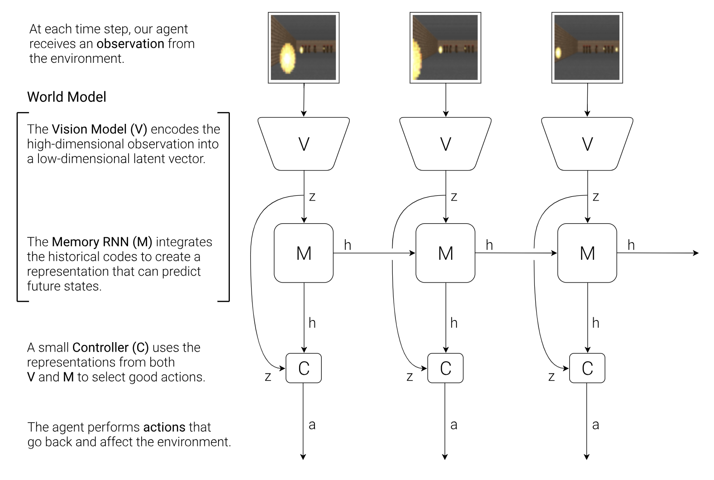
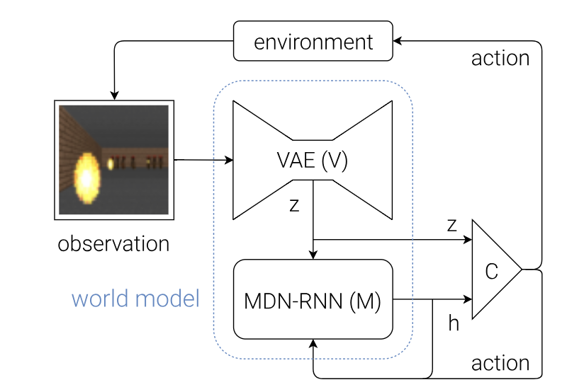
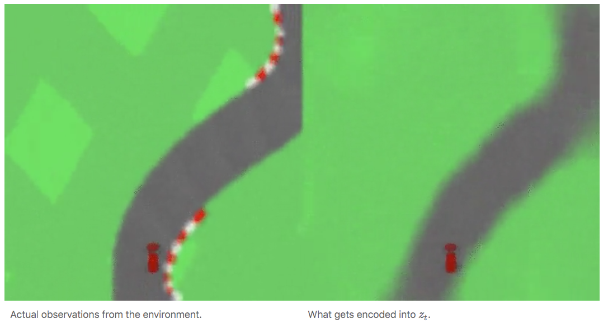
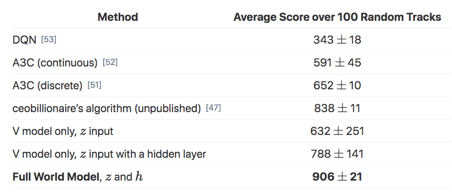
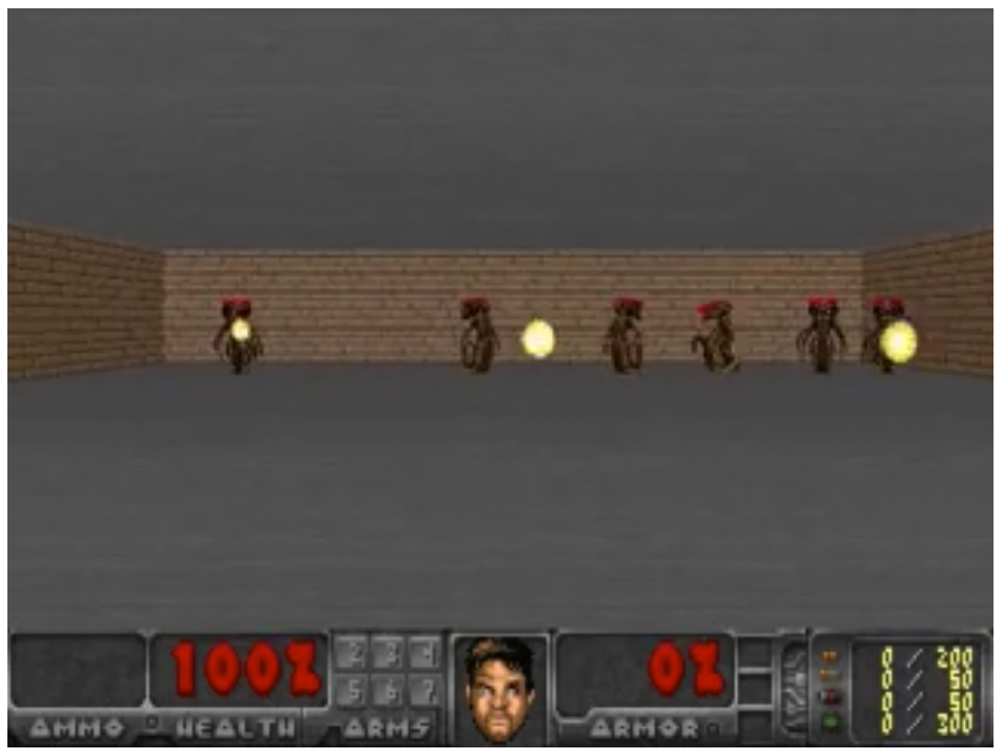

## Where is modern RL at today

Success of deep RL = in domains that aren’t similar to the real world (Go is structured, with few unexpected situations)

Sample inefficient -> requires simulation

Why is everyone not using q learning

- not easy to get convergence - q learning with nonlinear function approximation is not guaranteed to converge either in theory or practice
- doesn’t in general converge
- sensitive to hyper parameters
- lots of local optima

rl tasks = small, uniform, goal=master, test identical to train

real world = huge, highly varied, goal=dont screw up too much, test set = unmitigated disaster of complexity

## Open AI Dota

TODO

(https://www.reddit.com/r/MachineLearning/comments/99ix2d/d_openai_five_loses_against_first_professional/)

(https://www.rockpapershotgun.com/2018/07/20/ai-wizard-mike-cook-wants-openais-dota-bots-to-teach-him-not-beat-him/)

(http://www.gamesbyangelina.org/2018/06/good-luck-have-fun/)]

(https://s3-us-west-2.amazonaws.com/openai-assets/dota_benchmark_results/network_diagram_08_06_2018.pdf)

## Learning Montezuma's Revenge

https://blog.openai.com/learning-montezumas-revenge-from-a-single-demonstration/

## Ha & Schmidhuber (2018) World Models

[paper](https://arxiv.org/pdf/1803.10122.pdf) - [blog post](https://worldmodels.github.io/) - [blog post appendix](https://worldmodels.github.io/#appendix)

## Inspiration from humans

We use low dimensional mental models to represent the world around us.

Our brain learns abstract representations of spatial and temporal infomation.  Evidence also suggests that perception itself is governed by an internal prediction of the future, using our mental models.

This predictive model can be used to perform fast reflexive behaviours when we face danger

### The agent

Solves a car racing task that hasn't been solved using traditional methods

Uses a generative environment model to train an agent.  Agent can be trained entirely within the 'dream environment', with the policy being transferred into the actual environment.  Very cool!

Agent has

- visual sensory component (V) that compresses pixels into lower dimensional representation
- memory component (M) that makes predictions based on past sequences
- decision making component (C) decides what action to take based on vision and memory

First use unsupervised learning to learn model.  Then controller to perform task using the model.  A smaller controller allows the learner to focus on credit assignment on a smaller search space, without sacrifing capacity and expressiveness via the world model

Most model based RL trains on the actual env.  World models trains only inside of generated environment, transferring the policy back to the actual environment

Uses a temperature parameter to control amount of uncertainty in generated environments.  Show that noisier environments help prevent agent from taking advantage of imperfections of its internal world model.



### Variational Auto Encoder (V) 

Creates a compressed representation that can be used to reconstruct the original image.  

### Mixed Density Recurret Network (M) 

Compresses over time.  A predictive model of the future vectors that V is expected to produce.

Outputs probability density function instead of a deterministic prediction.  Modeled as a mixture of Gaussians.  Known as a Mixture Density Network.

### Mixed density networks

Bishop (1994) - Mixture Density Networks [paper](https://publications.aston.ac.uk/373/1/NCRG_94_004.pdf)

Mixture Density Networks with TensorFlow [blog post](http://blog.otoro.net/2015/11/24/mixture-density-networks-with-tensorflow/) - [pytorch implementation](https://github.com/hardmaru/pytorch_notebooks/blob/master/mixture_density_networks.ipynb)

The mixed density network uses the log-likelihood of the distribution versus the training data as the loss function.  This is also used in logistic regression and in the cross entropy minimization of a softmax.

### Controller (C)

Many model free RL algos use small networks with few parameters.  The algo is often bottlenecked by the credit assignment problem - making it hard to learn millions of weights.  Smaller networks are used as they iterate faster to a good policy

High compact policy (it is a linear function!).

Simple as possible - trained separately from V and M.  Single linear layer that maps the MDN-RNN hidden state and latent representation of the observation to action

{ width=80%, height=80% }

```python
def rollout(controller):
    ''' env, rnn, vae are '''
    ''' global variables  '''
    obs = env.reset()
    h = rnn.initial_state()
    done = False
    cumulative_reward = 0
    while not done:
    z = vae.encode(obs)
    a = controller.action([z, h])
    obs, reward, done = env.step(a)
    cumulative_reward += reward
    h = rnn.forward([a, z, h])
    return cumulative_reward
```

The simplicity of C allows using unconventional ways to train C - Ha et. al use Covariance-Matrix Adaptation Evolution Stragety (CMA-ES).  This algorithm works well for solution spaces of up to a few thousand parameters.

### CMA-ES - [wikipedia](https://en.wikipedia.org/wiki/CMA-ES)

Stochastic and derivative free.  

Evolutionary algo = repeated interplay of variation (recombination and mutuation) + selection based on some objective function.

New candidates are sampled according to a mulitvariate normal distribution.  Recombination is selecting a new mean for this distribution.  Mutation is adding a zero mean random vector.  

Pairwise dependencies are represented by a covariance matrix - CMA is a method to update this covariance matrix.  Adapting this covariance matrix amounts to learning a second order model of the objective function.  Only the ranking between candidates is used for learning the sample distribution.

## Environment & experiments

First agent to solve this car racing task.  Tracks are randomly generated for each trial, agent rewarded for visiting as many tiles in the least amount of time.  Action space is continuous - steering left/right, acceleration and brake.

VAE is trained using dataset of 10,000 random rollouts.  Minimize the different between a frame and the reconstructed version.  **How is this distance measured????**

Now can use the trained autoencoder to train the memory model.  The MDN-RNN is trained to model $P(z_{t+1} | a_t, z_t, h_t)$ using a mixture of Gaussians.  The MDN-RNN is predicting the next state (generating a probability distribution over next states as function of the action taken, the latent representation of the observation and the hidden state of the MDN-RNN).

## Procedure

{ width=80%, height=80% }

1. 10,000 random rollouts
2. train VAE to encode observation into latent vector
3. train MDN-RNN to predict probability distribution of next state 
4. use CMA-ES to solve for the parameters of the linear controller

| Model | Parameter Count |
|---|---|
|VAE|4,348,547|
|MDN-RNN|422,368|
|Controller|867|

## Experiment results

### V only

Learning to drive from good features is not difficult - easy to train small feed-forward network to map hand engineered features to policy.  

First test is on the agent that can only access the latent representation of the observation.  Achieved 632 +/- 251 over 100 trials.  Same performance as A3C.  Adding a hidden layer improves it to 788 +/- 141 (still not solved)

### V and M - full world model

Combining with M gives good representation of both current observation and what to expect in the future.  **Agent doesn't need to plan** - all of the infomation about the future is represented in the RRN hidden state.  

{ width=80%, height=80% }

Traditional Deep RL requires pre-processing of frame (i.e. edge detection) or stacking of trajectories.  World models directly learns a spatial-temporal representation.

## Learning inside of a dream

Use the *VizDoom: Take Cover* environment - reward is number of timesteps alive.  Each rollout runs for 2100 steps, task is solved if average survival time over 100 consecutive rollouts is greater than 750 steps.

### Procedure

{ width=80%, height=80% }

Building a world model suitable for training requires predicting the done flag for a terminal state (one of the game rules).

Model predicts the latent representation of the observation.  This means that this simulation doesn't need to encode any real pixel frames.  This has advantages (discussed later).  The dream environment has identical interface as the real environment, allowing policy to be transferred from the dream to real environment.

TODO draw a picture of the dream env without the autoencoder 

Result of '~900 time steps'.  RNN is able to simulate key aspects of the game (game logic, enemy behaviour, physics and the 3D graphics rendering).

Possible to add noise into the dream environment using a temperature parameter during the sampling process.  **Agents that perform well in the higher temperature settings perform better in the normal setting**.  The temperature parameter prevents agent taking advantages of imperfections in the world model.  An agent that is able to survive in the noisier virtual environment will thrive in the original, cleaner environment.

Agent that learned in dream environment has a score of ~1100 time steps over 100 consecutive random trials.  

## Cheating the world model

Initial experiments the agent discovered a way to use an adversarial policy that prevented the memory model generating fireballs.  World model is exploitable by the controller, in a way that the real environment might not be.  

Controller has access to all hidden states of M - this grants the controller access to the internal states and memory of the game engine - rather than being limited to observations.

MDN-RNN models the distribution of possible next states to make it more difficult for the controller to exploit deficiencies of M.  If actual env is deterministic, then this could be approximated.  Also allows the temperature parameter to be used to control randomness (the tradeoff between realism and exploitability).

Latent space is a single dimension Gaussian distribution.  The use of mixed density model is useful for envs with random discrete events.  A single dimension Gaussian is sufficient to encode individual frames, but a mixed density Gaussian makes it eaiser to model the logic behind random discrete states.

Temperature at 0.1 is effectively training C with a deterministic LSTM - this M is not able to shoot fireballs.  M is not able to jump to another mode in the mixture Gaussian model where fireballs are formed and shot.  The policy inside the dream will achieve perfect score (2100), but will fail in the real environment.

```
reviewed up until

Note again, however, that the simpler and more robust approach in Learning to Think [27] does not insist on using M for step by step planning. Instead, C can learn to use M’s subroutines (parts of M’s weight matrix) for arbitrary computational purposes but can also learn to ignore M when M is useless and when ignoring M yields better performance. Nevertheless, at least in our present C—M variant, M’s predictions are essential for teaching C, more like in some of the early C—M systems [20, 21, 22], but combined with evolution or black box optimization.
```


## Model based RL

TODO

## Deep RL doesn't work yet

Blog post - [Deep Reinforcment Learning Doesn't Work Yet](https://www.alexirpan.com/2018/02/14/rl-hard.html)

{ width=30%, height=30% }

State of the art reinforcement learning is **sample inefficient** - we need lots of experience to learn

Tackling any problem where we don't have access to a simulator remain beyond modern RL

**Domain specific algorithms often work faster & better**.  This is especially true if you have access to a good environment model to plan with

Requirement of a reward function - or the requirement to design one

Results can be unstable and hard to produce (this applies to a lot of scientific literature).  Different random seeds can lead to dramatically different results


>>[Supervised learning] wants to work. Even if you screw something up you’ll usually get something non-random back. RL must be forced to work. If you screw something up or don’t tune something well enough you’re exceedingly likely to get a policy that is even worse than random. And even if it’s all well tuned you’ll get a bad policy 30% of the time, just because - Andrej Karpathy (when he was at OpenAI)

Still immature in real world production systems - examples are rare

Requirements and/or nice to haves for learning

- easy to generate experience
- simple problem
- ability to introduce self play
- well defined rewards and dense

RL solution doesn’t have to achieve a global optima, as long as its local optima is better than the human baseline

### Modern RL is sample inefficient

{ width=30%, height=30% }

To pass the 100% median performance

- Rainbow = 18 million frames = 83 hours of play
- Distributional DQN = 70 million
- DQN = never (even after 200 million frames!)

We can ignore sample efficiency if sampling is cheap

In the real world it can be hard or expensive to generate experience

It's not about learning time - it's about the ability to sample

### Other methods often work better 

Many problems are better solved by other methods

- allowing the agent access to a ground truth model (i.e. simulator)
- model based RL with a perfect model

{ width=30%, height=30% }

The generalizability of RL means that except in rare cases, domain specific algorithms work faster and better

### Requirement of a reward function 

Reward function design is difficult
- need to encourage behaviour
- need to be learnable

Shaping rewards to help learning can change behaviour

### Unstable and hard to reproduce results

{ width=30%, height=30% }

Only difference is the random seed!

30% failure rate counts as working

Machine learning adds more dimensions to your space of failure cases

{ width=30%, height=30% }

RL adds an additional dimension - random change

**A sample inefficient and unstable training algorithm heavily slows down your rate of productive research**

{ width=30%, height=30% }

### Going forward & the future

{ width=30%, height=30% }

Make learning eaiser

- ability to generate near unbounded amounts of experience
- problem is simplified into an eaiser form
- you can introduce self-play into learning
- learnable reward signal
- any reward shaping should be rich

The future

- local optima are good enough (is any human behaviour globally optimal)
- improvements in hardware help with sample inefficiency
- more learning signal - hallucinating rewards, auxillary tasks, model learning
- model learning fixes a bunch of problems - difficulty is learning one

Many things need to go right for RL to work - success stories are the exception, not the rule

## Inverse reinforcement learning

{ width=30%, height=30% }

## Closing thoughts

Exploration versus exploitation

Test your models on simple problems

Reinforcement learning is sample inefficient

Deep RL is hard

Reward engineering is key
