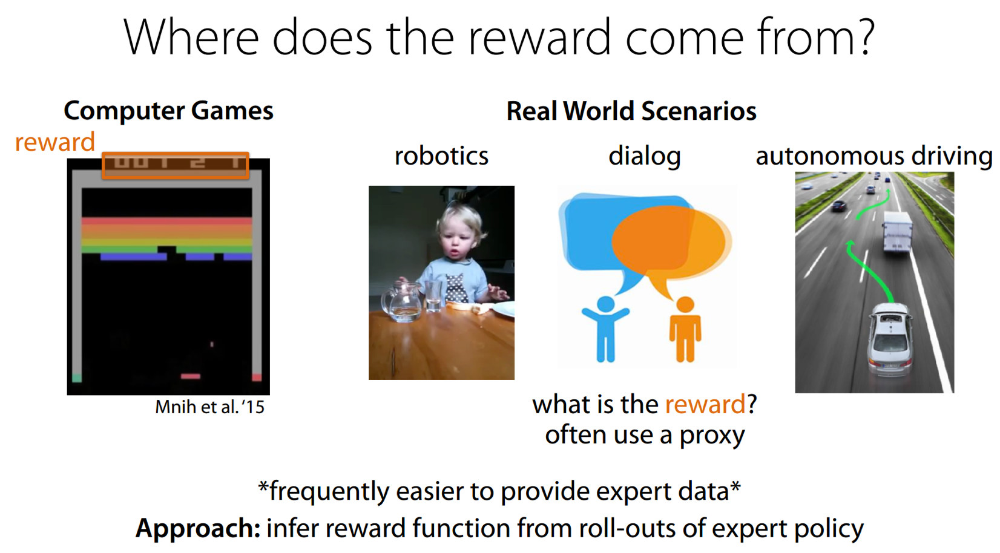

## Where is modern RL at today

Success of deep RL = in domains that aren’t similar to the real world (Go is structured, with few unexpected situations)

Sample inefficient -> requires simulation

Why is everyone not using q learning

- not easy to get convergence - q learning with nonlinear function approximation is not guaranteed to converge either in theory or practice
- doesn’t in general converge
- sensitive to hyper parameters
- lots of local optima

rl tasks = small, uniform, goal=master, test identical to train

real world = huge, highly varied, goal=dont screw up too much, test set = unmitigated disaster of complexity

## Open AI Dota

TODO

(https://www.rockpapershotgun.com/2018/07/20/ai-wizard-mike-cook-wants-openais-dota-bots-to-teach-him-not-beat-him/)

(http://www.gamesbyangelina.org/2018/06/good-luck-have-fun/)]

(https://s3-us-west-2.amazonaws.com/openai-assets/dota_benchmark_results/network_diagram_08_06_2018.pdf)

## World models

TODO

## Model based RL

TODO

## Deep RL doesn't work yet

Blog post - [Deep Reinforcment Learning Doesn't Work Yet](https://www.alexirpan.com/2018/02/14/rl-hard.html)

{ width=30%, height=30% }

State of the art reinforcement learning is **sample inefficient** - we need lots of experience to learn

Tackling any problem where we don't have access to a simulator remain beyond modern RL

**Domain specific algorithms often work faster & better**.  This is especially true if you have access to a good environment model to plan with

Requirement of a reward function - or the requirement to design one

Results can be unstable and hard to produce (this applies to a lot of scientific literature).  Different random seeds can lead to dramatically different results

>>[Supervised learning] wants to work. Even if you screw something up you’ll usually get something non-random back. RL must be forced to work. If you screw something up or don’t tune something well enough you’re exceedingly likely to get a policy that is even worse than random. And even if it’s all well tuned you’ll get a bad policy 30% of the time, just because - Andrej Karpathy (when he was at OpenAI)

Still immature in real world production systems - examples are rare

Requirements and/or nice to haves for learning

- easy to generate experience
- simple problem
- ability to introduce self play
- well defined rewards and dense

RL solution doesn’t have to achieve a global optima, as long as its local optima is better than the human baseline

### Modern RL is sample inefficient

{ width=30%, height=30% }

To pass the 100% median performance

- Rainbow = 18 million frames = 83 hours of play
- Distributional DQN = 70 million
- DQN = never (even after 200 million frames!)

We can ignore sample efficiency if sampling is cheap

In the real world it can be hard or expensive to generate experience

It's not about learning time - it's about the ability to sample

### Other methods often work better 

Many problems are better solved by other methods

- allowing the agent access to a ground truth model (i.e. simulator)
- model based RL with a perfect model

{ width=30%, height=30% }

The generalizability of RL means that except in rare cases, domain specific algorithms work faster and better

### Requirement of a reward function 

Reward function design is difficult
- need to encourage behaviour
- need to be learnable

Shaping rewards to help learning can change behaviour

### Unstable and hard to reproduce results

{ width=30%, height=30% }

Only difference is the random seed!

30% failure rate counts as working

Machine learning adds more dimensions to your space of failure cases

{ width=30%, height=30% }

RL adds an additional dimension - random change

**A sample inefficient and unstable training algorithm heavily slows down your rate of productive research**

{ width=30%, height=30% }

### Going forward & the future

{ width=30%, height=30% }

Make learning eaiser

- ability to generate near unbounded amounts of experience
- problem is simplified into an eaiser form
- you can introduce self-play into learning
- learnable reward signal
- any reward shaping should be rich

The future

- local optima are good enough (is any human behaviour globally optimal)
- improvements in hardware help with sample inefficiency
- more learning signal - hallucinating rewards, auxillary tasks, model learning
- model learning fixes a bunch of problems - difficulty is learning one

Many things need to go right for RL to work - success stories are the exception, not the rule

## Inverse reinforcement learning

{ width=30%, height=30% }

## Closing thoughts

Exploration versus exploitation

Test your models on simple problems

Reinforcement learning is sample inefficient

Deep RL is hard

Reward engineering is key
